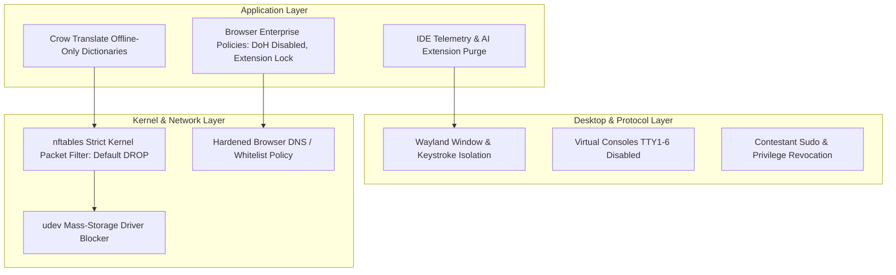

# GallosOS Network Lockdown & Security Hardening Specification

This document details the multi-layered security architecture, network whitelist enforcement, peripheral locking, and integrity controls specified for **GallosOS**.

---

## 1. Threat Model & Integrity Goals

In modern competitive programming (ICPC, IOI, local tournaments), unauthorized access to Generative AI coding assistants, remote problem solvers, or hidden code storage completely undermines contest integrity.

### 1.1 The AI Risk Philosophy

Generative AI presents a unique risk to algorithmic development. Competitive programming relies on deep analytical thinking, algorithm design, and manual tracing (the "old way"). If a student wants to use AI coding assistants and other distractions, they are free to use their personal laptop in the club or training camp (if permitted by the organizers), during their own time, or at their own place. **GallosOS is built with competitive programming in mind.** To enforce this, even in the open `Default` mode, GallosOS continuously sinks known AI domains (OpenAI, Claude, Copilot, Cursor) using an auto-updating host blacklist (synced with community-maintained AI tracking lists like [`ai.robots.txt`](https://github.com/ai-robots-txt/ai.robots.txt), [`Stevos-GenAI-Blocklist`](https://github.com/Stevoisiak/Stevos-GenAI-Blocklist), and [`hagezi/dns-blocklists`](https://github.com/hagezi/dns-blocklists)), ensuring the training environment remains pure.

### 1.2 Primary Threat Vectors

1. **Cloud AI & LLM Endpoints:** OpenAI API, Anthropic Claude, Google Gemini, GitHub Copilot, Cursor backend, Perplexity, HuggingFace Inference.
2. **IDE AI Plugins & Telemetry:** Pre-installed Copilot / Supermaven / JetBrains AI Assistant communicating via hidden sockets.
3. **Evasion Tunnels:** DNS-over-HTTPS (DoH), DNS-over-TLS (DoT), WireGuard, OpenVPN, SSH port-forwarding, Tor bridges, SOCKS5 proxies.
4. **Unauthorized Mass Storage:** USB flash drives containing pre-written templates or algorithm libraries plugged in during contest hours.
5. **Hardware Macros (BadUSB):** Personal keyboards with internal memory injecting pre-baked scripts at superhuman speeds.
6. **Session Leakage:** Snooping on other workstation windows via legacy X11 protocol vulnerabilities.
7. **Low-Level Sandbox Evasion & Syscall Manipulation:** Execution of direct kernel system calls (`syscall` / inline assembly `__asm__` blocks) or compiler/kernel exploits to escape local sandboxes, access forbidden directories, or tamper with background monitoring agents.

> [!NOTE]
> **Integrity by Architecture:** GallosOS does not rely on heuristic deep-packet inspection or speculative "AI-detector" algorithms. Anti-Cheat protection is the deterministic consequence of strict Zero-Trust system design: a kernel-level `nftables` Default-DROP firewall allowing strictly the verified contest judge, combined with startup scripts that physically purge IDE AI plugins (`com.intellij.ml.llm`, Copilot) and strip cloud telemetry endpoints.

---

## 2. Multi-Layered Zero-Trust Architecture



---

## 3. Network Isolation & Firewall Architecture

The GallosOS specification mandates a **Strict Default-DROP** policy for all outbound packet traffic generated by the contestant.

### 3.1 Kernel Packet Filter (`nftables`)

> [!IMPORTANT]
> **These sets are rendered per-event by `gallos-daemon`, never copy-pasted as-is.** The elements shown below are illustrative placeholders. `allowed_judge_ips` MUST resolve to the organizer's actual judge host(s) — never a whole RFC1918 supernet (`10.0.0.0/8`, `172.16.0.0/12`, `192.168.0.0/16`), which would let a contestant reach every other device on the venue LAN and defeat the judge-only guarantee entirely.

> [!NOTE]
> **IPv6 is disabled network-wide, not merely un-whitelisted.** [Precedent: huronOS's own docs (`docs/start/requirements.md`) recommend disabling IPv6 outright because a dual-stack firewall that is only IPv4-aware can let contestants reach IPv6-only destinations unfiltered.] GallosOS follows the same posture: IPv6 is turned off at the kernel level (`ipv6.disable=1` boot parameter, or `net.ipv6.conf.all.disable_ipv6=1` at runtime), and the ruleset below uses `table ip` (IPv4-only), not `table inet` (dual-stack) — so there is no separate IPv6 chain to keep in sync or accidentally leave open.

```nftables
#!/usr/sbin/nft -f

table ip gallos_filter {
    # Judge server(s) reachable during Contest mode, derived from
    # [contest].allowed_websites in gallos.toml:
    #   - Self-hosted LAN judges (BOCA / DOMjudge / CMS, the typical ICPC
    #     onsite case): the organizer's specific static judge-server IP(s),
    #     resolved once and pinned into /etc/hosts at configure-time rather
    #     than re-resolved live. [Precedent: maratona-firewall's
    #     config-ip-boca.sh does exactly this — see §3.4.]
    #   - CDN-fronted remote judges (Codeforces, AtCoder, omegaUp): kept in
    #     sync via periodic DNS resolution — see §3.4.
    set allowed_judge_ips {
        type ipv4_addr
        flags interval
        elements = { 192.168.50.10 }   # example: single self-hosted BOCA host
    }

    # Venue Controller only (CUPS printing + audit/telemetry upload).
    # Scoped to one host and explicit ports — never the whole LAN.
    # IDEA FOR LATER (not adopted): the real ICPC World Finals ruleset
    # (icpcsysops/ansible do_iptables.yml) scopes every Controller service to
    # its own separate /32+port rule instead of one shared set. Consider
    # splitting this set into per-service rules to match more closely.
    set allowed_venue_controller_ip {
        type ipv4_addr
        elements = { 192.168.50.1 }    # example: Venue Controller LAN IP
    }

    set telemetry_dns_blacklist {
        type ipv4_addr
        elements = {
            1.1.1.1, 1.0.0.1,         # Cloudflare DNS bypasses
            8.8.8.8, 8.8.4.4,         # Google DNS bypasses
            9.9.9.9, 9.9.9.10,        # Quad9 / JetBrains IDE telemetry DNS
            149.112.112.10, 149.112.112.112
        }
    }

    chain output {
        type filter hook output priority 0; policy drop;

        # 1. Allow Loopback (Required for IDE local debuggers and local doc servers)
        oif "lo" accept

        # 2. Allow Established / Related connections
        ct state established,related accept

        # 3. Hard-Drop Broadcast, Multicast & Telemetry Clutter (prevents discovery leakage)
        #    mDNS (5353) is dropped unconditionally, full stop. [Precedent: the
        #    real ICPC World Finals ruleset REJECTs 5353 outright — onsite
        #    printers are statically configured, no Avahi/mDNS broadcast on
        #    contestant machines at all.] GallosOS follows the same default:
        #    [contest.printing] mode = "hosted" targets a static CUPS server
        #    IP (printer_host) by default; mDNS discovery is opt-in only via
        #    enable_mdns_discovery = true, which — if set — narrowly reopens
        #    5353 scoped to allowed_venue_controller_ip alone (not shown here,
        #    since it's off by default).
        udp dport { 137, 1124, 3289, 3702, 5353, 8610, 8612 } drop
        ip daddr { 224.0.0.1, 224.0.0.22, 239.255.255.250, 255.255.255.255 } drop

        # 4. Hard-Drop Hardcoded IDE DNS Resolvers & DoT/DoH
        ip daddr @telemetry_dns_blacklist drop
        tcp dport 853 drop

        # 5. Allow Local DNS (Port 53 UDP/TCP) to verified local gateway only (dynamically populated by gallos-daemon)
        udp dport 53 ip daddr 192.168.1.1 accept
        tcp dport 53 ip daddr 192.168.1.1 accept

        # 6. Allow NTP Time Synchronization (Port 123) — scoped to the
        #    Venue Controller (if it hosts NTP) or the organizer-configured
        #    campus NTP pool IP(s), never wide open. An unrestricted NTP rule
        #    is an unmonitored outbound channel regardless of judge whitelisting.
        udp dport 123 ip daddr @allowed_venue_controller_ip accept

        # 7. Allow HTTP/HTTPS exclusively to Whitelisted Judge IPs
        tcp dport { 80, 443 } ip daddr @allowed_judge_ips accept

        # 7a. Venue Controller printing: CUPS/IPP (631), static IP only —
        #     no mDNS (5353) unless enable_mdns_discovery = true (see rule 3)
        tcp dport 631 ip daddr @allowed_venue_controller_ip accept

        # 7b. Venue Controller audit/telemetry upload (fleet metrics,
        #     screenshot sync, code backup) — HTTPS to the Controller only
        tcp dport 443 ip daddr @allowed_venue_controller_ip accept

        # 7c. ICMP: asymmetric, not blanket-dropped. [Precedent: the real
        #     World Finals ruleset accepts ping only from its backup/admin
        #     subnet and drops+logs everything else.] Diagnostic ping is
        #     useful for on-site troubleshooting without opening a general
        #     ICMP hole.
        icmp type echo-request ip saddr @allowed_venue_controller_ip accept

        # 8. Rate-limited Audit Logging for Denied Outbound Attempts
        limit rate 5/minute burst 7 packets log prefix "GALLOS_DENIED: " flags all

        # 9. Reject everything else with immediate ICMP port unreachable
        reject
    }

    chain input {
        type filter hook input priority 0; policy drop;
        iif "lo" accept
        ct state established,related accept
    }
}
```

### 3.2 DNS-over-HTTPS (DoH), Telemetry & Tunnel Mitigation

- **DoH / DoT & Direct DNS Drop:** All traffic on port `853` (DoT) and port `443` directed to public DoH resolvers (`1.1.1.1`, `8.8.8.8`, `9.9.9.9`), as well as hardcoded IDE telemetry resolvers (e.g. JetBrains embedded telemetry attempting to reach `9.9.9.10` / `149.112.112.10`), is dropped at the packet filter level.
- **Enterprise Browser Lockdown:** `/etc/firefox/policies/policies.json` and `/etc/chromium/policies/managed/default.json` enforce:
  - `"DNSOverHTTPS": { "Enabled": false, "Locked": true }`
  - `"DisableTelemetry": true`
  - `"ExtensionInstallBlocklist": ["*"]` (Only Competitive Companion pre-installed).

### 3.3 Browser Sub-URL Filtering (omegaUp / Platform Lockdown)

At the kernel level, `nftables` can only filter by IP addresses and domain names (e.g., `omegaup.com`). Because HTTPS encrypts the URL path, the firewall cannot distinguish between an allowed contest link (`/arena/contest/omi2026`) and a banned public problem archive (`/arena/problem/`).

To enforce strict platform isolation without breaking the domain, GallosOS dynamically injects **Chromium and Firefox Enterprise Managed Policies** (`/etc/chromium/policies/managed/gallos.json`).

When `gallos.toml` declares specific `[contest.bookmarks]`, the daemon can optionally build strict URL boundaries:

- **`URLBlocklist`**: Blocks `https://omegaup.com/arena/problem*`, `/submissions*`, `/course*`, `/rank*`.
- **`URLAllowlist`**: Unblocks only `/login`, `/api/*`, and the specific `/arena/contest/*` route.

This ensures that even if `omegaup.com` is whitelisted in the firewall, contestants receive a strict `ERR_BLOCKED_BY_ADMINISTRATOR` screen if they attempt to navigate outside the active contest arena to look up old code.

### 3.4 Dynamic Judge IP Resolution for CDN-Fronted Judges

`gallos.toml`'s `allowed_websites` is declared by **domain name** (e.g. `boca.icpcmexico.org`), but `nftables` filters only by IP address. GallosOS resolves this gap differently depending on judge topology:

- **Self-hosted LAN judges (BOCA, DOMjudge, CMS — the typical ICPC/IOI onsite case):** These run on a dedicated machine on the venue LAN with a fixed IP. Rather than resolving the domain at every boot, `gallos-daemon` resolves it **once at configure-time and writes a static `/etc/hosts` entry** pinning the domain to that IP, which is also what populates `allowed_judge_ips`. [Precedent: this directly follows `maratona-firewall`'s real `config-ip-boca.sh` script, which hardcodes the resolved judge IP into `/etc/hosts` at configure-time and never re-resolves it live — simpler than a periodic-repin daemon, and correct for this case because a self-hosted LAN judge's IP does not change during the contest.] The organizer can also supply the IP directly, skipping resolution entirely.
- **CDN-fronted remote judges (Codeforces, AtCoder, omegaUp, used in `Event`/`Default` practice profiles):** These sit behind shared CDN infrastructure with edge IPs that rotate and are frequently shared with unrelated tenants — the static-pin approach above does not fit here. `gallos-daemon` periodically (every 30–60 seconds) re-resolves each whitelisted domain via the allowed local DNS server and diffs the result into `allowed_judge_ips` (`nft add element` / `nft delete element`), keeping the set current as CDN IPs rotate.

> [!WARNING]
> **Documented residual limitation, not a solved problem:** IP-based allowlisting — with or without periodic re-resolution — cannot distinguish between two hostnames that happen to share the same CDN edge IP, because `nftables` has no visibility into the TLS SNI or HTTP Host header. A contestant who already knows a whitelisted domain's current edge IP could, in principle, reach unrelated content hosted behind the same edge if the CDN routes by SNI rather than IP. Closing this gap requires SNI-aware filtering (e.g. an inline stream proxy with `ssl_preread`-style hostname matching), which is heavier infrastructure than the in-band Bash/Python daemon is designed to run and is not currently planned for the MVP. This is why strict `Contest`-mode lockdowns should prefer self-hosted LAN judges wherever possible — the CDN-sharing risk does not apply to them — and why CDN-fronted judges are treated as acceptable for lower-stakes `Event`/`Default` practice contexts rather than official lockdown scenarios.
>
> **IDEA FOR LATER, not adopted:** `icpc-environment/icpc-env` closes this exact gap for real — it forces all contestant traffic through a local Squid instance with full TLS interception (`ssl_bump bump all`, a self-signed CA installed system-wide, UID-locked to the contestant user) backed by an nginx reverse proxy doing per-path filtering on the decrypted traffic (`files/squid/squid.conf.j2`, `files/nginx.conf.j2`). This would give real hostname/path-level filtering instead of IP allowlisting, at the cost of trusting a MITM proxy in the TCB and installing a CA cert everywhere. Flagged as a documented option for a future design decision, not implemented here.
>
> **Independent corroboration at World Finals scale:** `icpc-env` itself has been dormant since 2024-10-03, but the actively-maintained `icpcsysops/ansible` (pushed 2026-03-25 — the same team running real ICPC World Finals/NAC infrastructure) independently arrived at the same class of fix: its `roles/reverseproxy` role redirects specific whitelisted judge/CDN domains to a local TLS-terminating nginx proxy that filters by hostname and path (not by IP), and its example inventory reserves a dedicated `squidserver` host alongside its other production server roles (the role/playbook configuring that host is not present in the tree available for inspection). This is evidence that TLS-terminating traffic filtering is current practice at the highest tier of ICPC infrastructure, not a stale idea from one inactive regional repo — see [`docs/COMPARATIVE_ANALYSIS.md`](./COMPARATIVE_ANALYSIS.md) §9.1 for detail.

---

## 4. IDE Hardening & Licensing Strategy

### 4.1 VSCodium (Default Open Source IDE) & C/C++ Extension Strategy

1. **Telemetry-Free Binary & Clean Licensing:** VSCodium is a community-driven MIT build of Code-OSS without Microsoft proprietary telemetry keys, freely redistributable inside our SquashFS images, and connected to the Open VSX marketplace.
2. **Open-Source C/C++ Toolchain (`clangd` + `webfreak.debug`):**
   - **Why NOT `ms-vscode.cpptools`:** Microsoft's official `ms-vscode.cpptools` extension contains proprietary license restrictions restricting its use strictly to official Microsoft builds. Starting in April 2025, Microsoft introduced runtime checks that detect non-official builds and actively block execution in VSCodium/Code-OSS. Attempting to bypass these checks violates Microsoft's EULA.
   - **GallosOS Solution:** Pre-installs **`llvm-vs-code-extensions.vscode-clangd`** (LLVM's official open-source language server) and **`webfreak.debug`** (Native Debug / GDB). This pairing is 100% open source, faster at C++ autocompletion, fully compliant with Open VSX, and 100% legal to redistribute.
3. **Alternative Official Microsoft VS Code Track:**
   - For organizations requiring official Microsoft VS Code and `ms-vscode.cpptools`, the containerized build script can pull the binary directly at build/boot time from `packages.microsoft.com` rather than redistributing proprietary binaries in public ISOs (avoiding Microsoft redistribution EULA violations).
   - Telemetry is unconditionally disabled in the deployed `/etc/vscodium/settings.json` or `/etc/code/settings.json`:

     ```json
     {
       "extensions.autoUpdate": false,
       "extensions.autoCheckUpdates": false,
       "extensions.showRecommendationsOnlyOnDemand": false,
       "extensions.ignoreRecommendations": true,
       "telemetry.telemetryLevel": "off"
     }
     ```

4. **Pre-Installed & Declarative Extension Control (via `gallos.toml`):**
   - **`vscode-clangd`** (LLVM Language Server for fast offline C++ autocompletion).
   - **`webfreak.debug`** (Native GDB debugger).
   - **Competitive Programmer Helper (CPH)** (Offline/Online testcase runner for training).
   - **Vim Emulation (`vscodevim.vim` / `IdeaVim`)** (Modal keybindings for VSCodium and JetBrains).

   Organizers can declaratively enable, disable, or customize extensions per mode directly in `gallos.toml`:

   ```toml
   [default.ide_extensions]
   vscodium = ["llvm-vs-code-extensions.vscode-clangd", "webfreak.debug", "cph", "vscodevim.vim"]
   jetbrains = ["IdeaVim"]

   [contest.ide_extensions]
   # In strict contest mode, CPH is omitted, leaving pure language servers & modal keybindings
   vscodium = ["llvm-vs-code-extensions.vscode-clangd", "webfreak.debug", "vscodevim.vim"]
   jetbrains = ["IdeaVim"]
   ```

   > [!TIP]
   > **Mode-Sensitive Extension Control:** Extensions like **CPH** and browser companions (**Competitive Companion**) streamline practice during `Default` and `Event` training (Codeforces, AtCoder, CSES). In strict onsite tournaments (ICPC / IOI with DOMjudge/BOCA), organizers can omit them from `[contest.ide_extensions]` to enforce strict manual testing rules.

### 4.2 JetBrains Ecosystem (Community Baseline vs. Optional Sponsored Pro Extension)

- **Default Standard (FOSS / Zero Config):** IntelliJ IDEA Community Edition & PyCharm Community Edition are the primary JetBrains baseline. They require zero license configuration, zero network activation, and are ready out of the box for university clubs and regional contests.
- **Declarative Plugins:** Essential competitive programming plugins such as **IdeaVim** are pre-bundled and activated declaratively via `gallos.toml`.
- **Optional Sponsored Pro Mode (Future Extension):**
  - For tournaments officially sponsored by JetBrains (e.g. ICPC World Finals), a modular license injection mechanism can optionally load offline ticket licenses for **CLion** and **IntelliJ Ultimate**. This is treated as a secondary, late-stage extension since Community Editions and VSCodium cover the vast majority of contest scenarios.
  - **Crucial Air-Gap Guarantee:** In all JetBrains editions, the `com.intellij.ml.llm` (JetBrains AI Assistant) plugin is unconditionally purged from `plugins/`.

### 4.3 Proprietary Kernel Modules (GPU Drivers) & SecureBoot Taint Policy

Every proprietary component discussed above (§ 4.1–4.2) is a *userspace* binary. The opt-in `drivers/nvidia-proprietary` `.gsm` module (`docs/HARDWARE_COMPATIBILITY.md` § 1.3) is different in kind — it's a closed-source, out-of-tree **kernel** module, which taints the kernel and requires a Machine Owner Key (MOK) signature to load under SecureBoot.

- **Scope of the taint:** limited to the display driver stack. Loading it does not disable, weaken, or bypass any of the Zero-Trust controls in § 1–3 (nftables default-DROP, DNS/DoH mitigation, browser sub-URL filtering) or the peripheral/USB lockdown in § 5 — it adds no new judge-facing network surface or contestant-facing privilege escalation path.
- **Not part of the default threat model:** the module is opt-in per `build.toml`/`gallos.toml`, so the baseline "unmodified, untainted kernel" posture this document otherwise assumes (§ 9.2) holds for any venue that doesn't explicitly enable it.
- **MOK enrollment is a venue-setup action, not a runtime one:** organizers enroll the shipped MOK certificate once per physical machine before the contest (see `docs/BUILD_SYSTEM.md` § 4 and `docs/HARDWARE_COMPATIBILITY.md` § 1.3 for the mechanics); contestants have no path to enroll, revoke, or otherwise interact with MOK trust during a session, since they run unprivileged (§ 9.1).

---

## 5. Peripheral & USB Storage Lockdown

During **`Contest` Mode**:

- **HID Allowed:** USB keyboards, mice, and assistive devices are permitted.
- **Mass Storage Blocked (primary mechanism — polkit/udisks2 denial):** When `allow_usb_storage = false`, `gallos-daemon` (and the build-time hardening stage) installs a `polkit` rule denying the `contestant` user all `org.freedesktop.udisks2.*` actions outright (`ResultAny=no` / `polkit.Result.NO`), so mass-storage devices are refused at the policy layer before they're ever mounted. [Precedent: this directly follows `maratona-usuario-icpc`'s real polkit rules, which deny the `icpc` user `NetworkManager.*`, `timedate1.*`, and `udisks2.*` actions the same way.]

  > [!NOTE]
  > **Polkit `.pkla` vs. Modern JavaScript `.rules` (Ubuntu 24.04 LTS):**
  > While upstream `maratona-usuario-icpc` used the legacy `.pkla` (localauthority) backend format shown below for illustration, Ubuntu 24.04 LTS (`noble`) ships `polkitd >= 106`, which dropped `.pkla` support entirely in favor of JavaScript rules in `/etc/polkit-1/rules.d/`. GallosOS translates this rule to `/etc/polkit-1/rules.d/99-gallos-usb-block.rules` (`polkit.addRule(...)`). See [`vendor/inherited/maratona-usuario-icpc/UPSTREAM.md`](../vendor/inherited/maratona-usuario-icpc/UPSTREAM.md).

  ```javascript
  // /etc/polkit-1/rules.d/99-gallos-usb-block.rules
  polkit.addRule(function(action, subject) {
      if (action.id.indexOf("org.freedesktop.udisks2.") === 0 && subject.user === "contestant") {
          return polkit.Result.NO;
      }
  });
  ```

  *(Legacy `.pkla` equivalent from `maratona-usuario-icpc`):*

  ```ini
  # /etc/polkit-1/localauthority/50-local.d/99-gallos-usb-block.pkla
  [Block mass storage for contestant]
  Identity=unix-user:contestant
  Action=org.freedesktop.udisks2.*
  ResultAny=no
  ResultInactive=no
  ResultActive=no
  ```

- **Fallback mechanism (systems without polkit/udisks2 enforcement):** a dynamic `udev` rule unbinds the `usb-storage` and `uas` kernel modules directly:

  ```bash
  # Block new USB mass storage devices from being exposed as block nodes
  echo 'ACTION=="add", SUBSYSTEM=="usb", ATTR{bInterfaceClass}=="08", RUN+="/bin/sh -c '\''echo 0 > /sys$DEVPATH/authorized'\''"' > /etc/udev/rules.d/99-contest-usb-block.rules
  udevadm control --reload-rules
  ```

- At the end of the contest, USB storage is re-authorized (polkit rule removed, or `udev` rule reverted) so contestants can manually export their source code.

---

## 6. Keyboard Layout Selector

Contestants come from diverse international backgrounds and require specific layout mappings:

- **Supported Layouts:** `latam` (Latin America), `us` (US English), `es` (Spain), `br` (Brazil ABNT2), `dvorak`.
- **Fast Switching:**
  - **Global Hotkey:** `Super + Space` (or `Alt + Shift`) cycles through active layouts.
  - **Status Bar Module:** Visual flag/text indicator in Waybar status bar.
  - **Persistence:** Layout choice is saved across app launches within the session.

---

## 7. Offline Documentation & Translation

To ensure non-native English speakers can compete fairly without internet access to Google Translate / DeepL:

1. **Bundled Offline Language Documentation (`/usr/share/doc/`):**
   - C++: Full `cppreference-doc` HTML snapshot with offline search index.
   - Java: JDK API Specification.
   - Python: Official Python 3 docs.
   - Kotlin / Rust: Language manuals.

2. **Dual-Mode Translation Engine (Offline Dictd + Whitelisted API Crow Translate):**
   - **Airtight Offline Mode (Air-Gapped & Strict Regionals):** Bundles a local `dictd` daemon (`127.0.0.1:2628`) with FreeDict bilingual databases (`eng-spa`, `eng-por`) and StarDict lexicons. Lookups run entirely over loopback with zero external network traffic, guaranteeing 100% functionality even under complete firewall lockdown.
   - **Controlled Online Translation Mode (Optional for Camps / Qualifiers):** When organizers permit online translation, they whitelist raw API endpoints (e.g. `translate.googleapis.com` or LibreTranslate) in `gallos.toml`. Because Crow Translate communicates strictly via raw translation APIs (JSON payload) rather than rendering web pages, it provides full-sentence translation **without exposing web-proxy bypass vulnerabilities** (which occur when contestants access the full `translate.google.com` web browser interface to load forbidden sites).
   - **Automatic Local Fallback:** If online translation endpoints become unreachable or network drops, translation tools fall back seamlessly to the bundled local dictionary databases.

---

## 8. Administrative Proctoring, Auditing & Fleet Telemetry

For official tournaments requiring strict proctoring (such as ICPC Regionals, IOI selection contests, and certified remote competitions), the GallosOS architecture defines an **opt-in, declarative auditing engine** managed by `gallos-daemon`:

### 8.1 Periodic Desktop Screen Auditing

- **Wayland-Safe Capture:** While unprivileged student applications cannot snoop on the screen, a privileged system service running as root/daemon captures periodic desktop frames via compositor protocols (`grim` / `wlr-screencopy`).
- **Interval & Storage:** Configurable via `gallos.toml` (e.g. every 60 seconds). Images are tagged with timestamp, team ID, and hostname, and stored in `/var/log/gallos/audit/screenshots/` or synced to the central administrative server.
- **IDEA FOR LATER, not adopted:** IOI 2025 Contestant-VM's real `contest.sh monitor` (cron, every minute) captures a screenshot with only 50% probability per invocation rather than a deterministic fixed interval — a cheaper-storage sampling alternative worth considering. Not implemented here.

### 8.2 Automated Incremental Code Backups

- **Dispute Resolution & Crash Protection:** Inspired by IOI's `ioibackup.sh` (IOI Contestant-VM) and ICPC World Finals SysOps' backup watchdog subsystem (`roles/icpc_host_backup/files/backup_watchdog` and `sh.backupclient` in `icpcsysops/ansible`), GallosOS runs an automated background snapshot of `/home/contestant/` every $N$ seconds (declaratively configured via `[contest.audit] backup_interval_secs` in `gallos.toml`, defaulting to 300 seconds / 5 minutes).
- **Forensic Timeline & Rapid Disaster Recovery:** Allows the contest jury to review a timeline of source code changes in case of cheating allegations, and allows organizers to instantly restore a team's code via `recovery.sh` if physical workstation replacement is needed.
- **IDEA FOR LATER, not adopted:** the real `ioibackup.sh` also enforces a 100KB per-file size cap and a 1MB/s bandwidth throttle on the rsync. GallosOS's `backup_interval_secs` has neither knob today — at 50–200 machines, a simultaneous unthrottled backup burst to the Venue Controller could saturate the venue LAN. Worth adding `backup_max_file_size` / `backup_bandwidth_limit_kbps` to `[contest.audit]` in a future revision; not implemented here.

### 8.3 Privileged Keystroke Forensics (Optional for IOI / Olympiads)

- **Kernel-Level Audit (`/dev/input`):** Inspired by `martkeys` in ICPC World Finals SysOps, when enabled via `[contest.audit] enable_keystroke_forensics = true` in `gallos.toml`, raw keyboard events are captured directly from the kernel input subsystem into a structured JSON audit stream (`/var/log/gallos/audit/keystrokes.jsonl`).
- **Isolation Guarantee:** Input capture operates entirely inside the privileged system daemon without exposing global key event streams or X11 snooping vectors to unprivileged desktop applications.
- **ICPC vs. IOI Operational Profile:**
  - **ICPC / University Camps:** Keystroke logging is disabled by default (`enable_keystroke_forensics = false`); only firewall drop alerts, CUPS print jobs, and EarlyOOM kill events are collected.
  - **IOI / National Olympiads:** Full forensics (keystrokes and periodic screenshots) can be enabled declaratively for arbitration.
- **IDEA FOR LATER, not adopted:** the real `martkeys` shipped config (`roles/martkeys/files/keys.yaml`) does **not** log raw keystroke content by default — only aggregated `modifier`/`metrics` (click rate, cadence sampled every 60s) feed its output; a raw per-key capture mode exists but is commented out, implying it's reserved for targeted forensic investigation rather than always-on. A metrics-only default (with raw capture as an explicit, separately-invoked escalation) may be a more privacy-defensible default than "raw JSONL stream" as currently described here. Not implemented — flagged for a future decision.

### 8.4 Process Hierarchy & Focused Window Tracking

- **Forensic Activity Journal:** Inspired by `s.py` from ICPC SysOps, `gallos-daemon` optionally samples the active focused window and maps its parent-child process hierarchy via `/proc/<pid>/task/<pid>/children` and `comm` descriptors.
- **Cheating & Anomaly Detection:** Allows arbiters to verify what editor, tool, or background process was running at any specific second of the contest timeline (e.g. distinguishing between interactive terminal execution vs. background scripts).
- **IDEA FOR LATER, not adopted:** the real `s.py` (`roles/team/files/s.py`) detects the focused window via X11-only `xprop`/`_NET_ACTIVE_WINDOW`, which has no Wayland/labwc equivalent and cannot be ported as-is. The process-hierarchy half above is already portable. A Wayland-native replacement for the window-focus half (e.g. `wlr-foreign-toplevel-management`) is needed before this feature can be implemented; not designed here.

### 8.5 Fleet Telemetry & Monitoring

- **Prometheus Exporters:** Bundles lightweight `node-exporter` and `gallos-exporter` services.
- **Central Dashboard:** Exposes real-time CPU load, memory utilization, network sockets, and process lists to the contest director's Venue Controller dashboard over the local contest LAN.

---

## 9. Mitigations for Low-Level Sandbox Evasion & Syscall Manipulation

To prevent contestants from executing malicious kernel system calls (`syscall` / inline assembly `__asm__`) or compiler-busting memory exploits to hijack the system or bypass the local sandbox, GallosOS implements four strict operating system defenses:

### 9.1 Privileged Command & Sudo Revocation

- **Strip Sudo Access:** The `contestant` user profile is stripped of all administrative rights. There is no `sudo` binary access, and `polkit` policies are configured to block privilege escalation.
- **Root Directory Lock:** Even if inline assembly executes direct system calls (`sys_open`, `sys_write`), the kernel rejects operations attempting to touch folders outside `/home/contestant/` and `/tmp/`.

### 9.2 Immutable Read-Only Root Filesystem (SquashFS + OverlayFS)

- **SquashFS Layer Integrity:** Critical OS directories (`/bin`, `/sbin`, `/lib`, `/usr`) reside inside the read-only SquashFS container.
- **Ephemeral RAM Overlays:** Any local file modifications, write attempts, or script replacements only affect the ephemeral memory OverlayFS layer in RAM. A reboot immediately purges any local modifications, preventing contestants from permanently replacing system binaries or tampering with security/audit logging services.

### 9.3 Systemd Hardening & Syscall Filtering (`seccomp-BPF`)

- **Systemd Service Sandboxing:** Background services (such as `gallos-daemon`, OOM notifier, and telemetry exporter) run under systemd hardening guidelines:
  - `NoNewPrivileges=true`: Prevents child processes from gaining more privileges than their parents.
  - `ProtectSystem=strict`: Mounts the entire OS filesystem tree as read-only to the service.
  - `SystemCallFilter=~execve` or strict whitelist restrictions: Blocks unauthorized system calls at the kernel level using `seccomp-BPF`.

### 9.4 Wayland Window & Input Isolation

- **No Global Keystroke Sniffing:** Unlike legacy X11, the Wayland compositor (`labwc`) restricts input events exclusively to the active focused application.
- **Zero Client Inter-Process Access:** Unprivileged applications cannot inject keys, capture screenshots of other client windows, or read memory of competing IDEs, rendering GUI keyloggers or screen-snooping hacks technically impossible.
