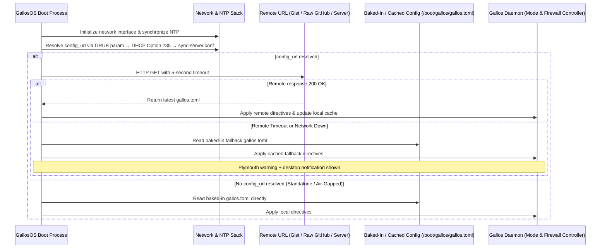
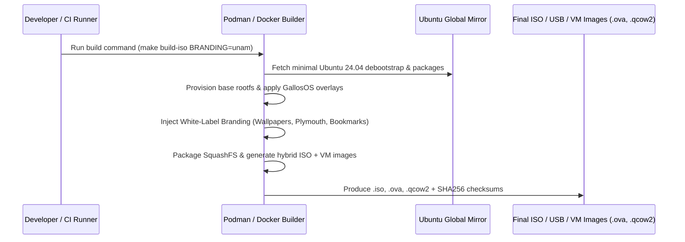
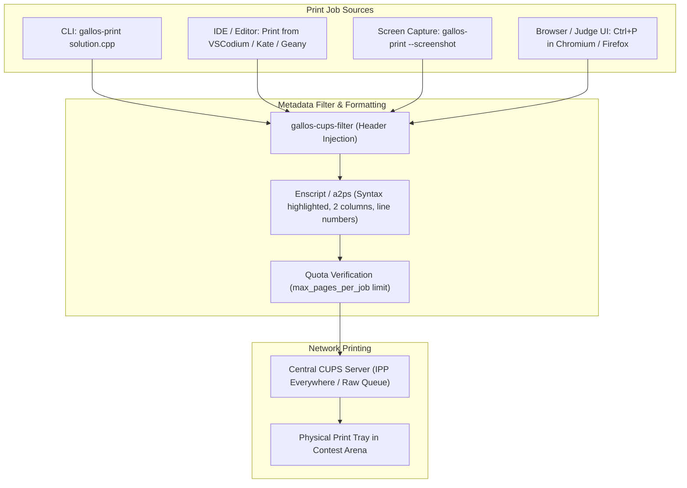
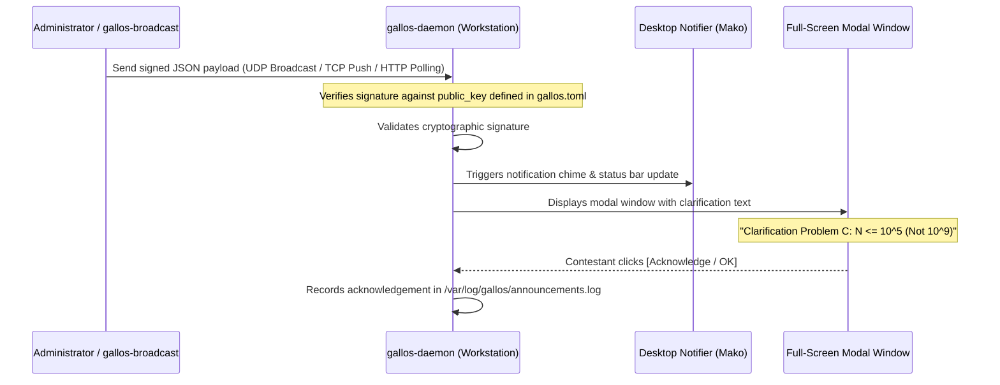

# GallosOS Architecture & System Design

This document provides a comprehensive technical overview of the architecture, subsystems, build pipeline, and execution environments of **GallosOS**.

---

## 1. System Overview & Layered Architecture

GallosOS is built around a **multi-layered, immutable live-boot architecture** that ensures total reproducibility, quick recovery, and tamper resistance across any competitive programming context (weekly university clubs, training camps, or official ICPC tournaments).

```mermaid
graph TD
    subgraph "Contestant User Space"
        IDE[IDEs: VSCodium, JetBrains CE/Pro, Geany, Vim]
        Browser[Hardened Chromium / Firefox ESR]
        Docs[Offline Docs Viewer & Crow Translate]
        Tools[Compilers: GCC, Clang, OpenJDK, Python, PyPy, Rust]
    end

    subgraph "Desktop & Security Layer"
        Wayland[Wayland Compositor: Labwc]
        Desktop[Wayland Kiosk Desktop: Labwc + Waybar]
        Firewall[Anti-Cheat Kernel Firewall: nftables Default DROP]
        DevLock[Device Lockdown: USB Mass-Storage Filter]
    end

    subgraph "Filesystem Layer (OverlayFS)"
        Upper[Upper Layer: Ephemeral tmpfs in RAM]
        Modules[Middle Layers: Modular SquashFS Packages .gsm]
        Lower[Lower Layer: Base Ubuntu 24.04 LTS SquashFS Root]
    end

    subgraph "Hardware & Boot Layer"
        GRUB[GRUB2 / Syslinux Hybrid Bootloader (UEFI + BIOS)]
        Kernel[Linux Kernel 6.8+ with OverlayFS & eBPF Support]
        Hardware[Target Machine RAM / Disk / USB]
    end

    Contestant_User_Space --> Desktop_and_Security_Layer
    Desktop_and_Security_Layer --> Filesystem_Layer
    Filesystem_Layer --> Hardware_and_Boot_Layer
```

---

### 1.1 Repository Strategy & Tooling Philosophy

GallosOS enforces a **Monorepo** strategy with a strict **"In-Band vs Out-of-Band"** tooling philosophy. This prevents the project from suffering the "lack of support" fate of HuronOS or the complexity of Maratona Linux.

- **Monorepo Structure:** All components (OS build scripts, Wayland configs, and external CLI tools) live in a single Git repository. This lowers the barrier to entry, ensuring that one `git clone` provides the entire ecosystem.
- **In-Band Tooling (Hackable OS Core):** Any code that runs **inside** the live USB environment (`gallos-daemon`, init scripts) is written strictly in **Python**. The core OS must be hackable on the fly. If an edge-case bug occurs during a regional contest, an organizer with root access can open the script, patch it, and save the event without needing a compiler.
- **Out-of-Band Tooling (Compiled Organizer CLIs):** Tools run by the organizer on their host machine (e.g., `gallos-convert`, `gallos-flash`) are built as **Statically Compiled Binaries (Rust)**. Organizers suffer from "dependency hell" when asked to install Python just to convert a config file. Rust delivers a single, portable executable that "just works" out of the box.

---

## 2. Dynamic Directives Ingestion Architecture

GallosOS is designed to be **infrastructure-agnostic**: it operates correctly whether the venue has zero network infrastructure, a basic home router, a university-managed DHCP server, or a full dedicated GallosOS Venue Controller. The system never assumes the presence of any particular network service.

### 2.1 `config_url` Auto-Discovery Priority Chain

Before fetching a remote directives file, GallosOS resolves the target URL through the following priority chain (first match wins):

```text
Priority 1 — GRUB Boot Parameter (explicit, set at flash time)
  gallos.config=https://gist.githubusercontent.com/.../raw/gallos.toml
  ↳ Organizer bakes the URL directly into the USB at flash time via gallos-flash.
    Highest priority; always takes precedence. The same gallos.config=
    parameter also accepts a local baked-in profile filename instead of a
    URL (see docs/CONFIG_SPEC.md) — daemon/src/config.py scheme-sniffs the
    value to tell the two apart, rather than using a second parameter name.

Priority 2 — DHCP Option 235 (zero-infrastructure path)
  Standard DHCP response includes Option 235 with the config URL.
  ↳ Works with any router running dnsmasq or ISC DHCP — including basic
    university lab routers and consumer-grade APs — with a single config line:
    dnsmasq:  dhcp-option=235,"https://server/gallos.toml"
    ISC DHCP: option option-235 code 235 = text;
              option option-235 "https://server/gallos.toml";
  ↳ Requires no GallosOS-specific server. The lab's existing DHCP infrastructure
    announces the URL automatically at DHCP lease time.
  ↳ Option 235 is an unassigned site-specific option (RFC 3942 range 224–254),
    chosen deliberately instead of the commonly-used Option 252 — which is
    informally reserved for WPAD (Windows proxy autodiscovery) on many
    real-world networks. Reusing 252 risks colliding with genuine WPAD
    deployments on BYOD-heavy campus networks.

Priority 3 — Local Config File (written by Venue Controller or manually)
  /etc/gallos/sync-server.conf
  ↳ Written by the GallosOS Venue Controller on its first connection to a
    contestant machine, or manually injected at flash time for static setups.

Priority 4 — None (Standalone / Air-Gapped)
  No config_url resolved → boot directly from baked-in /boot/gallos/gallos.toml.
```

### 2.2 Remote Fetch & Fallback Sequence

Once a `config_url` is resolved (via any of the above methods), the boot sequence proceeds as follows:



---

## 3. Base Distribution & Mirror Strategy

### Why Ubuntu 24.04 LTS (Noble Numbat)?

1. **Global Mirror Availability:** Official Ubuntu packages are mirrored across thousands of universities, CDNs, and research institutions worldwide. Users building GallosOS in Mexico, Brazil, Poland, India, or Japan download packages at gigabit speeds without single-point-of-failure bottlenecks.
2. **Hardware Compatibility:** Linux Kernel 6.8+ provides out-of-the-box support for the latest Intel Core Ultra, AMD Ryzen, Realtek/Intel Wi-Fi 6E/7, and Ethernet chipsets common in university computer labs.
3. **5-Year Long Term Support:** Guaranteed security updates and toolchain stability through 2029+.
4. **Debian/Ubuntu Ecosystem Compatibility:** Direct binary compatibility with Maratona Linux `.deb` tools (`maratona-firewall`, `maratona-usuario-icpc`) and official ICPC packages.

### 3.1 `base_os` Version Tiers (`build.toml`)

Ubuntu 24.04 LTS is not architecturally hardcoded — it's the `base_os` value the pipeline defaults to, and the only one the upstream maintainer builds and tests against. `build.toml`'s `[build] base_os` field accepts any Ubuntu release the `debootstrap`/chroot pipeline in § 6 below can bootstrap, split into two support tiers:

| Tier | `base_os` values | Testing status |
| :--- | :--- | :--- |
| **Maintainer-tested default** | `ubuntu-24.04-minimal` | Built and tested by the upstream GallosOS maintainer for every official release. |
| **Community-supported** | `ubuntu-22.04-minimal` (older LTS, wider legacy-hardware compatibility), `ubuntu-26.04-minimal` (newer LTS, newer hardware/silicon support), interim non-LTS releases (e.g. `ubuntu-25.10-minimal`) | Architecturally compatible with the OverlayFS/`.gsm`/casper pipeline described in this document, but **not validated by the upstream maintainer** — no claim of empirical boot/hardware testing is made for these targets. Organizers selecting them are building and validating their own bespoke image via Track 2 (§ 7). |

**Kernel/hardware caveat:** picking an older `base_os` for newer GPU or CPU silicon may require bumping the `kernel` field to a matching HWE package (`linux-generic-hwe-<version>`) — the default `ubuntu-24.04-minimal` + `linux-generic-hwe-24.04` pairing in `docs/BUILD_SYSTEM.md` is what the maintainer actually tests; other `base_os`/`kernel` combinations are not.

---

## 4. Storage & Filesystem Architecture

GallosOS utilizes an **immutable root filesystem** with **OverlayFS** backed entirely by RAM (`tmpfs`). **The OS itself never writes to the USB drive during normal operation** — no swap-on-disk, no logs, no browser cache, no tmp files touch flash. This is what the ephemeral design actually protects against: it's high-frequency, OS-internal write *churn* that wears flash through repeated erase cycles, not the occasional, contestant-initiated save described in item 5 below.

1. **Base SquashFS Layer (`rootfs.squashfs`):**
   Contains the core operating system, base libraries, desktop environment, and network daemons. Kept minimal (~1.2 GB compressed).

2. **Modular Extension Layers (`.gsm`):**
   SquashFS modules mounted dynamically into the overlay stack:
   - `langs-extra.gsm`: Rust, Haskell, Go, Kotlin compilers.
   - `ide-jetbrains.gsm`: IntelliJ IDEA CE, PyCharm CE, CLion.
   - `docs-offline.gsm`: cppreference, Python docs, JDK manuals, offline dictionaries.
   - `drivers/nvidia-proprietary.gsm`: opt-in proprietary NVIDIA display driver (see `docs/HARDWARE_COMPATIBILITY.md` § 1.3). Unlike the userspace-only modules above, this is the one documented `.gsm` that also carries a DKMS kernel module — loading it taints the kernel and requires the one-time per-machine MOK enrollment described there.

   *Note: The official default GallosOS ISO includes the complete standard CP toolchain pre-packaged, giving organizers instant out-of-the-box readiness while enabling granular module filtering via `gallos.toml`.*

3. **Upper Writable Layer (`tmpfs` — 100% Ephemeral in RAM):**
   All OS and session-internal writes (logs, caches, `/home/contestant/` during the active session) reside **entirely in system RAM (`tmpfs`)**. A hard reboot completely resets the OS to a pristine state, eliminating leftover state, malicious modifications, or accidental file corruption.

   *(This is the runtime tmpfs — inside the booted live ISO. For an unrelated build-host tmpfs technique to speed up the ISO build's I/O, see `docs/BUILD_SYSTEM.md` § 2.3.)*

4. **`allow_usb_storage` vs. `event-data` — two different mechanisms, both called "USB":**
   - **`allow_usb_storage`** (`docs/ANTI_CHEAT_AND_SECURITY.md` §5) governs *external* USB mass-storage devices a contestant plugs in during a session — a separate flash drive, not the drive GallosOS booted from.
   - **`event-data`** (item 5 below) is a partition *on the boot drive itself*, mounted automatically by `gallos-daemon` when present, independent of `allow_usb_storage`.

5. **Optional Persistent Storage (`event-data` partition):**
   A contestant's own dedicated USB may carry a persistent `event-data` partition for `Event`/`Default`-mode workspace continuity across sessions (club practice, training camps) — an explicit, low-frequency-write exception to item 3's ephemeral design, not a contradiction of it. Two provisioning paths converge on the same runtime mechanism:
   - **Dedicated `gallos-flash` dd-flash (organizer-provisioned fleets):** `gallos-flash` partitions the drive as `GALLOS_BOOT` (FAT32) + `event-data` (ext4, sized to consume all remaining drive capacity). This is the primary path for official events and is required regardless of Ventoy support below.
   - **Ventoy multi-boot USB (BYOD / personal drives):** `Ventoy2Disk`'s own `-r SIZE_MB` flag ("preserve some space at the bottom of the disk") leaves the reserved region unallocated at install time; the user formats it ext4 afterward. This is a real, documented Ventoy feature rather than a workaround — Ventoy's own docs state "you can create Part3 and Part4 with the reserved space and use them as you want" — though whether a partition in that reserved space survives a later Ventoy version update is not documented upstream and should not be assumed without verification. This targets the BYOD audience specifically — organizers mass-flashing 50-200 single-purpose tournament USBs have no reason to add Ventoy's multi-boot chainload overhead, and a student's personal multi-ISO Ventoy stick shouldn't be dd-wiped by `gallos-flash` for a club session.
   - **Detection, either path:** `gallos-daemon` mounts `event-data` by **filesystem label**, never a fixed partition number/offset — the two provisioning paths produce different partition layouts (`gallos-flash`'s own vs. Ventoy's exFAT+EFI+reserved-space layout), so label-based discovery is what lets one detection code path serve both.
   - **Contest mode never mounts it, at all.** This isn't a policy toggle — `event-data` is simply not mounted during a `Contest` window, full stop, matching the existing Clean State Wipe guarantee (`docs/CONFIG_SPEC.md` §6) and keeping the zero-USB-write-churn property intact even on drives that do carry the partition.
   - **Note on huronOS's inherited 3-partition layout:** huronOS's own design (`docs/COMPARATIVE_ANALYSIS.md` §1) includes a separate `contest-data` partition for "isolated persistent Overlay storage during Contest mode." GallosOS deliberately does **not** carry this forward — it directly contradicts the Clean State Wipe / zero-write-during-Contest guarantee above, which is a firmer requirement here than in huronOS's own design. GallosOS uses a 2-partition layout (`GALLOS_BOOT`, `event-data`) instead of huronOS's 3.

6. **In-Place Delta Injection & Modular Updating (`gallos-inject`):**
   - Organizers with fleets of pre-flashed USB drives can apply contest updates, wallpaper swaps, and system tweaks without wiping or re-flashing whole drives.
   - **Zero-Touch Config & Assets:** `gallos.toml` and wallpapers reside directly on the FAT32 `GALLOS_BOOT` partition (`/gallos/config/`), allowing direct file replacement without SquashFS rebuilding.
   - **Dynamic Module Drop-in (`/gallos/modules/*.gsm`):** Standalone SquashFS packages can be added or replaced on the FAT32 partition and are dynamically discovered and stacked by OverlayFS at boot.
   - **Custom Layer Overrides (`99-custom.gsm`):** For deep system customizations (e.g. emergency driver quirks, udev rules, custom dotfiles, offline deb packages), `gallos-inject` extracts only the top `99-custom.gsm` SquashFS layer, overlays changes, recompresses it, and refreshes `/gallos/checksums.sha256`, preserving the base OS image (`rootfs.squashfs`) and partition table.

7. **Contestant Code & Session Lifecycle:**

   | Mode | Network & Storage State | Contestant Workflow |
   | :--- | :--- | :--- |
   | **Default / Club Session** | Full internet & external USB mass-storage unlocked; `event-data` mounted if present | Normal development on BYOD or lab machines. Supports **WPA2 Enterprise / Eduroam** authentication before lockdown. External workspace access (Git push, browser upload), personal USB, or `event-data` allowed. |
   | **Event (Training Camp)** | Internet & external USB storage unlocked; `event-data` mounted if present | Daily lecture practice; push solutions to Git, a personal flash drive, or the drive's own `event-data` partition before end of day. |
   | **Contest (Official Lockdown)** | Strict judge-only network; external USB storage locked; `event-data` **not mounted** | Ephemeral RAM scratchpad only; background audit snapshots collected by Venue Controller if active. |
   | **Post-Contest (Upsolving / Finish)** | Automatic transition to Default/Event mode: network, external USB storage, and `event-data` unlocked | Contestants freely copy solutions to their personal USB drive, `event-data`, push to GitHub, or upload to their personal cloud. |

   > [!NOTE]
   > **Blank Slate Philosophy:** To simulate the exact conditions of a World Final, the `/home/contestant/workspace` directory starts completely empty during `Contest` mode specifically. There are **no pre-loaded code templates** or extra files. IDEs (accessible cleanly from the Waybar menu) launch into this pristine environment.

8. **Organizer Audit vs. Contestant Data Separation:**
   - **Organizer Audit Archive:** Automated audit aggregation (`gallos-audit-YYYYMMDD.tar.gz`) is strictly a **Venue Controller / Organizer tool** to collect firewall logs, proctoring snapshots, and system health metrics for tournament arbitration.
   - **Contestant Code Ownership:** Contestants own their code and need no proprietary extraction scripts: as soon as the contest ends and the system transitions to post-contest/Default mode, internet and USB mass storage unlock automatically, allowing standard Git push, cloud upload, or direct file transfer to personal USB drives.

---

## 5. Display Server & Desktop Environment

> For the comprehensive desktop environment specification, dotfile structure, keybindings, and UI module configurations, see [`docs/WAYLAND_DESKTOP.md`](./WAYLAND_DESKTOP.md).

### 5.1 The Shift to Wayland (Labwc + Waybar Kiosk Session)

Traditional competitive programming environments rely on legacy X11. While X11's lack of window isolation makes client-side proctoring (such as running unprivileged keyloggers or screenshot tools) easy to implement, it introduces a massive security vulnerability: any malicious or unprivileged application can sniff passwords, keystrokes, and graphical data from other windows. Pushing for modern graphics standards, GallosOS embraces **Wayland** as the future of Linux compositing. It secures the workstation by default, while routing official, authorized proctoring and auditing (such as desktop snapshots) through secure, privileged compositor-level APIs (`wlr-screencopy` / `grim`) managed by the root daemon. Additionally, standard Desktop Environments (GNOME, KDE Plasma, Budgie) are too resource-heavy, pull in massive package dependency graphs (unnecessarily bloating the final ISO size, download times, and USB mass-flashing duration), and lack built-in kiosk restrictions. Meanwhile, lightweight desktops like LXQt expose configuration panels that contestants can exploit, and XFCE—which is still undergoing its migration to Wayland—remains experimentally integrated and has not been thoroughly production-tested in secure environments.

To solve this, GallosOS defaults to a customized, stripped-down **Wayland Kiosk Session** running:

- **Compositor:** **Labwc** (a stacking compositor inspired by Openbox with native per-client security isolation).
- **Status Bar:** **Waybar** (CSS-customizable bar with integrated application launcher, countdowns, and layout switchers).
- **Default Terminal Emulator:** **Foot** (ultra-lightweight, Wayland-native, minimal startup latency and low memory footprint, full UTF-8/color support).
- **Notification Daemon:** **Mako** (lightweight Wayland notification server for broadcast alerts and EarlyOOM notifications).

| Feature | Legacy X11 (XFCE / Openbox) | GallosOS Wayland Kiosk (Labwc + Waybar + Foot) |
| :--- | :--- | :--- |
| **Window Isolation** | ❌ Any client can sniff keys / capture screen | ✅ Kernel-enforced window isolation (Anti-Cheat) |
| **Desktop Shell Overhead** | Monolithic desktop daemons & background services | Minimal kiosk stack (Labwc + Waybar + Mako) |
| **HiDPI Scaling** | Blurry fractional scaling | Sharp, native per-monitor Wayland scaling |
| **UI Customization** | Hardcoded configs / GTK themes | Declarative dynamic styling via CSS |
| **Sandbox Support** | Native | XWayland sandbox for legacy apps (e.g. Geany) |

*Note: Resource usage metrics represent theoretical architectural estimates derived from core package profiles and have not been empirically benchmarked.*

### 5.2 Desktop Ergonomics & Kiosk Controls (UX)

GallosOS separates administrative contest constraints (governed by `gallos.toml`) from **client-side contestant comfort and ergonomics**, which are built directly into the custom Waybar and launcher configurations:

1. **Precision Clock & One-Click Stress Toggle:**
   - By default, the Waybar clock displays full precision `HH:MM:SS` (e.g. `14:32:08 CST`), essential for pacing and managing submissions during the scoreboard freeze.
   - **Stress-Free Toggle (Contestant-Controlled):** For contestants who experience anxiety watching seconds tick down, clicking directly on the clock widget cycles between:
     $$\text{Full Precision (HH:MM:SS)} \longrightarrow \text{Relaxed (HH:MM)} \longrightarrow \text{Focus Mode (Hidden / Dot Icon)}$$
   - Clicking again or hovering reveals the full timestamp instantly.

2. **Waybar-Integrated Whitelisted Dropdown Menu:**
   - To maintain a completely clean workspace, the desktop has no icons or right-click context menus. A dedicated "Menu" or system icon on the Waybar triggers a clean, whitelisted dropdown menu (utilizing `jgmenu` or Waybar's custom GTK-menu bindings) exposing strictly authorized contest applications (IDEs, Terminal, Docs, Browser).

3. **Instant Keyboard Layout Indicator:**
   - Clear visual indicator in Waybar showing the active layout (e.g., `latam`, `us`, `es`), with `Super + Space` (or `Alt + Shift`) hotkey cycling for international contestants.

4. **Dynamic Contest Countdown (Optional):**
   - Waybar executes a local script that parses `gallos-daemon` state to display a live count-down timer (e.g., `Time Left: 02:45:10`), flashing amber when under 15 minutes remaining.

5. **Anti-Accident Power Button Lock:**
   - In `Contest` mode, graphical shutdown and reboot options are strictly disabled from the Waybar to prevent contestants from accidentally powering off the machine during the competition (physical hard reboots remain possible if the machine freezes).

---

## 6. Time Synchronization Subsystem

Accurate, trustworthy system time is a **critical dependency** for GallosOS: it governs the 3-tier mode scheduler (when `Contest` windows open and close), countdown timers displayed to contestants, judge submission timestamps, and audit log integrity. GallosOS must handle time correctly across the full infrastructure spectrum, from air-gapped labs with dead CMOS batteries (Tier 0) to NTP-rich championship arenas (Tier 3–4).

### 6.1 Time Daemon: `chrony`

GallosOS uses **`chrony`** (not legacy `ntpd`) as the system NTP daemon, consistent with Ubuntu 24.04 LTS defaults and validated by Maratona Linux (`maratona-kairos`) in production Latin American ICPC regionals.

Key `chrony` behaviors configured by `gallos-daemon`:

- **Early Boot Convergence (`makestep 1 3`):** During the first 3 NTP polls (before the desktop session launches), allow clock jumps of up to 1 second to converge quickly from a drifted RTC.
- **Contest-Active Slewing Only:** Once `gallos-daemon` enters an active `Contest` window, `chrony` switches to gradual slewing mode only (no abrupt jumps), protecting `make`, `gcc`, `gdb`, and filesystem timestamps from clock discontinuities.
- **Source Auto-Discovery:** `chrony` accepts NTP sources from multiple paths simultaneously and automatically selects the best one:
  - Venue Controller LAN server (if present, advertised via DHCP Option 42 or `sync-server.conf`).
  - DHCP-provided NTP servers (Option 42, standard in enterprise and university routers).
  - Internet NTP pools (`pool.ntp.org`, regional pools like `ntp.unam.mx` or `ntp.br`).
  - Hardware RTC as last resort (when no network is available).

### 6.2 Dual Scheduling Modes: Absolute vs. Relative

GallosOS supports **two complementary scheduling mechanisms** in `gallos.toml`, ensuring correct operation regardless of whether the system clock is trustworthy:

#### Mode A: Absolute Timestamps (NTP-Synced Environments)

Used when the venue has reliable NTP (Tier 1–4) and all machines share a synchronized clock:

```toml
[[contest.schedule]]
start = "2026-11-14T10:00:00-06:00"
end   = "2026-11-14T15:00:00-06:00"
```

- `gallos-daemon` compares the current `chrony`-synchronized system time against the schedule.
- The `Contest` mode activates automatically at `start` and deactivates at `end`, transitioning back to `Event` or `Default`.
- Multiple `[[contest.schedule]]` blocks can define successive contest days (e.g. Day 1 and Day 2 of a regional).

### 6.3 The "Clean State" Session Wipe (Anti-Cheat Transition)

A critical vulnerability in multi-mode systems is cache retention. If a student uses `Event` mode to browse ChatGPT, save algorithms to their desktop, or inject templates, simply changing the firewall when `Contest` mode hits is insufficient—their browser cache and saved files would still exist!

To guarantee absolute integrity, whenever `gallos-daemon` transitions the system **into** `Contest` mode, it executes a **Clean State Wipe**:

1. **Kills the Wayland Session:** Instantly logs out the `contestant` user, closing all open windows, IDEs, and browsers.
2. **Purges the Home Directory:** Executes `rm -rf /home/contestant/* /home/contestant/.*` to completely destroy browser caches, bash history, downloaded files, and saved templates.
3. **Restores Skeleton:** Redeploys a pristine filesystem from `/etc/skel`.
4. **Restarts Session:** Logs the user back in to a completely fresh, air-gapped desktop with the Contest firewall and red branding applied.

### 6.4 Universal Baselines (Always-On Security)

While modes change the *network firewall, audio, and branding*, certain core competitive programming protections are **immutable and always on**, regardless of the active mode:

- **AI Purging:** IDE AI plugins (JetBrains AI, Copilot) are forcibly purged on every boot.
- **EarlyOOM + `systembus-notify`:** EarlyOOM (`-n`) and `systembus-notify` are permanently active to catch runaway memory leaks and deliver desktop notifications via D-Bus.
- **Wayland Kiosk Lockout:** System settings, root terminal access, and Virtual TTY consoles (`Ctrl+Alt+F3`) are permanently disabled.

#### Mode B: Relative Duration (Air-Gapped / Airtight / Tier 0)

Used when there is **no network, no NTP server, and the BIOS clock may be unreliable** (dead CMOS battery, UTC/localtime Windows skew, or simply unknown drift):

```toml
[contest]
duration_minutes = 300   # 5 hours from manual trigger or boot
```

- The contest window does **not** depend on the absolute wall-clock time at all.
- The timer starts from one of the following triggers:
  1. **Organizer manual trigger:** The organizer runs `gallos-ctl contest start` from the administrator session or Venue Controller.
  2. **First boot:** If `auto_start_on_boot = true`, the timer begins counting from the moment the desktop session is ready.
- The countdown runs on a monotonic kernel clock (`CLOCK_MONOTONIC`), which is immune to NTP adjustments, wall-clock jumps, and RTC corruption.
- This mode is the **primary mechanism for Tier 0 air-gapped deployments**, where the only infrastructure available is electricity and the GallosOS USB itself.

#### Combining Both Modes

When both `[[contest.schedule]]` and `duration_minutes` are specified, the absolute schedule takes precedence if `chrony` reports a synchronized clock (`chronyc tracking` → `Leap status: Normal`). If the clock is unsynchronized, `gallos-daemon` falls back to `duration_minutes` automatically and logs a warning.

### 6.3 UTC/Localtime BIOS Skew Handling

A common real-world problem in university labs: machines dual-booting Windows store the hardware RTC in **localtime**, while Linux assumes **UTC**, causing a systematic offset (e.g. 5–6 hours in Mexico). GallosOS mitigates this by:

- Setting `timedatectl set-local-rtc 0` during build to enforce UTC-only RTC interpretation.
- Relying on `chrony` NTP sync to correct the offset within seconds of boot (when network is available).
- In air-gapped mode, the offset is irrelevant because `duration_minutes` uses `CLOCK_MONOTONIC`.

### 6.4 Waybar Time Confidence Indicator

The Waybar status bar displays a small icon next to the system clock indicating the synchronization confidence level:

| Icon | State | Meaning |
| :--- | :--- | :--- |
| 🟢 | **NTP Synced** | Clock synchronized with a remote NTP source. Absolute schedules are trustworthy. |
| 🟡 | **Local RTC Only** | No NTP source reachable; running on hardware RTC. Relative timers (`duration_minutes`) recommended. |
| 🔴 | **Clock Untrusted** | RTC date appears invalid (e.g. year < 2026) or massive drift detected. Only `duration_minutes` mode is safe. |

*Note: The indicator is derived from `chronyc tracking` output and is informational for the organizer. It does not block contestant workflow.*

---

## 7. Containerized Build System (Docker & Podman)

To ensure builds are 100% reproducible and isolated from host development machines, the entire build toolchain runs inside an OCI container.

### Build Workflow



### Supported Build Environments

- **Linux (Native):** Podman (rootless) or Docker.
- **macOS:** Podman Desktop / Docker Desktop.
- **Windows (WSL2):** Ubuntu on WSL2 with Podman/Docker.

### 7.1 Flexible Distribution & Customization Model

GallosOS bridges the simplicity of pre-baked distribution images with the power of complete source-level customizability through three primary deployment tracks:

1. **Track 1: Pre-Baked Official ISO Releases (Zero Compilation Required):**
   - Official full-featured ISO images are automatically built via GitHub Actions CI/CD and distributed across two primary release channels:
     - **GitHub Releases CDN:** Serves as the primary release registry, hosting release tags, cryptographic checksums (`SHA256SUMS`), GPG signatures, standalone organizer CLI binaries (`gallos-flash`, `gallos-inject`, `gallos-convert`), minimal base ISOs, and split multi-part archives for releases capped at GitHub's 2 GB per-asset limit.
     - **Official Google Drive Mirror (`cpc.gallos@gmail.com`):** Serves as the official high-capacity direct mirror for monolithic, un-split ISO images exceeding 2 GB (which bundle full offline IDEs, SDKs, and offline DevDocs). Organizers can download the complete image in a single file without needing multi-part reassembly.
   - These images arrive pre-packed with the standard contest suite (GCC, Clang, OpenJDK 21, Python 3, PyPy3, Rust, VSCodium, JetBrains CE, Geany, DevDocs).
   - Organizers simply download the official release, flash it to USBs, and configure behavior purely at runtime via `gallos.toml` directives without compiling or modifying any system packages.

2. **Track 2: Containerized Source Compilation (Bespoke Base ISO Builds):**
   - For institutions or organizers requiring custom Linux kernels, non-standard toolchains, proprietary internal packages, or a different `base_os` version (§ 3.1 above — e.g. `ubuntu-22.04-minimal` or `ubuntu-26.04-minimal`), the containerized build pipeline allows compiling a customized base rootfs from source.
   - Simply customize `branding/` or the build recipe and run `make build-iso` locally inside Podman/Docker on Linux, macOS, or Windows WSL2.

3. **Track 3: Modular Layer Extension (Gallos Software Modules `.gsm` — HuronOS Parity):**
   - Retaining the beloved modularity of HuronOS, organizers can add or remove specific application suites without recompiling the base OS by simply dropping or deleting `.gsm` SquashFS layers in the `/gallos/modules/` directory of the USB drive.
   - The `casper` boot engine dynamically discovers all `*.gsm` modules at boot and stacks them seamlessly onto the in-tree OverlayFS lowerdir chain (`lowerdir=modN:...:mod1:base`).

---

## 8. Windows & WSL2 Development with `usbipd-win`

> [!NOTE]
> **Priority Status:** Because GallosOS uses OCI containers (Podman/Docker) for building, the ISO can be compiled on any OS. However, **native Linux** remains the primary environment for development because it provides direct block device access (`/dev/sdX`) for flashing and testing. Windows/WSL2 flashing via `usbipd-win` is an optional "nice-to-have" extension, but is **not a core priority** for Phase 1.

Contest administrators running Windows can conceptually build, test, and flash GallosOS without dual-booting:

1. **Install WSL2 and Docker/Podman:**

   ```powershell
   wsl --install -d Ubuntu-24.04
   ```

2. **Install `usbipd-win` on Windows:**

   ```powershell
   winget install --id dorssel.usbipd-win
   ```

3. **Bind and Attach Target USB Drives to WSL2:**

   ```powershell
   # List connected USB devices
   usbipd list

   # Bind and attach the target flash drive (e.g., Bus ID 2-4)
   usbipd bind --busid 2-4
   usbipd attach --wsl --busid 2-4
   ```

4. **Execute Multi-Flash inside WSL2:**

   Inside the WSL2 terminal, the USB appears directly as `/dev/sdX` and can be flashed using `gallos-flash`.

---

## 9. Virtualization & Testing Matrix

Before physical USB mass-flashing, images are verified against multiple hypervisors:

### 1. QEMU / KVM (Virt-Manager) — Primary Rapid Test

- Headless automated boot test:

  ```bash
  qemu-system-x86_64 -m 4G -enable-kvm -cdrom output/gallos-os-amd64.iso \
    -boot d -net nic -net user -bios /usr/share/ovmf/OVMF.fd
  ```

### 2. VirtualBox

- Type: `Linux`, Version: `Ubuntu (64-bit)`.
- EFI Enabled: `Settings -> System -> Enable EFI`.
- RAM: 4096 MB, VRAM: 128 MB (VBoxSVGA).

### 3. VMware Workstation / Player / Fusion

- Guest OS: `Ubuntu 64-bit`.
- Firmware: UEFI (`firmware = "efi"` in `.vmx`).

### 4. Ventoy Multi-Boot USBs

- Simply copy `gallos-os-amd64.iso` onto any standard Ventoy USB drive.
- GallosOS detects the Ventoy partition and automatically mounts any `/gallos/gallos.toml` placed alongside the ISO, enabling instant rule/time updates without re-generating the ISO image.
- **Optional persistent `event-data` on the same drive:** run `Ventoy2Disk` with `-r SIZE_MB` at install time to reserve unallocated space at the end of the disk, then format that reserved region as ext4 with the label `event-data`. `gallos-daemon` mounts it automatically using the same label-based detection it uses on a `gallos-flash`-provisioned drive — see §4 "Storage & Filesystem Architecture," item 5. This is the BYOD/personal-drive on-ramp to that same mechanism, not a separate feature.

---

## 10. Deployment Infrastructure Spectrum

GallosOS is designed to be **infrastructure-agnostic**. There is no single required deployment model — the system operates correctly across the full spectrum of network and computational infrastructure that a venue may or may not provide.

The key design principle:

> **GallosOS never assumes the existence of specific infrastructure. Each tier adds optional capabilities on top of lower tiers. Any tier is a fully functional, production-ready deployment.**

---

### Tier 0 — Fully Offline / Air-Gapped

No network infrastructure required — only power outlets. Everything is baked into the USB at flash time.

```text
[PC-01 / Gallos USB]   [PC-02 / Gallos USB]   [PC-NN / Gallos USB]
  machine.toml            machine.toml            machine.toml
  gallos.toml             gallos.toml             gallos.toml
  (baked-in FAT32)        (baked-in FAT32)        (baked-in FAT32)
  Offline docs ✓          Offline docs ✓          Offline docs ✓
  RTC timer ✓             RTC timer ✓             RTC timer ✓
```

- ✅ Works anywhere with a power outlet. Zero networking required.
- ✅ Maximum resilience — no server, no internet, no single point of failure.
- ✅ config_url discovery: **Priority 4 (baked-in only)**.
- 💡 **Ventoy Friendly:** Drop `gallos-os-amd64.iso` onto any Ventoy USB drive; GallosOS auto-loads `/gallos/gallos.toml` from the Ventoy partition, and can optionally use a `-r`-reserved, ext4-formatted region as persistent `event-data` (§4 "Storage & Filesystem Architecture," item 5).
- 💡 **VM Appliance Mode:** Same ISO boots in VirtualBox, VMware, or QEMU/KVM for remote contestants or home practice.
- ⚠️ Config changes require re-flashing or manually updating the FAT32 partition.
- ⚠️ No cross-machine monitoring or fleet control.

---

### Tier 1 — Existing DHCP / Basic LAN (Zero-Infra Config Distribution)

A standard router or switch is already present in the lab. The organizer adds **one line** to the existing DHCP server configuration to announce the `config_url` via **DHCP Option 235**. No GallosOS-specific server is required.

```text
[Lab Router / Existing DHCP Server]
  dhcp-option=235,"https://gist.github.com/.../gallos.toml"
         |
   Contest LAN (existing switch/AP)
         |
+--------+--------+--------+
|        |        |        |
v        v        v        v
[PC-01]  [PC-02]  [PC-03]  [PC-NN]
 Gallos   Gallos   Gallos   Gallos
 USB      USB      USB      USB
```

- ✅ config_url discovery: **Priority 2 (DHCP Option 235)** — no boot parameter needed, no GallosOS server needed.
- ✅ One config line on the router → all machines automatically receive the URL at lease time.
- ✅ Organizer updates the Gist or HTTP file → all machines pick it up on next boot.
- ✅ Works with any dnsmasq / ISC DHCP router: `dhcp-option=235,"https://url"`.
- ✅ Machine identity still baked into each USB's `machine.toml` at flash time.
- ⚠️ No fleet monitoring or centralized audit.

---

### Tier 2 — URL-Driven Sync (Internet or Intranet HTTP) *(HuronOS-style)*

Each USB boots independently and fetches a config file from any reachable HTTP URL — a GitHub Gist, raw GitHub file, university web server, or personal VPS. This is exactly how HuronOS operates. GRUB boot parameter or DHCP Option 235 points each machine at the URL.

```text
     Internet / LAN (any reachable HTTP server)
               |
   GitHub Gist / campus server / any URL
               |
     +---------+---------+---------+
     |         |         |         |
     v         v         v         v
 [PC-01]   [PC-02]   [PC-03]   [PC-NN]
  Gallos    Gallos    Gallos    Gallos
  USB       USB       USB       USB
```

- ✅ config_url discovery: **Priority 1 (GRUB param)** or **Priority 2 (DHCP Option 235)**.
- ✅ Zero local GallosOS infrastructure needed.
- ✅ Organizer edits the Gist → all machines pick up changes on next sync.
- ✅ Works over internet or any reachable LAN HTTP server.
- ⚠️ No local monitoring or fleet control dashboard.
- ⚠️ Machine identity must be baked into each USB's FAT32 partition at flash time.

---

### Tier 3 — GallosOS Venue Controller *(Dedicated Local Server)*

> [!IMPORTANT]
> **The Venue Controller is an Advanced, Optional Component.**
> The default `gallos-os-amd64.iso` distributed to the public is a fully standalone operating system that works perfectly out of the box (Tiers 0, 1, and 2). It does **not** include or require a Venue Controller. If you want centralized fleet monitoring, MAC address auto-mapping, or network print spooling, you must explicitly configure and deploy the controller infrastructure yourself.

A dedicated machine (or a specially burned **GallosOS Server USB**) boots into **server mode** on the contest LAN. It provides centralized control, monitoring, DHCP, NTP, and printing without requiring internet connectivity. The Venue Controller also writes `/etc/gallos/sync-server.conf` on each contestant machine at first contact, enabling Priority 3 config_url resolution.

The **judge server** (DOMjudge, BOCA, PC^2, CMS) is always a **separate, dedicated machine** managed by the contest organizers. GallosOS does not host it.

```text
  [External Judge Server]     [GallosOS Venue Controller (Server Mode)]
  DOMjudge / BOCA / PC^2     - Serves gallos.toml directives to contestant PCs
  (separate machine,         - Admin monitoring dashboard (team heartbeat, status)
   not GallosOS)             - MAC → Team/PC identity mapping
                             - SquashFS SHA256 integrity verification
                             - DHCP + NTP server for the contest LAN
                             - CUPS print server (per-room network printers)
          |                                      |
          +------------------+-------------------+
                             |
                        Contest LAN
           +----------------+----------------+
           v                v                v
     [PC-01 Alpha]    [PC-02 Beta]     [PC-NN ...]
      Gallos USB       Gallos USB       Gallos USB
      (contestant)     (contestant)     (contestant)
```

- ✅ config_url discovery: **Priority 2 (DHCP Option 235, served by Controller)** and **Priority 3 (/etc/gallos/sync-server.conf)**.
- ✅ **Full Fleet & Proctoring Monitoring:** Live Grafana dashboard displays online workstation heartbeats, team identity mappings, RAM consumption, and OS SHA256 integrity status.
- ✅ **Persistent Audit & Log Aggregation (Overcoming Ephemeral RAM):** Because contestant workstations run entirely on ephemeral RAM (logs vanish on reboot), the Venue Controller acts as the central persistent telemetry sink. It ingests firewall drop alerts, EarlyOOM kill logs, print audit trails, and proctoring snapshots, exportable as `gallos-audit-YYYYMMDD.tar.gz`.
- ✅ **Scalable Multi-Server Architecture:** One central Controller or multiple distributed auditing nodes (e.g. one per lab floor in large multi-room venues).
- ✅ **Centralized Print Spooler:** Manages network print queues and formats print headers automatically via CUPS.
- ✅ **Dynamic Directives & Clarification Dispatch:** Broadcasts signed `gallos.toml` updates and `gallos-broadcast` messages across the arena LAN.
- ✅ **Optional Ansible Fleet Orchestration Bridge:** For large-scale championship arenas (100+ nodes), the Venue Controller can drive Ansible playbooks over SSH to perform high-concurrency ad-hoc diagnostics, live test data injection, or fast disaster recovery (borrowing proven patterns from [`icpcsysops/ansible`](./COMPARATIVE_ANALYSIS.md#9-specialized-analysis-icpc-world-finals--nac-sysops-fleet-orchestration-icpcsysopsansible)) without compromising the client OS's underlying immutable OverlayFS guarantees.
- ✅ **Works 100% Air-Gapped:** Zero external cloud dependencies; self-hosted DHCP, DNS, and NTP.
- ❌ Does **not** host the competitive programming judge — that runs on a separate dedicated server.

---

### Tier 4 — Externally Managed Institutional Infrastructure

The venue already has its own DHCP, DNS, NTP, and print servers managed by an IT department. GallosOS integrates with these services via standard protocols without requiring any modifications to the existing infrastructure:

- **DHCP:** The IT DHCP server adds `dhcp-option=235,"https://..."` to announce the config URL.
- **NTP:** GallosOS uses the campus NTP pool for clock synchronization.
- **Printing:** `gallos-print` targets an existing IPP/CUPS endpoint on the institutional print server.
- **DNS:** GallosOS operates on the existing local DNS with its own `nftables` whitelist applied on top.

GallosOS integrates **without disrupting** the existing network setup. The IT department retains full control of their infrastructure.

---

### Infrastructure Spectrum Comparison

| Feature | Tier 0 Air-Gapped | Tier 1 DHCP Basic | Tier 2 URL-Driven | Tier 3 Venue Controller | Tier 4 Institutional IT |
| :--- | :---: | :---: | :---: | :---: | :---: |
| Network required | ❌ No | ✅ LAN only | ✅ LAN or Internet | ✅ LAN only | ✅ LAN |
| GallosOS server needed | ❌ No | ❌ No | ❌ No | ✅ Yes | ❌ No |
| config_url auto-discovery | ❌ None | ✅ DHCP Option 235 | ✅ GRUB param | ✅ DHCP + conf file | ✅ DHCP Option 235 |
| On-the-fly config updates | ❌ No | ✅ Yes | ✅ Yes | ✅ Yes | ✅ Yes |
| Fleet monitoring dashboard | ❌ No | ❌ No | ❌ No | ✅ Yes | ❌ No |
| MAC-based machine identity | ❌ No | ❌ No | ❌ No | ✅ Yes | ❌ No |
| USB integrity verification | ❌ No | ❌ No | ❌ No | ✅ Yes | ❌ No |
| Network printing (CUPS) | ❌ No | ❌ No | ❌ No | ✅ Yes | ✅ Existing |
| Persistent audit export | ❌ No | ❌ No | ❌ No | ✅ Yes | ❌ No |
| Judge server hosted here | ❌ No | ❌ No | ❌ No | ❌ No | ❌ No |
| Works fully air-gapped | ✅ Yes | ✅ Yes (LAN only) | ❌ No | ✅ Yes (LAN only) | ❌ No |

---

## 11. Machine Identity, Team Assignment & USB Security

This section addresses one of the most critical operational concerns: **how individual machines get their identity, and how to prevent unauthorized USB substitution**.

### 11.1 The Identity Problem

All GallosOS USBs flashed from the same ISO image are **identical** — same SHA256, same root credentials, same SSH host keys. This is the correct behavior for reproducibility, but it creates two problems:

1. **Machine identity:** How does PC-07 know it is "Team Gamma, Seat 3"?
2. **USB substitution:** A student could bring their own GallosOS USB (with modified software) and plug it into a lab machine during a contest.

### 11.2 Machine Identity Resolution (Tiered)

```text
Boot sequence
    |
    v
[1] Read FAT32 config partition on the USB:
    /boot/gallos/machine.toml
    -> If present: use embedded machine identity (decentralized / simple mode)
    |
    v
[2] Fetch remote directives (if config_url is set):
    Central server receives MAC address in request header
    -> Server returns machine-specific block appended to global config
    -> [machines] table maps MAC -> team/PC identity (centralized mode)
    |
    v
[3] Hostname assignment via DHCP:
    DHCP server assigns hostname "gallos-pc-07" by MAC reservation
    -> OS applies hostname at boot
```

**`machine.toml` (FAT32 partition, per-USB, set by `gallos-flash` at burn time):**

```toml
[machine]
pc_name     = "PC-07"
pc_number   = 7
room        = "Lab-A"
team_name   = "Team Gamma"          # Optional: set by organizer pre-contest
seat_label  = "Seat 3"              # Optional: physical seat tag
```

**`[machines]` section in central server's `gallos.toml`:**

```toml
[[machines]]
mac = "aa:bb:cc:dd:ee:01"
pc_name   = "PC-01"
team_name = "Alpha"

[[machines]]
mac = "aa:bb:cc:dd:ee:02"
pc_name   = "PC-02"
team_name = "Beta"
```

### 11.3 USB Integrity Verification (Anti-Substitution)

> [!CAUTION]
> **A student bringing their own GallosOS USB is a real attack vector.** If a student pre-loads their USB with extra algorithms, macros, or even a compromised browser, they gain an unfair advantage.

**Defense layers:**

1. **Physical:** USBs are distributed by organizers at the contest. Contestants do not bring their own USBs. Lab machines boot only from organizer-issued drives.
2. **SquashFS SHA256 Attestation (Centralized Mode):**
   - At boot, GallosOS sends a signed report of its running `rootfs.squashfs` SHA256 to the central server.
   - The server maintains the expected SHA256 of the official ISO release.
   - Mismatched hash → machine is flagged in the admin dashboard and optionally denied judge access.
3. **Network MAC Whitelist:**
   - In centralized mode, the judge server (BOCA/DOMjudge) only accepts submissions from MAC addresses registered in the contest's machine table.
   - An unauthorized USB on an unregistered MAC cannot submit.
4. **DHCP MAC Binding:**
   - The DHCP server only assigns IPs to known MAC addresses (MAC whitelist).
   - Unauthorized machine → no IP → no network → no judge access.

### 11.4 External Workspace Access & Credential Safety on Shared/Live PCs

> [!WARNING]
> **External workspace access in Default/Event mode requires careful credential handling.** Since GallosOS is a live system (all writes in RAM), SSH keys and OAuth tokens are never persisted to disk — but they exist in RAM for the duration of the session. For **shared team machines** (3 contestants per PC in ICPC), credential management needs deliberate design.

**Recommended Strategies (in order of preference):**

| Strategy | Description | When to Use |
| :--- | :--- | :--- |
| **OAuth Device Flow** | Student runs `gh auth login --web` → authenticates via browser → token lives in RAM only. No stored private key. | Best for club sessions on shared/personal lab PCs |
| **SSH Agent (Session-Only)** | Student pastes or loads their private key into `ssh-agent`. Key lives in RAM only. Evicted on reboot. | If student is sole user of that PC for the session |
| **git Credential Helper (RAM)** | `git config --global credential.helper "cache --timeout=3600"` → HTTPS token cached in RAM for 1 hour | Simple HTTPS token for quick push/pull |
| **External Workspace Access Disabled** | During Contest mode, all external workspace access is hard-blocked by the firewall regardless of credentials | Always applied during Contest windows |

**Key design decisions for GallosOS:**

- `ssh-agent` is started automatically at login but **no keys are pre-loaded**.
- No `.ssh/` or `~/.config/gh/` directory is pre-populated in the base image.
- On reboot, all credentials are wiped (RAM cleared) — no credential leakage between teams.
- The organizer's `gallos.toml` controls whether GitHub/GitLab/GDrive are in the `allowed_websites` list during Event/Default modes.

---

## 12. The `gallos-print` Subsystem (CUPS, Metadata Headers & Syntax Formatting)

In in-person collegiate contests (ICPC World Finals, SWERC, NWERC, Latin America), teams share a single workstation, making physical paper printouts essential for debugging code away from the keyboard.

The GallosOS architecture defines a complete printing pipeline integrating CUPS with mandatory contest metadata injection:



### 12.1 Automatic Real-Time Header Injection

Every printed page is stamped with a tamper-proof integrity header at the top margin:

```text
+---------------------------------------------------------------------------------------------------------+
| [GallosOS Contest Print]  Team: Team-42 (UNAM)  |  PC: PC-14  |  File: solution.cpp  |  2026-08-29 14:23:05  |
| Page 1 of 3               |  Language: C++20    |  Hash: 7a9f...  |  Room: Lab-A (Seat 03)               |
+---------------------------------------------------------------------------------------------------------+
```

To inject this team-specific metadata dynamically without requiring complex multi-user Linux PAM accounts (the OS always runs on the fixed, unprivileged `contestant` user account with auto-login), GallosOS sources all identity data early during system initialization using the **Workstation Identity Pipeline** (detailed in [Section 11](#11-machine-identity-team-assignment--usb-security)):

1. **Static USB Directives:** Read directly from `/boot/gallos/machine.toml` (pre-baked per USB by `gallos-flash`).
2. **Central Server MAC Mapping:** Dynamically assigned by the central controller upon boot via MAC/IP table matching.
3. **First-Run Welcome Modal (Fallback):** If unassigned, a lightweight GUI prompt on the Wayland desktop prompts the team for their Team ID and institution on first boot.

The resolved identity is stored in `/run/gallos/identity.json` and exposed as environment variables (`GALLOS_TEAM_NAME`, `GALLOS_PC_NAME`, `GALLOS_ROOM`), which `gallos-print` automatically reads when formatting print jobs.

> [!NOTE]
> **ICPC World Finals & SWERC Lyon References:** This dynamic audit-trail printing paradigm combines the lightweight `printfile` (`a2ps` / `enscript`) terminal formatting pipeline from ICPC World Finals SysOps (`icpcsysops/ansible`) with the secure anonymized printing systems deployed at the South Western Europe Regional Contest (SWERC) in Lyon.

### 12.2 Key Features of `gallos-print`

1. **Multi-Source Support:**
   - **Source Code:** Formats code into 2 compact columns with line numbers, monospaced font, and keyword syntax highlighting.
   - **Browser / Judge UI (`Ctrl + P`):** Standard print dialogs from Chromium / Firefox (e.g. printing problem statements, scoreboard snapshots, or submission clarifications from DOMjudge/BOCA) automatically route through the default virtual queue, where `gallos-cups-filter` intercepts the document stream, validates page quotas, and prepends the official team header.
   - **Screenshots:** `gallos-print --screenshot` or `gallos-print --window` grabs the current screen/window via `grim` and formats it onto paper with team metadata (ideal for geometry problem visuals or judge clarification printouts).
   - **Text Files:** Standard plain text, problem statements, and diff outputs.
2. **Anti-Spam & Quota Guard:**
   - Enforces `max_pages_per_job` (e.g. 10 pages) to prevent runaway loops or accidental printing of binary files.
   - Rejects unprintable binary files (e.g. accidentally printing `./a.out`).

### 12.3 Printing Deployment Modes (`external`, `hosted`, `none`)

GallosOS models printing flexibility into three explicit modes configured via `[contest.printing]` in `gallos.toml`:

```toml
[contest.printing]
mode = "hosted"                 # "hosted", "external", or "none"
printer_host = "192.168.1.50"   # Required if mode = "external"; implicitly the Controller's own IP if mode = "hosted"
enable_mdns_discovery = false   # Opt-in only — off by default (see below)
max_pages_per_job = 10
syntax_highlighting = true
```

1. **`external` Mode (Existing Venue Network Printer / Server):**
   - Similar to the judge server, the GallosOS Controller does not host the print spooler. Instead, it points to an existing CUPS/IPP print server or network printer already managed by the university/venue (`printer_host`).
   - The firewall automatically opens outbound TCP traffic strictly on port `631` to that designated IP.

2. **`hosted` Mode (Controller Hosts CUPS with Local USB Printer):**
   - The GallosOS Venue Controller machine has a physical printer plugged directly via USB.
   - The Controller starts its own CUPS spooler with `gallos-cups-filter`. **By default, contestant workstations target the Controller's own known IP directly (static, no discovery step)** rather than broadcasting via Avahi/mDNS. [Precedent: the real ICPC World Finals firewall (`icpcsysops/ansible` `do_iptables.yml`) explicitly `REJECT`s port 5353 — onsite printers there are statically configured, with no mDNS broadcast on contestant machines at all.] GallosOS's own `nftables` ruleset (`docs/ANTI_CHEAT_AND_SECURITY.md` §3.1) follows the same default: mDNS is dropped unconditionally unless `enable_mdns_discovery = true` narrowly reopens it, scoped to the Controller's IP only.
   - Zero manual IP setup is still required from the *organizer's* side: the Controller's IP is already known to `gallos-daemon` from the venue network layout, it just isn't broadcast/discovered dynamically by default.

3. **`none` Mode (Disabled Printing):**
   - Printing is completely disabled for online exams, virtual camps, or paperless venues.
   - Completely suppresses CUPS and Avahi daemons, saving RAM and CPU cycles.

---

## 13. Memory Leak Protection, Process Isolation & OOM Hardening

In competitive programming contests and Live USB environments, contestants frequently run test solutions that suffer from **unbounded recursion, massive dynamic programming table allocations (e.g. `int dp[100000][100000];`), infinite memory leaks, or accidental fork bombs**.

Because GallosOS lives entirely in RAM (`tmpfs`) without a physical swap partition, an unconstrained memory leak can quickly exhaust system memory, causing the kernel's late-stage OOM Killer to arbitrarily terminate the wrong process — potentially killing the desktop compositor (`labwc`), the IDE, or even `systemd` instead of the contestant's misbehaving binary.

> [!NOTE]
> **Design decision verified against HuronOS upstream:** HuronOS initially used `oomd` (Facebook's OOM daemon) and compressed zRAM swap, but abandoned both in favor of [EarlyOOM](https://github.com/rfjakob/earlyoom). Their reasoning: `oomd` waits until RAM is fully exhausted before acting (too late), requires complex cgroups v2 + PSI infrastructure designed for datacenter workloads, and is overkill for `while(true) malloc()`. `systemd-oomd` has known behavioral issues where it terminates entire user session cgroups instead of solely the offending runaway process. EarlyOOM eliminated the need for zRAM swap entirely. GallosOS adopts the same decision.

---

### 13.1 EarlyOOM — Proactive Userspace OOM Daemon

GallosOS ships **`earlyoom`** (available directly via `apt install earlyoom` on Ubuntu, no compilation required) as the sole OOM management solution.

**How it works:**

- EarlyOOM continuously polls `/proc/meminfo` and `/proc/vmstat`.
- When **available RAM drops below 10%** (or available swap below 5%), it immediately sends `SIGTERM` to the process with the highest `oom_score` (the biggest RAM consumer in the contestant's session).
- After 1 second, if the process is still running, it sends `SIGKILL`.

**Why EarlyOOM over alternatives:**

| | EarlyOOM ✅ | oomd (Facebook) ❌ | systemd-oomd ❌ |
| :--- | :--- | :--- | :--- |
| **Trigger mechanism** | % of free RAM (proactive) | PSI pressure (reactive) | PSI pressure (reactive) |
| **Infrastructure needed** | None (single C binary) | cgroups v2 + PSI | cgroups v2 + PSI + systemd units |
| **Kills** | Offending process only | cgroup (can kill IDE/desktop) | Entire cgroup slice (known bug) |
| **Live image suitability** | ✅ Trivial to package | ❌ Heavyweight | ❌ Bug risk |
| **Used by HuronOS** | ✅ Yes | No (deprecated) | No |

**System process immunity** — critical system processes are protected with negative `oom_score_adj` to ensure EarlyOOM never targets them:

```text
# /etc/systemd/system.conf.d/99-oom-immunity.conf
# Applied at boot by gallos-daemon

systemd          oom_score_adj = -1000
dbus-daemon      oom_score_adj = -1000
labwc            oom_score_adj = -900   # Wayland compositor
waybar           oom_score_adj = -900
gallos-daemon    oom_score_adj = -900
vscodium         oom_score_adj = -500
idea.sh          oom_score_adj = -500   # JetBrains
```

### 13.2 Desktop Notifications (`earlyoom -n` + `systembus-notify`)

Rather than relying on brittle log-scraping scripts, GallosOS leverages EarlyOOM's native D-Bus broadcasting flag (`-n` / `--notify`) coupled with [**`systembus-notify`**](https://github.com/rfjakob/systembus-notify), the official companion daemon developed by EarlyOOM's author.

1. **System Service (`earlyoom`):** Runs as root and broadcasts an `org.freedesktop.earlyoom` signal on the system D-Bus whenever a process is terminated.
2. **User Session Service (`systembus-notify`):** Runs within the unprivileged `contestant` user session, listens for system D-Bus OOM signals, and bridges them directly to the Wayland notification daemon (**Mako**) via standard FreeDesktop notifications.

```ini
# /etc/default/earlyoom
# Instructs earlyoom to broadcast kill events over system D-Bus
EARLYOOM_ARGS="-m 10 -s 5 -r 60 -n --avoid '^(labwc|waybar|mako|gallos-daemon|Xwayland)$' --prefer '^(chrome|chromium|firefox|vscodium|idea)$'"
```

```ini
# /usr/lib/systemd/user/systembus-notify.service
[Unit]
Description=System Bus Notification Bridge (EarlyOOM)
Documentation=https://github.com/rfjakob/systembus-notify
After=graphical-session.target

[Service]
Type=simple
ExecStart=/usr/bin/systembus-notify
Restart=always

[Install]
WantedBy=graphical-session.target
```

When a runaway competitor binary (e.g. `while(true) malloc()`) is killed, the contestant receives an immediate, non-intrusive desktop notification via Mako clarifying that the process was terminated due to memory limits—preventing confusion with judge or OS crashes.

### 13.3 Process Limits (`ulimit` / `limits.conf`)

EarlyOOM handles RAM exhaustion. For fork bombs and stack overflows, standard `ulimit` rules apply:

```text
# /etc/security/limits.d/99-contestant.conf
contestant  hard  nproc    1024   # Prevents fork bombs
contestant  soft  nproc    512
contestant  soft  stack    262144 # 256 MB stack (ICPC standard)
contestant  hard  stack    unlimited
```

- **Stack size of 256 MB** matches standard ICPC / Codeforces judge environments, so a recursion depth error produces a clean `SIGSEGV` or `StackOverflowError` — not a system freeze.
- **`nproc` cap** prevents `:(){ :|:& };:` fork bombs from consuming all PID slots.

---

## 14. Real-Time Broadcast & Clarifications Subsystem (`gallos-broadcast`)

During live contests, the contest jury frequently issues urgent clarifications or corrections to problem statements. Declaring announcements inside the static `gallos.toml` configuration is impractical as it requires pushing a new system-wide configuration file for simple message updates.

Instead, GallosOS specifies an **optional, disableable** real-time network broadcast and polling protocol managed by `gallos-daemon`. To prevent unauthorized users on the network from spoofing fake clarifications, all incoming broadcasts must be cryptographically signed by the contest organizers.

> [!NOTE]
> **Optional & Context-Aware Usage:**
>
> - **Official Tournaments (Judge-Handled):** In contests like ICPC Regionals or IOI where clarifications are handled exclusively through the judge's web portal (DOMjudge, BOCA, CMS), `gallos-broadcast` can be completely disabled (`enabled = false`). When disabled, `gallos-daemon` leaves no broadcast listening sockets open.
> - **Classrooms, Camps & Local Contests:** In university classes, training camps, or venues without interactive judge messaging, the **Venue Controller** can use `gallos-broadcast` to push real-time announcements, schedule reminders (*"5 minutes to scoreboard freeze"*), or operational notices (*"Printed solutions ready in Lab A"*).
> - **Standalone / Air-Gapped (Topology C):** With no central controller present, the subsystem remains inert.



### 14.1 Cryptographic Verification & Public Key Configuration

When enabled, the `gallos.toml` file configures the **public verification key** at boot/session setup. This lives under `[global.broadcast]` rather than under `[contest]` — the Venue Controller also uses `gallos-broadcast` during `Event`-mode training camps (see the "Classrooms, Camps & Local Contests" case above), so a single key pair and enable flag must apply regardless of which mode is currently active:

```toml
[global.broadcast]
enabled = true # Set to false to disable socket listener if judge handles messages
broadcast_public_key = "a8f3b2...c9d4e5"
```

The administrators use a corresponding private key with the `gallos-broadcast` tool to sign a JSON message payload containing:

- `id`: Unique UUID to prevent replay attacks.
- `timestamp`: Creation time.
- `priority`: `"urgent"` (forces fullscreen modal with confirmation) or `"info"` (subtle system notification banner).
- `title`: Title of the message.
- `message`: Text content.
- `signature`: Ed25519 cryptographic signature of the fields above.

### 14.2 Contestant Experience & Acknowledgement

- **High-Priority Modal:** Urgent announcements pop up immediately over the Wayland compositor (`labwc`), blocking interaction until the team clicks "Acknowledge".
- **Clarification History:** Contestants can access the history of received and verified announcements at any time from the Waybar widget or by running the `gallos-announcements` command in the terminal (reading from `/var/log/gallos/announcements.log`).
