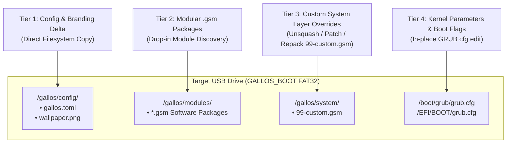
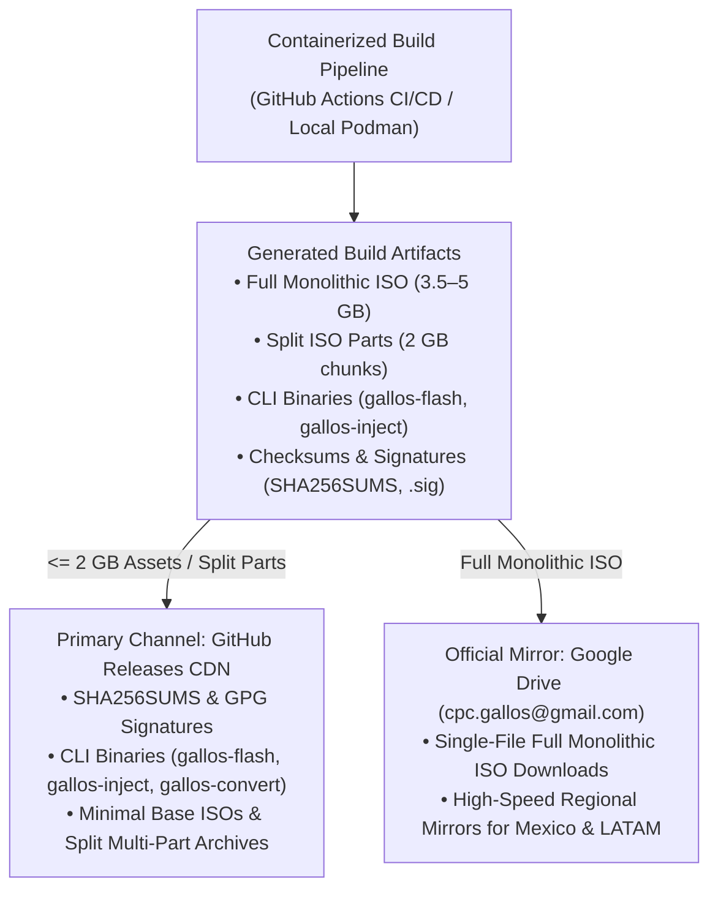

# Containerized Build Pipeline (`build.toml`)

GallosOS is designed to be **100% reproducible and infrastructure-agnostic**. To achieve this, the entire ISO generation process is isolated inside a **Podman/Docker Container Build System** (`gallos-builder`).

This approach completely eliminates host OS pollution and allows developers to build GallosOS on Linux, macOS, or Windows (via WSL2) without installing tools like `debootstrap`, `mksquashfs`, or `xorriso` on their local machines.

---

## 1. The Holy Trinity of GallosOS Configurations

GallosOS separates concerns across three distinct TOML configuration files:

| Config File | Phase | Description | Web UI? |
| :--- | :--- | :--- | :--- |
| **`build.toml`** | **Build-Time** | Used by the `gallos-builder` container to generate a custom ISO (strip blobs, inject apt packages). | ❌ No |
| **`gallos.toml`** | **Run-Time** | The global contest rules, branding, and mode logic (`Contest`/`Event`/`Default`). | ✅ **Yes (Config Builder)** |
| **`machine.toml`** | **Run-Time** | The physical identity of the specific workstation (Seat ID, Static IP). | ❌ No (Local Script) |

---

## 2. Declarative ISO Generation (`build.toml`)

Rather than maintaining fragile Bash scripts with hardcoded `apt-get` commands, organizers feed a `build.toml` manifest into the container pipeline. This defines exactly what gets baked into the immutable `rootfs.squashfs` before the ISO is stitched together.

### Example `build.toml` Blueprint

```toml
[build]
base_os = "ubuntu-24.04-minimal"
kernel = "linux-generic-hwe-24.04"
target_arch = "amd64"
bootstrap_method = "debootstrap"  # or "tarball" — see § 2.2
apt_mirror = "auto"               # or an explicit mirror URL — see § 2.2

[optimization]
# Strip down the OS to save RAM and USB space for Tier 0 (low-resource) environments
strip_man_pages = true
strip_docs = true
remove_apt_cache = true
locales = ["en_US.UTF-8", "es_MX.UTF-8"]

[packages]
# Base packages permanently baked into the rootfs (No .gsm required)
preinstall_apt = [
    "curl",
    "git",
    "python3-pip",
    "valgrind",
    "gdb"
]

[modules]
# Which GallosOS Software Modules (.gsm) to pre-bundle into the final ISO's /gallos/software/ directory
bundle = [
    "langs/gcc",
    "langs/openjdk",
    "programming/vscodium",
    "programming/vim",
    "tools/foot"
]

[security]
# Static build-time security posture (docs/ANTI_CHEAT_AND_SECURITY.md §3)
disable_ipv6 = true
judge_ips = ["192.168.50.10"]
venue_controller_ip = "192.168.50.1"
local_dns_ip = "192.168.1.1"
telemetry_dns_blacklist = [
    "1.1.1.1", "1.0.0.1", "8.8.8.8", "8.8.4.4",
    "9.9.9.9", "9.9.9.10", "149.112.112.10", "149.112.112.112",
]
blocked_tcp_ports = [22, 853]
allow_usb_storage = false
```

### 2.1 `base_os` Version Tiers

`base_os` is not hardcoded to `ubuntu-24.04-minimal` — it is the pipeline's default and the only version the upstream GallosOS maintainer builds and tests against. See `docs/ARCHITECTURE.md` § 3.1 for the full maintainer-tested-vs-community-supported tier table (`ubuntu-22.04-minimal`, `ubuntu-26.04-minimal`, and interim non-LTS releases are architecturally supported but not upstream-validated). Pair a non-default `base_os` with a matching `kernel = "linux-generic-hwe-<version>"` when targeting newer hardware than the chosen release ships by default.

### 2.2 `bootstrap_method` and `apt_mirror` (Stage 1 source)

`bootstrap_method` picks how Stage 1 builds the base rootfs:

- **`"debootstrap"` (default):** runs `debootstrap` live inside the container against `apt_mirror`. This is the default specifically because mirror flexibility genuinely exists at this layer — Canonical's apt archive is broadly mirrored (see `launchpad.net/ubuntu/+cdmirrors` for the official list) and the same mirror choice also serves Stage 2's package installs, since `debootstrap` configures the target's `sources.list` to match.
- **`"tarball"`:** imports Canonical's official `ubuntu-base-<version>-base-amd64.tar.gz` snapshot (published at `cdimage.ubuntu.com/ubuntu-base/releases/`) from `.cache/base-images/`, verified against its `SHA256SUMS`/`SHA256SUMS.gpg`. This tarball is itself Canonical's own `debootstrap` output, republished as a pinned artifact — useful for fully offline builds or maximum build-to-build reproducibility (a fixed snapshot rather than whatever the mirror serves today). Its tradeoff: unlike the apt archive, this tarball is **effectively single-source** — checked during this pipeline's development, a real community mirror that does carry Ubuntu's `ubuntu-releases` (full ISO) tree returned 404 for the `ubuntu-base` tree, so no broad mirror network exists for it. No official BitTorrent distribution exists for it either (`cdimage.ubuntu.com/ubuntu-base/` has no `.torrent` files — only the full Desktop/Server ISOs at `releases.ubuntu.com` get those).

`apt_mirror` controls which apt mirror `debootstrap` (and Stage 2's `apt-get`) use:

- **`"auto"` (default):** tries an ordered fallback list of independently-verified mirrors (`build/scripts/lib-mirrors.sh`), first reachable one wins.
- **An explicit URL** (e.g. `"http://us.archive.ubuntu.com/ubuntu/"`): pins one mirror. If it's unreachable the build fails with a clear error rather than silently substituting another — an organizer who names a specific mirror (e.g. an internal proxy) should get a clear signal, not a silent swap.

`debootstrap`'s own default only writes a bare `main`-component, no-pockets `sources.list` line — no `restricted`/`universe`/`multiverse`, and no `-updates`/`-backports`/`-security`. The pipeline overwrites it after bootstrapping with all four components across `$SUITE`, `$SUITE-updates`, and `$SUITE-backports` on the chosen `apt_mirror`, plus `$SUITE-security` pinned to `security.ubuntu.com` specifically (not the general mirror — community mirrors don't reliably mirror the security pocket promptly; this matches Canonical's own convention).

### 2.3 Build-Time Caching and I/O

**What's cached today.** The only build-speed cache in the pipeline is `.cache/base-images/`, described in §2.2 above — it applies exclusively to `bootstrap_method = "tarball"`. Nothing else in the pipeline is cached across runs:

- **No apt-package cache.** `build/scripts/01-bootstrap.sh` deletes and recreates `$ROOTFS` (`rm -rf "$ROOTFS"`) at the start of every run, so Stage 2's `apt-get install` re-downloads every package from `apt_mirror` on every `make iso` invocation.
- **No container layer caching of ISO contents.** Stages 1–5 execute as `podman run` invocations of shell scripts against a bind-mounted host directory (`build/Makefile`: `-v $(REPO_ROOT):/repo:Z`), not `RUN` instructions in a Containerfile — so ordinary Docker/Podman image-layer caching doesn't apply to them. Layer caching only benefits rebuilds of the separate `gallos-builder` tool image (`build/Containerfile`, the container that *holds* `debootstrap`/`mksquashfs`/`xorriso`), which is unrelated to what ends up on the ISO.
- **No BuildKit cache mounts.** The pipeline uses plain `podman build`/`podman run`, not `docker buildx`, so `--mount type=cache` syntax isn't applicable here.

Don't confuse this with the `optimization.remove_apt_cache` flag (§2 above, applied in Stage 4 / `build/scripts/04-optimize.sh`): that purges `/var/cache/apt/archives` and `/var/lib/apt/lists/*` at the *end* of the pipeline to shrink the shipped ISO's disk footprint — it's a size optimization for the output image, not a build-speed cache.

**Optional build-host tmpfs for I/O.** This section describes a *build-host* tmpfs — RAM-backed storage on the machine running `make iso` — which is unrelated to the *runtime* tmpfs documented in `docs/ARCHITECTURE.md` § 4, item 3 (the ephemeral OverlayFS upper layer inside the *booted* live ISO). The two share a name but nothing else; see that section if you came here from there.

`build/output/` (holding `rootfs/` and `staging/`, per `build/scripts/run-pipeline.sh`) lives under the same host bind mount as the rest of the repo, so every file write across Stages 1–5 lands on whatever filesystem backs that path on the host. Stage 5a's `mksquashfs` call (`build/scripts/build-squashfs.sh`) is the most I/O-concentrated single step — it reads the entire `$ROOTFS` tree and writes one large compressed archive.

An operator with spare RAM can point `build/output/` at a tmpfs before invoking `make iso`, with no pipeline changes required — for example:

```sh
sudo mount -t tmpfs -o size=8G tmpfs build/output/
```

(or bind a `/dev/shm`-backed directory there instead). Rootfs population (Stages 2–4) and squashing (Stage 5a) are disk-I/O-bound operations — reading/writing many files, then one large archive — so routing them through RAM instead of a disk-backed filesystem removes that disk round-trip. No speedup is claimed here; this is architectural reasoning about where the I/O goes, not a benchmarked result.

Caveats: `size=8G` is not a spec, just headroom above one observed data point — an `icpc.toml` run on this machine produced a ~1.4 GB rootfs and ~1 GB of staging output (`$STAGING/casper/filesystem.squashfs` alone was ~900 MB), so `build/output/` needs roughly 2.5 GB free plus room for the final ISO; a profile pulling in more `.gsm` modules or `[optimization]` settings will need more. Re-check with `du -sh build/output` against your own profile rather than assuming this figure holds. tmpfs contents don't survive a reboot or unmount, so this is a purely transient build accelerant, not a substitute for `.cache/base-images/`'s cross-run persistence. This is a manual, opt-in host-level step; nothing in `build.toml`, the `Makefile`, or the pipeline scripts currently detects, requires, or automates it.

---

## 3. The 5-Stage Container Pipeline (`Makefile` / `Containerfile`)

When a developer runs `make iso CONFIG=profiles/icpc.toml`, the container executes the following stages internally:

### Stage 1: Base Bootstrap (`debootstrap` or `ubuntu-base` tarball)

Controlled by `build.toml`'s `bootstrap_method` (§ 2.2). By default the container runs `debootstrap` against `apt_mirror` (`"auto"` picks the first reachable mirror from an ordered fallback list — `build/scripts/lib-mirrors.sh`). Setting `bootstrap_method = "tarball"` instead imports Canonical's official `ubuntu-base-<version>-base-amd64.tar.gz` rootfs snapshot from `.cache/base-images/`, verified against its `SHA256SUMS`/`SHA256SUMS.gpg` before extraction — useful for offline builds or maximum reproducibility, at the cost of that artifact being effectively single-source (§ 2.2 has the details). Either path establishes the basic directory structure and populates `/dev`, `/proc`, and `/sys` for chrooting.

### Stage 2: Provisioning (`chroot`)

The builder enters the chroot environment and:

1. Installs the Linux kernel, casper live boot machinery, and system utilities.
2. Parses `build.toml` $\to$ `[packages]` and executes `apt-get install -y <packages>`.
3. Copies the Wayland kiosk desktop overlay `build/desktop/` verbatim into the rootfs (`/etc/xdg/{labwc,waybar,foot,mako}`, `/etc/profile.d/gallos-kiosk.sh`, the `/usr/bin/gallos-*` helper scripts, `/usr/share/gallos/apps.list`), seeds `/etc/skel/workspace`, and generates the three mode wallpapers with `build/scripts/gen-wallpapers.py` (Python stdlib only, no binary asset in git) — see [`docs/WAYLAND_DESKTOP.md`](./WAYLAND_DESKTOP.md) and [`build/desktop/README.md`](../build/desktop/README.md).
4. Injects the GallosOS casper-bottom hook (`55gallos-live`) and patches casper for `.gsm` module mounting, then installs `gallos-daemon` and `gallos-ctl`.

### Stage 3: Security Lockdown & Resource Hardening (`chroot`)

Enforces the static Zero-Trust contest security posture defined in `[security]`:

1. Installs and enables `nftables` with a default-DROP IPv4-only firewall ruleset whitelisting judge IPs and dropping telemetry DNS.
2. Disables IPv6 via `/etc/sysctl.d/99-gallos-noipv6.conf` and kernel bootcmd parameters.
3. Locks down USB mass-storage via modern Polkit JavaScript rules (`/etc/polkit-1/rules.d/99-gallos-usb-block.rules`) and Udev fallback rules.
4. Configures and enables the `earlyoom` daemon with `-n` D-Bus notification support.
5. Locks down virtual terminal switching (TTY1–6) via `logind.conf.d`, masking `autovt@.service`, and loading a stripped console keymap.
6. Hardens contestant privileges by purging `sudo` and locking the `root` account.

### Stage 4: Stripping & Optimization

To keep the Live OS memory footprint minimal (Crucial for `toram` boot):

1. Parses `build.toml` $\to$ `[optimization]`.
2. Deletes unused locales via `locale-gen`.
3. Purges `/usr/share/doc`, `/usr/share/man`, and `/var/cache/apt/archives`.

### Stage 5: Squash & Stitch (`mksquashfs` & `xorriso`)

1. **Stage 5a (Squash):** Compresses the entire optimized rootfs into `filesystem.squashfs` (using `zstd` for high-speed decompression in RAM).
2. **Stage 5b (ISO):** Sets up the GRUB bootloader for UEFI and Legacy BIOS with `ipv6.disable=1` and uses `xorriso` to output the final hybrid bootable image: `gallosos-<profile>-amd64.iso` (profile-derived from the `CONFIG` `build.toml` filename, e.g. `gallosos-icpc-amd64.iso`). Copying `[modules]` `.gsm` bundles from `build.toml` onto the ISO's `/gallos/modules/` directory is not yet wired into `build-iso.sh` — the `.gsm` *mounting mechanism* (this stage's casper-side counterpart) is implemented per ROADMAP.md Phase 1, but populating an ISO with real bundled modules at build time is separate, still-open work.

---

## 3.1 Shell Script Validation

The pipeline's orchestration scripts (`build/scripts/*.sh`) are expected to pass [`shellcheck`](https://www.shellcheck.net/) before merge — run `shellcheck build/scripts/*.sh` locally, or `shellcheck -x build/scripts/*.sh` to also follow the `# shellcheck source=` directives in `01-bootstrap.sh`, `02-provision.sh`, `03-harden.sh`, and `04-optimize.sh` into their sourced libs (`lib-mirrors.sh`, `lib-chroot.sh`). The same requirement applies to the in-band desktop helpers the pipeline ships (`build/desktop/usr/bin/gallos-*`, `build/desktop/etc/profile.d/gallos-kiosk.sh`, `build/desktop/etc/xdg/labwc/autostart`), and `scripts/validate_desktop.py` additionally checks the labwc XML, the Waybar JSONC and that every keybind target is shipped. This is now enforced automatically: `.github/workflows/ci.yml` runs ShellCheck against both sets and the desktop validator on every push/PR to `main`, and `.pre-commit-config.yaml` runs ShellCheck on every local commit. See [`docs/DEVELOPMENT.md`](./DEVELOPMENT.md) for the full lint/test/CI pipeline, including the Python (`ruff`/`pytest`) checks that apply to `daemon/` rather than to these build scripts.

---

## 4. MOK Signing Key Persistence (Optional Proprietary Kernel Modules)

The `drivers/nvidia-proprietary` `.gsm` module (see `docs/HARDWARE_COMPATIBILITY.md` § 1.3) carries a DKMS-built, out-of-tree kernel module, which requires a Machine Owner Key (MOK) signature to load under SecureBoot. Because organizers enroll that MOK **once per physical machine** (a venue-setup step, not a per-boot one), the signing key itself must stay stable across ISO rebuilds — a rotated key would silently invalidate every previously-enrolled machine's trust.

- `gallos-builder` generates the MOK signing keypair once (outside of any single `make iso` invocation) and persists it as a pipeline secret, reusing it to sign the `nvidia-dkms` module on every subsequent build.
- Each release ships the corresponding public certificate alongside the ISO so organizers can run `mokutil --import` during venue setup.
- This key is independent of, and unrelated to, Canonical's `shim`/kernel signing keys described in `docs/HARDWARE_COMPATIBILITY.md` § 1.2 — those cover the stock boot chain; the MOK covers only the opt-in proprietary module.

---

## 5. In-Place USB Delta Updates & Layer Injection (`gallos-inject`)

While `gallos-flash` is engineered for the initial mass provisioning of raw USB drives across large workstation fleets, organizers frequently need to make minor contest adjustments (e.g. updating contest schedules, changing whitelisted URLs, swapping event wallpapers, adding an offline IDE extension, or adjusting GPU kernel flags) on **already-flashed USB drives**.

Re-flashing an entire 4.5–6.0 GB raw disk image just to update a few kilobytes of configuration introduces massive unnecessary I/O, wears down USB NAND flash cells, and wipes any existing user `event-data` partition.

Inspired by the battle-tested injection scripts developed during production deployments in [`CPC-GALLOS/icpc-gpm-uaa-huronos`](https://github.com/CPC-GALLOS/icpc-gpm-uaa-huronos), GallosOS formalizes **`gallos-inject`** as an official organizer CLI tool for in-place, non-destructive delta updates.

### 5.1 The 4-Tier Delta Injection Model



1. **Tier 1: Configuration & Branding Delta (`gallos.toml` & Wallpapers)**
   - **Mechanism:** Direct filesystem write to `/gallos/config/gallos.toml` and `/gallos/config/wallpaper.png` on the FAT32 `GALLOS_BOOT` partition.
   - **I/O Scope:** Kilobytes of plain text/image data.
   - **Advantage:** No SquashFS repacking or chroot operations invoked.

2. **Tier 2: Modular Software Package Management (`/gallos/modules/*.gsm`)**
   - **Mechanism:** Standalone SquashFS packages. The early-boot initramfs dynamically stacks all `.gsm` modules present in `/gallos/modules/` into the live OverlayFS stack.
   - **I/O Scope:** Limited to the size of the added or replaced `.gsm` package (e.g. `programming-vsc-cph.gsm`).
   - **Advantage:** Adds compilers or IDE extensions without modifying the core `rootfs.squashfs` base image.

3. **Tier 3: Custom System Layer Overrides (`99-custom.gsm`)**
   - **Mechanism:** Reserved at the top of the OverlayFS layer stack. `gallos-inject` extracts `99-custom.gsm`, applies arbitrary files/scripts (e.g. emergency `udev` rules, custom dotfiles, offline deb packages, or driver quirks), recompresses it via `mksquashfs`, and updates `checksums.sha256`.
   - **I/O Scope:** Scoped exclusively to the lightweight override layer.
   - **Advantage:** Leaves the base OS completely untouched while permitting deep system tailoring.

4. **Tier 4: Bootloader & Kernel Tuning**
   - **Mechanism:** Modifies `/boot/grub/grub.cfg` and `/EFI/BOOT/grub.cfg` on the FAT32 partition.
   - **I/O Scope:** Kilobytes of configuration text.
   - **Advantage:** Toggles `toram` execution, adjust boot timeouts, or append hardware quirks (e.g. `nomodeset`, `nouveau.modeset=0`) in-place.

### 5.2 `gallos-inject` CLI Usage & Workflows

```bash
# Update runtime configuration without touching OS binaries:
gallos-inject --config examples/icpc-onsite.toml /dev/sdb1

# Replace event wallpaper:
gallos-inject --wallpaper assets/icpc-gpm-2026.png /dev/sdb1

# Inject an offline software module (.gsm):
gallos-inject --add-module build/modules/programming-vsc-cph.gsm /dev/sdb1

# Apply a folder of system-level custom overrides into 99-custom.gsm:
gallos-inject --custom-layer ./custom-lab-overrides/ /dev/sdb1

# Multi-target batch mode: Auto-detect all mounted GALLOS_BOOT drives and update in parallel:
gallos-inject --all-drives --config icpc-date3.toml --wallpaper gpm-wallpaper.png
```

---

## 6. Release Artifact Distribution & Mirror Architecture

Official GallosOS release images and organizer utilities are deployed across a dual-channel distribution topology engineered for high availability and zero-bottleneck global downloads:

### 6.1 GitHub Releases & File Size Boundaries

* **GitHub Release Asset Limit (2 GB):** GitHub enforces a hard limit of 2,000 MB (2 GB) per single uploaded file asset.
* **Competitive Programming ISO Footprint:** A comprehensive contest image containing full compiler toolchains (GCC 14, Clang 18, OpenJDK 21, Python 3.12, Rust), offline IDE suites (VSCodium, JetBrains IntelliJ/CLion CE), and offline DevDocs bundles typically exceeds 2.5–4.5 GB in size.

### 6.2 Dual-Channel Distribution Strategy



1. **Primary Release Channel (GitHub Releases CDN):**
   * **Scope:** Hosts release tags, changelogs, cryptographic checksums (`SHA256SUMS`), GPG signature files (`.sig`), standalone CLI binaries (`gallos-flash`, `gallos-inject`, `gallos-convert`), and minimal base ISOs.
   * **Multi-Part Delivery for Large Images:** Monolithic images distributed through GitHub Releases are pre-split into multi-part 2,000 MB chunks (e.g., `gallos-os-24.04-amd64.iso.001`, `gallos-os-24.04-amd64.iso.002`) alongside an automated concatenation helper script (`cat gallos-os-*.iso.* > gallos-os.iso`).

2. **Official Monolithic Mirror (Google Drive via `cpc.gallos@gmail.com`):**
   * **Scope:** Managed directly by the CPC-GALLOS organization (`cpc.gallos@gmail.com`) to host full-sized, single-file monolithic `.iso` images without file splitting.
   * **Advantage:** Provides a single-click, direct download path for tournament organizers and university lab administrators across Mexico and Latin America, eliminating multi-part reassembly steps prior to flashing.

