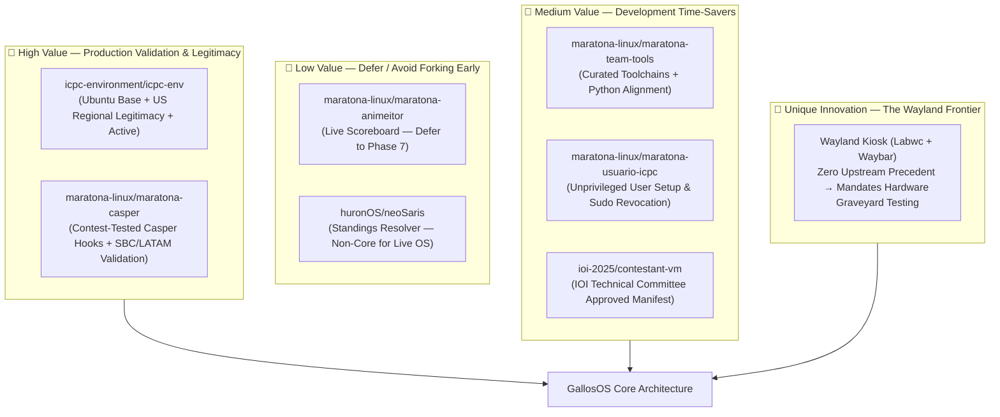

# Comparative Analysis: GallosOS vs. Global Competitive Programming Distributions & Environments

This document provides a comparative analysis between **GallosOS** (evaluated as an architectural design specification) and the leading competitive programming distributions, official ICPC championship environments, and Olympiad setups worldwide: **HuronOS**, **Maratona Linux**, **NOI Linux 2.0 (China CCF)**, **ICPC World Finals / PacNW**, **ICPC Asia Yokohama**, **ICPC Europe (SWERC/NWERC)**, **IOI Contestant-VM**, and **European Olympiads (EGOI/CEOI/BOI)**.

> [!NOTE]
> **Methodology & Status Disclosure:**
> All reference systems and production contest images analyzed below were examined directly via binary inspection, disk image mounting (`.iso`, `.img.gz`, `.ova`/`.vmdk`), and official source code analysis. Comparisons with GallosOS describe its **target architectural design and modular specification**, not empirical physical hardware benchmarks.

---

## 1. Master Matrix: Live Distributions & Core Operating Systems

| Architectural Feature | **HuronOS** | **Maratona Linux** | **GallosOS (Target Design)** |
| :--- | :--- | :--- | :--- |
| **Target Ecosystem** | OMI, TCMX, ICPC Gran Premio | ICPC Latin America (SBC/BOCA) | **Universal (ICPC, IOI, Camps, Clubs)** |
| **Primary Deployment** | Live USB (AUFS + `.hsl`/`.hsm`) | Ubuntu PPA Meta-Packages | **Live USB (OverlayFS + `.gsm`) + VMs (`.ova`/`.qcow2`) + PXE** |
| **Base Operating System** | Debian 11 Minimal (AUFS Kernel) | Ubuntu 22.04 LTS (PPA) | **Ubuntu 24.04 LTS Minimal Base**¹ |
| **Base Download Mirrors** | Custom hosting (`mirrors.huronos.org`) | Canonical Global Mirrors | **Canonical Mirrors + GitHub CDN** |
| **Build Pipeline** | Custom `sysforge` scripts | Debian `.deb` package builds | **Podman/Docker + CI/CD** |
| **Display Server / DE** | X11 / Budgie Desktop | X11 / Ubuntu Desktop | **Wayland / Labwc + Waybar (Kiosk)** |
| **Execution Modes** | `Contest > Event > Always` | Single static mode | **`Contest > Event > Default` (Formalized)** |
| **Configuration Format** | Legacy `.hdf` (INI format) | Package config files | **Native TOML (`gallos.toml`)** |
| **Anti-Cheat & Integrity** | Domain IP mapping (`AllowedWebsites`) | `maratona-firewall` (`iptables`) | **nftables Kernel Drop + AI Extension Purge** |
| **Fleet Management** | Remote `.hdf` polling (`hsync`) | None (local workstation) | **Remote TOML Ingestion (HTTP/LAN) + Optional Prometheus** |
| **IDE & Tooling Suite** | VS Code, CLion, IntelliJ (`.hsm`) | VS Code, CLion, IDEA (PPA) | **VSCodium + JetBrains CE (`.gsm`) + CPH/Companion** |
| **Mass USB Flashing** | Single `install.sh` (extlinux) | Manual `dd` / Etcher | **Parallel Flasher (`gallos-flash`)** |
| **Translation & Offline Docs** | Crow Translate (online-only) | `dictd` + FreeDict / doc packages | **Dual-Mode (`dictd` FreeDict Offline + API Whitelist) + DevDocs** |
| **WSL2 / Windows Flashing** | None (Linux-only scripts) | None | **Native WSL2 + `usbipd-win` + Flasher** |

¹ The upstream maintainer builds and tests only against Ubuntu 24.04 LTS. `base_os` is a build-time `build.toml` field — organizers may target `ubuntu-22.04-minimal`, `ubuntu-26.04-minimal`, or an interim non-LTS release via Track 2, but these alternates are architecturally supported, not maintainer-validated (see `docs/ARCHITECTURE.md` §3.1).

---

## 2. Specialized Matrix: ICPC Official Contest Environments

This matrix compares the official environments deployed across major ICPC regionals and championships:

| Feature / Metric | **ICPC World Finals / PacNW (`pac2025...img.gz`)** | **ICPC Asia Yokohama (`icpc-trial...iso`)** | **ICPC Europe (SWERC / NWERC)** | **ICPC Latin America (Maratona Linux)** | **GallosOS (Target Design)** |
| :--- | :--- | :--- | :--- | :--- | :--- |
| **Image Format** | Raw Disk Image (`.img.gz`, 7.9 GB) | Automated Subiquity ISO (8.4 GB) | Workstation Setup / Trial `.ova` | Debian PPA Repository | **Modular Live USB + VMs (`.ova`/`.qcow2`) + PXE** |
| **Deploy Model** | 10–15 min per USB (`dd`) | 15–20 min disk wipe & install | Varies by host venue | Manual package install | **Live RAM boot without host disk installation** |
| **Judging System** | Kattis / DOMjudge | DOMjudge (Asia Pacific) | DOMjudge Live Scoreboard | BOCA / DOMjudge | **Universal (BOCA, DOMjudge, OmegaUp, Codeforces, etc.)** |
| **Resource Limits** | Unrestricted / OS defaults | Cgroups v2 (`MemoryMax=4G`, `CPUQuota=600%`) | DOMjudge *isolate* sandbox on server | Unrestricted on workstation | **EarlyOOM (`-n`) + `systembus-notify` + `limits.conf`** |
| **Anti-Cheat Controls** | Static domain whitelisting | Explicit policy (bans ML full-line plugins) | Isolated contest LAN | `maratona-firewall` | **Kernel drop + IDE plugin strip + Sub-URL browser lock** |
| **Fleet Monitoring** | WireGuard + Grafana (`icpc-env`) | Prometheus `node-exporter` + `icpc-exporter` | Centralized venue monitoring | Local machine only | **Local LAN Prometheus (`gallos-exporter`) / Venue Controller** |
| **First-Boot Setup** | CloudContest Setup Wizard | Pre-baked cloud-init `user-data` | Pre-configured image | Manual account setup | **Declarative `gallos.toml` + Wizard** |
| **Practice Resets** | `Clear Team Account` session | Re-install image | Local home wipe scripts | Manual user cleanup | **Automated `Event -> Contest` state transition** |

---

## 3. Specialized Matrix: National & International Olympiads (IOI / EGOI / CEOI / NOI)

This matrix compares the environments engineered for national and international computer science olympiads:

| Dimension | **IOI Contestant-VM (`ioi-2025-v0.2.ova`)** | **EGOI European VM (`egoi23-vm-20230708.ova`)** | **NOI Linux 2.0 (China CCF)** | **GallosOS** |
| :--- | :--- | :--- | :--- | :--- |
| **Format** | Virtual Appliance (`.ova`, 4.5 GB) | Virtual Appliance (`.ova`, 5.65 GB / 50 GB VMDK) | Hybrid ISO / Virtual Appliance (3.63 GB) | **Multi-target (Live USB, `.ova`, `.qcow2`, PXE)** |
| **Base OS** | Ubuntu 24.04 Server | Debian 11.7 "Bullseye" (Kernel 5.10.0-20) | Ubuntu 20.04.1 LTS (Kernel 5.4) | **Ubuntu 24.04 LTS (Kernel 6.8+)**¹ |
| **Primary Judge** | CMS (Contest Management System) | CMS / Kattis | Lemonlime / Arbiter / CCF Judge | **CMS + Kattis + DOMjudge + BOCA** |
| **Anti-Cheating & Audit** | `logkeys` keylogger + `take_screenshot.py` | `ffmpeg` x11grab (4 fps) + `restic` S3 backup + GNOME extension (`egoiusername`) | Disconnected physical LAN | **Process isolation (Wayland) + Audit hooks** |
| **Network Lock** | `misc/iptables.save` (Default DROP) | `ufw` dynamic daemon (`/opt/egoi/egoi_conf.py`) | Air-gapped venue switches | **Kernel `nftables` Drop + Local Proxy** |
| **Desktop Protocol** | X11 / GNOME (`gdm3` contest lock) | X11 / GNOME Shell 3.38.6 + `gdm3` | X11 / GNOME Flashback 3.36 | **Wayland (Labwc + Waybar)** |
| **Offline Docs** | `cppreference` HTML in `/usr/share/doc` | `cppreference` in `/opt/documentation/cpp` | DevHelp + localized docs | **Offline DevDocs daemon (`127.0.0.1:9292`)** |
| **Languages** | C++20 (version pinned in editor config; Python 3 and Java present but unversioned upstream) | C++20 (GCC 10.2 / Clang 11.0), Python 3.9, PyPy3 7.3 | C++14/17/20, C, Python, Free Pascal | **Full ICPC/IOI Matrix (C++, Java, Python, Kotlin, Rust)** |
| **IDEs & Editors** | VS Code, Eclipse, Geany, Neovim (also Atom, Sublime Text, emacs, kate, kdevelop) | VS Code 1.80, Code::Blocks 20.03, Geany 1.37, Kate, Emacs 27, Vim 8.2 | VS Code 1.57, Code::Blocks, Geany, Vim, Sublime | **VSCodium, JetBrains CE, Geany, Neovim, CPH** |

¹ Maintainer-tested default only — see footnote 1 in §1 above and `docs/ARCHITECTURE.md` §3.1 for the community-supported `base_os` alternatives.

*Note: EGOI 2026 (European Girls' Olympiad in Informatics) officially retired Code::Blocks from its workstation specifications ("this year CodeBlocks will not be available on the contest machines, and we will not accept any requests to make it available" - egoi2026.it), accelerating the international transition toward modern editors (VSCodium, CLion, Geany, Neovim).*

---

## 4. Deep Dive: HuronOS

### Context & Real-World Deployments

HuronOS was originally conceived and deployed for three major competitive programming pillars in Mexico:

1. **Olimpiada Mexicana de Informática (OMI):** The designated national competition selecting the Mexican delegation for the **IOI (International Olympiad in Informatics)**.
2. **Training Camp Mexico (TCMX):** The official ICPC training camp in Mexico where daily cycles alternate between morning instruction (with persistent files) and afternoon simulated contests (with isolated, clean workspaces and post-contest upsolving).
3. **ICPC "Gran Premio de México":** Synchronized multi-location regional qualifying dates across major universities (BUAP, UNAM, IPN, ITESM, UANL, UDG, etc.).

### HuronOS Binary Anatomy (`huronOS-alpha-0.4-amd64.iso`)

Inspection of the official `huronOS-alpha-0.4-amd64.iso` binary image reveals the following architectural blueprint:

1. **Modular SquashFS System Layers (`.hsl`)**:
   - `01-base.hsl`: Debian minimal base system.
   - `02-firmware.hsl`: Wireless and hardware firmware blobs.
   - `03-budgie.hsl`: Solus Budgie Desktop Environment over X11.
   - `04-shared-libs.hsl`: Shared GUI and compilation runtime libraries.
   - `05-custom.hsl`: Custom configuration overrides.
   - (Layer sizes are not published in HuronOS's own documentation and are omitted here rather than estimated.)
2. **Modular Software Packages (`.hsm`)**:
   - 38 independent SquashFS modules across four categories per HuronOS's own software-modules directive documentation: `internet/` (chromium, firefox, crow, among others), `langs/` (gcc, g++, javac, dotnet, mono, pypy3, python3, ruby, among others), `programming/` (IntelliJ, Rider, PyCharm, VS Code + offline extensions, Eclipse, Code::Blocks, Geany, gvim/vim, Atom, emacs, gedit, joe, kdevelop, Sublime, Kate), and `tools/` (byobu, konsole, make, midnight-commander).
3. **Boot Chain (`install.sh`)**:
   - The installer image root contains `boot/`, `checksums/`, `EFI/`, `huronOS/` (the `.hsl`/`.hsm` payload), `install.sh`, and `utils/`, using `extlinux`/EFI boot per HuronOS's own installation documentation. (The specific partition-label scheme used internally by `install.sh` is not documented upstream and is not restated here to avoid inventing detail.)
4. **Kernel & Union Filesystem**:
   - Relies on a custom-patched Linux kernel with **AUFS** (AnotherUnionFS) support — HuronOS credits AUFS maintainer Junjiro Okajima directly — rather than in-tree OverlayFS. (The exact kernel version is not confirmed in HuronOS's own documentation and is omitted here rather than guessed.)

### HuronOS Key Strengths

- **Modular SquashFS Modules (`.hsm`):** Separates system base from compilers and heavy IDEs.
- **Dynamic 3-Tier Precedence:** Elegant model distinguishing `Contest`, `Event`, and `Always` execution modes.
- **Automated Mode Transitions & Fleet Management:** Switches wallpapers, software availability, and firewall rules dynamically based on contest start/end time via `hsync.service` and `happly.service`. HuronOS pioneered the hybrid configuration concept by first parsing a local `directives.hdf` file on the USB FAT32 partition during early boot (enabling offline white-labeling), and subsequently polling a `SyncServer` URL in the background once the network connects to apply live contest updates.
- **Post-Contest Archival:** Packages contestant data into `/home/contestant/contest-YYYYMMDDTHH-MM-SS` upon contest completion.

### HuronOS Critical Limitations & Bottlenecks

1. **Deprecated Union Filesystem (AUFS vs OverlayFS):** HuronOS relies on AUFS, an unmerged third-party patch set that requires building and maintaining custom Linux kernels. Modern Linux distributions have standardized on in-tree **OverlayFS**.
2. **Unsandboxed Display Server (X11 vs Wayland):** HuronOS runs Solus Budgie over legacy X11. While X11 allows administrative proctoring scripts (like screenshots or keyloggers) to run with ease, its lack of per-client input/output isolation means any unprivileged student process or background script can also capture other windows or intercept keystrokes without restriction.
3. **Installer Fragility:** The installation script (`install-huronos.sh`) relies on extlinux and requires repeated manual `sync` commands to prevent filesystem corruption on USB drives.
4. **Online-Dependent Translation:** Crow Translate is bundled without offline bilingual dictionary databases, meaning translation fails when the firewall isolates the network.
5. **Mirror Bottleneck:** HuronOS distributes custom monolithic ISO images from limited custom host servers (`mirrors.huronos.org` / `archive.huronos.org`).
6. **Project Stagnation & Incomplete Documentation:** Upstream development stalled after version Alpha 0.4 (2023–2024). **12 documentation pages** across its official repository are left as near-empty `TODO: Write doc` stubs (6–28 words each):
   - `internals/execution-modes.md`
   - `internals/firewall-manager.md`
   - `internals/multi-layered-persistence.md`
   - `internals/software-modules.md`
   - `internals/sync-manager.md`
   - `internals/system-layers.md`
   - `development/curret-goals.md`
   - `development/how-to-contribute.md`
   - `development/release-system.md`
   - `start/collaboration.md`
   - `start/using-for-training-camps.md`
   - `start/why-huronOS.md`

   Two further pages carry an internal `TODO` note but are not empty — `development/building-manually.md` has real build instructions and `about/the-team.md` has real team content pending review.

### Why GallosOS as a New OS Instead of Forking/Maintaining HuronOS?

Maintaining or patching HuronOS directly was unviable because its architectural foundations required a ground-up redesign:

1. **Kernel Modernization:** Replacing the unmaintained AUFS kernel patch set with standard **OverlayFS** on modern Ubuntu LTS kernels.
2. **Display Protocol & Process Isolation:** Moving from X11/Budgie to **Wayland (Labwc + Waybar)** to isolate unprivileged processes, while implementing dedicated, privileged system hooks for official administrative proctoring (screen auditing / logging).
3. **Declarative Architecture:** Replacing the untyped legacy `.hdf` INI format with canonical **TOML (`gallos.toml`)** validated by JSON Schema and supported by a GUI builder (GallosOS Config Builder).
4. **Containerized Reproducible Builds:** Eliminating host-polluting manual Debian builds in favor of **OCI Podman/Docker containerized ISO generation** capable of running anywhere (Linux, macOS, Windows WSL2).
5. **Multi-USB Parallel Tooling:** Replacing fragile interactive bash `extlinux` installation scripts with a dedicated parallel mass flashing tool (**`gallos-flash`**).

### GallosOS Architectural Design & Differentiation

- **Native OverlayFS on Standard Kernel:** Standard in-tree **OverlayFS** on **Ubuntu 24.04 LTS**, eliminating out-of-tree kernel builds.
- **Process-Isolated Wayland Desktop:** **Labwc + Waybar Kiosk Session (Wayland)**, providing process-level window and input isolation while supporting privileged administrative auditing.
- **Type-Safe Directives Engine:** Canonical **TOML (`gallos.toml`)** and JSON schema validation.
- **Parallel Multi-Target Flasher (`gallos-flash`):** Concurrent multi-USB writing with WSL2 + `usbipd-win` support.
- **Bundled Offline Docs & Translation DBs:** Pre-bundles DevDocs and Crow bilingual dictionaries for 100% offline air-gapped contests.

---

## 5. Deep Dive: Maratona Linux

Inspection of the official **`maratona-linux/maratona-linux`** super-repository and its 13 submodules (`maratona-firewall`, `maratona-team-tools`, `maratona-usuario-icpc`, `maratona-meta`, `maratona-kairos`, `maratona-fancy-tools`, `maratona-submission`, etc.) reveals the exact architecture and design principles of the official Brazilian and Latin American ICPC environment:

### Package Architecture & Source Code Anatomy

1. **Meta-Package & Desktop Structure (`maratona-meta`):**
   - **`maratona-desktop`:** The primary meta-package converting standard Ubuntu 22.04 LTS into the contest station. Depends on `maratona-firewall`, `maratona-usuario-icpc`, `maratona-fancy-tools`, and `maratona-background`.
   - **`maratona-conflitos`:** Enforces security constraints by hard-purging `snapd` (avoiding background auto-updates and unconfined snaps), disabling Ubuntu desktop notifications, hiding user lists from GDM, and blocking outbound SSH for the contest user.
   - **`maratona-desktop-latam`:** Installs an offline **`dictd`** daemon (`dict-freedict-eng-por`, `dict-freedict-eng-spa`) paired with `gnome-dictionary` for air-gapped bilingual translation.
2. **Toolchain & IDE Ecosystem (`maratona-team-tools`):**
   - **Languages (`maratona-linguagens`):** GCC/G++, OpenJDK 21 (`openjdk-21-jdk`), Python 3, PyPy3, and **Kotlin 2.1.0**.
   - **Offline Documentation (`maratona-linguagens-doc`):** Bundles offline `cppreference-doc-en-html`, `openjdk-21-doc`, `python3-doc`, `manpages-dev`, and `maratona-kotlin-doc` (offline Kotlin 2.1.0 PDF manual).
   - **IDEs (`maratona-editores-external`):** Packages Microsoft Visual Studio Code 1.98.2, JetBrains CLion 2024.3.4, IntelliJ IDEA Community 2024.3.4.1, and PyCharm Community 2024.3.3.
   - **VS Code Extensions (`maratona-vscode-extensions`):** Pre-bundles offline `.vsix` packages: `vscode-cpptools` 1.23.6, `redhat.java` 1.40, `vscode-java-debug` 0.58, `vscjava.vscode-java-dependency`, `fwcd.kotlin` 0.2.34, `formulahendry.code-runner` 0.12.2, `ms-python.python` 2025.0, and `vscodevim.vim` 1.29.0.
3. **Firewall & Network Lockdown (`maratona-firewall`):**
   - Utilizes `ufw` under the hood (`maratona-firewall-configuration.sh`) to reset rules and enforce `ufw default deny incoming`, `ufw default deny outgoing`, and `ufw default deny routed`.
   - Dynamically parses `/etc/maratona-firewall/hosts/*` and `/usr/share/maratona-firewall/hosts/*` (e.g. `boca.localdomain`), creating static `/etc/hosts` mappings and punching holes (`ufw allow out proto tcp/udp to "$IP"`) exclusively for BOCA judge instances.
4. **User & Workspace Lifecycle (`maratona-usuario-icpc`):**
   - Manages the unprivileged `icpc` user (`uid` in `users` group, process limit `icpc hard nproc 1024` in `limits.conf`).
   - Ships **`zera-home-icpc`**: Administrative cleanup script executed after warm-up practice. It places `/etc/nologin`, deletes all icpc-owned files across mounted volumes and `/home/icpc`, restores IDE configuration skeletons from `/usr/share/maratona-usuario-icpc/editores-config/`, and re-marks desktop shortcuts as trusted (`gio set ... metadata::trusted true`).
5. **Time Synchronization (`maratona-kairos`):**
   - Configures **`chrony`** with Latin American NTP sources with NTS support (`*.ntp.br`, `gps.ntp.br`, `nutellaboot.naquadah.com.br`).
6. **Contestant Wait Screen (`maratona-fancy-tools`):**
   - GTK3/GJS + WebKit2GTK application (`maratona-wait`) locking the screen with a "waiting for contest start" splash before competition hours.

### Maratona Linux Key Strengths

- **Official ICPC Latin America Standard:** Perfectly matches the BOCA judge workflow and regional operational rules.
- **Complete Offline Documentation & Tooling:** Packages full HTML/PDF docs for C++, Java 21, Python 3, and Kotlin 2.1.0, plus offline `dictd` translation.
- **Strict User Sanitization:** `zera-home-icpc` provides a well-tested reset sequence for multi-stage events.

### Maratona Linux Limitations

- **Not a Live Bootable ISO:** Distributed strictly as Ubuntu PPA packages (`ppa:icpc-latam/maratona-linux`), requiring an existing Ubuntu installation and manual package management.
- **Static Firewall (Requires Root Reconfiguration):** Changing judge IPs requires modifying `/etc/maratona-firewall/hosts/` and running `sudo dpkg-reconfigure maratona-firewall` as root on every workstation.
- **X11 Display Server:** Uses standard GNOME on X11 without Wayland's process-level screen/keystroke isolation.
- **No Dynamic Mode Scheduling:** Cannot automatically transition through Warm-up $\to$ Contest $\to$ Upsolving via a declarative time specification.

### How GallosOS Unifies and Elevates Maratona Linux

- **Native Live ISO / OverlayFS:** GallosOS encapsulates the entire Maratona package ecosystem into an immutable, fast-booting Live USB with ephemeral RAM overlays, eliminating the need to install or modify local OS partitions.
- **Declarative TOML Profile ([`maratona-sbc.toml`](../examples/maratona-sbc.toml)):** Provides a drop-in profile implementing Maratona's toolchains (GCC 14, Java 21, Kotlin 2.1, Python 3.12, PyPy3, VSCodium, CLion, Byobu) and BOCA firewall rules declaratively.
- **Modern Kernel Filtering (`nftables`):** Replaces `ufw`/`iptables` scripts with dynamic, kernel-level `nftables` sets that update instantly without package reconfigurations.
- **Process Isolation:** Runs under **Wayland (Labwc + Waybar)**, closing X11 security holes while preserving full terminal and IDE capabilities.

---

## 6. Deep Dive: ICPC Production Images (PacNW, Yokohama, CloudContest)

To ensure real-world architectural parity with actual 2024–2025 championship deployments, the conceptual design of GallosOS was evaluated directly against the verified production images used in international regionals and world finals:

### A. ICPC Pacific Northwest / World Finals Baseline (`pac2025-2025-11-11_image-amd64.img.gz`)

- **Reference:** [PacNW Build Instructions](https://image.icpc.global/pac2025/ImageBuildInstructions.html)
- **Format & Size:** Raw Disk Image (`.img.gz`, 7.9 GB compressed, ~8.4 GB raw).
- **Deployment Strategy:** Written directly to USB 3.2 flash drives via `dd`, Rufus, or Balena Etcher, or cloned onto internal hard drives using Clonezilla Live (`device-to-device`, `-k1` proportional partition table).
- **Key Characteristics:**
  - Standard user account `team:contest`.
  - Full suite of contest IDEs (CLion, VS Code, IntelliJ, Eclipse, Code::Blocks).
  - Machine-ID stripping (`echo -n > /etc/machine-id`) prior to mass duplication.
- **GallosOS Architectural Design & Differentiation:** GallosOS avoids the large monolithic raw image size and sequential disk writing by designing modular SquashFS layers (`.gsm`) and ephemeral RAM OverlayFS booting, paired with parallel multi-drive writing via `gallos-flash`.

### B. ICPC Asia Yokohama Regional 2025 (`icpc-trial-2025yokohama-20251128.iso`)

- **Reference:** [ICPC Yokohama System Trial Image](https://icpc.jp/2025/regional/environment/system-trial-image/)
- **Format & Size:** Automated Ubuntu 24.04 Installer ISO (8.4 GB hybrid ISO).
- **Deployment Strategy:** Subiquity/Curtin automated installation (`autoinstall ds=nocloud-net;s=file:///cdrom/`) that installs Ubuntu directly to the target machine disk with custom post-install scripts (`late-commands-common.sh`).
- **Key Characteristics:**
  - **LightDM over GDM/Wayland:** Replaces GDM3 and purges Wayland desktop entries, configuring LightDM with `greeter-hide-users=true` and `allow-guest=false`.
  - **Resource Cgroups v2 Containment:** Injects `systemd-run --user --scope -p MemoryMax=4G -p MemorySwapMax=3G -p CPUQuota=600%` into desktop launcher `.desktop` files (CodeBlocks, Emacs, Geany, Gvim, Kate, GNOME Terminal) to prevent runaway memory leaks.
  - **Prometheus Exporters:** Bundles `node-exporter` and custom `icpc-exporter` services.
  - **Anti-Cheat Policy:** Explicitly disallows ML-assisted code completion plugins (e.g. JetBrains "Full Line Code Completion").
  - **SSH Lockdown:** Disallows contestant SSH execution via `chmod o-rx /usr/bin/ssh`.
- **GallosOS Architectural Design & Differentiation:** Rather than requiring automated installation to wipe and overwrite the host machine's internal disk, GallosOS is designed to boot directly into RAM as an immutable Live OS without modifying the host storage, while utilizing a process-isolated **Wayland compositor (Labwc)** instead of legacy X11.

### C. ICPC CloudContest Admin & Wizard Suite (`environment.cloudcontest.org`)

- **Reference:** [ICPC Contest Environment Guide](http://environment.cloudcontest.org/guide/)
- **Key Characteristics:**
  - **First-Boot Setup Wizard:** Fetches team identity (Team ID, Name, Affiliation) and assigns printers (IPP Everywhere, PS, PCL) dynamically from site servers.
  - **Administrative Control (`icpcadmin`):** Dedicated admin desktop with *Reconfigure System*, *Factory Reset*, *Wipe Team Account*, and *Self Test* utilities.
  - **Post-Practice Round Cleaner:** Dedicated `Clear Team Account` greeter session that clears contestant state before the official scoring contest.
- **GallosOS Architectural Design & Differentiation:** GallosOS formalizes this workflow into its declarative **`gallos.toml` engine** and 3-tier mode hierarchy ($\text{Contest} \succ \text{Event} \succ \text{Default}$), automating the transitions between Practice Round, Wipe, and Live Contest without requiring manual administrator visits to every workstation.

---

## 7. Deep Dive: NOI Linux 2.0 (China Computer Federation)

- **Official Release Announcement:** [CCF NOI Linux 2.0 Release Notice (2021-07-16)](https://www.noi.cn/gynoi/jsgz/2021-07-16/732450.shtml)
- **Official User Guide:** [CCF NOI Linux 2.0 User Manual](https://www.noi.cn/gynoi/jsgz/2021-07-16/732451.shtml)
- **Direct Official ISO Download:** [https://noiresources.ccf.org.cn/download/ubuntu-noi-v2.0.iso](https://noiresources.ccf.org.cn/download/ubuntu-noi-v2.0.iso)
- **Image Checksum & Binary Metadata:**
  - Image size: **3.63 GB ISO** (`3,631,218,688` bytes), MD5 `22e405e0142f994268f0fde467ef5b39`.
  - Base OS: **Ubuntu 20.04.1 LTS "Focal Fossa"** (`.disk/info: 20200731`, ISO build timestamp `2021-07-06 22:47 UTC`).
  - Active status: Official, mandatory standard for all CCF competitive events (NOI, NOIP, CSP-J/S) through 2024–2026.
- **Binary Inspection Stack (`casper/filesystem.manifest`):**
  - **Desktop Environment:** Standard monolithic **GNOME Shell 3.36.3** (`ubuntu-desktop` 1.450.1) on legacy **X11** (`xserver-xorg` 1.20.8). Lacks lightweight UI or process-level isolation.
  - **Compilers & Runtimes:**
    - C/C++: **GCC / G++ 9.3.0** (`9.3.0-17ubuntu1~20.04`)
    - Pascal: **Free Pascal FPC 3.0.4** (`3.0.4+dfsg-23`)
    - Python: **Python 3.8.10** (`python3.8`) and legacy **Python 2.7.18**
  - **IDEs & Code Editors:**
    - **Visual Studio Code:** Official Microsoft build `code 1.57.0` (ships with standard Microsoft telemetry and cloud login enabled by default).
    - **Code::Blocks:** `20.03-3` with `codeblocks-contrib`.
    - **Sublime Text:** Version `4107` (Sublime Text 4).
    - **Geany:** Version `1.36` bundled with 40+ plugins (`geany-plugins`).
    - **Vim / Emacs:** `vim 8.1.2269` and `emacs 26.3`.
- **Architectural Bottlenecks & Missing Features:**
  - **No Live Fleet Management:** Static monolithic image designed for manual local installation via `ubiquity`. Lacks remote configuration sync (`.toml` or `.hdf`).
  - **No Runtime Mode Hierarchy:** Does not distinguish between instruction/warm-up and contest lockdown modes.
  - **No AI / Telemetry Stripping:** Bundles standard Microsoft VS Code without removing telemetry or cloud endpoints.
  - **Resource Heavy:** Running full GNOME 3.36 on live media requires significantly more memory compared to a dedicated lightweight Wayland kiosk stack (Labwc + Waybar).
- **GallosOS Architectural Design & Differentiation:** GallosOS supports full Chinese NOI compiler toolchains (GCC 9-14, FPC) while providing an immutable live USB overlay without hard drive installation, minimal desktop shell overhead, and kernel-level default-DROP firewall isolation (blocking external AI services and unauthorized internet traffic by design).

---

## 8. Deep Dive: International & European Olympiads (IOI, EGOI, CEOI, BOI)

### A. IOI Contestant-VM Standard (`ioi-2025-v0.2.ova`)

- **Reference:** [IOI 2025 Contestant-VM](https://github.com/ioi-2025/contestant-vm)
- **Target Ecosystem:** International Olympiad in Informatics (IOI), Central European Olympiad in Informatics (CEOI), Baltic Olympiad in Informatics (BOI).
- **Deployment Format:** Virtual Appliance (`.ova`, ~4.5 GB) paired with **CMS** or **Kattis**.
- **Key Characteristics:**
  - **Strict Kernel Firewall (`iptables` DROP):** Allows outgoing traffic strictly to the CMS contest server, venue NTP, and central backup endpoints.
  - **Proctoring & Audit Automation:** On-demand desktop screenshots via the GNOME Shell D-Bus screenshot API (`take_screenshot.py`), an automated keylogger (`logkeys`), and 5-minute incremental backups (`ioibackup.sh`).
  - **Offline VSIX & Docs:** Bundled offline extensions for VS Code / VSCodium and localized `cppreference` documentation.

### B. EGOI European Olympiad Appliance (`egoi23-vm-20230708.ova`, 5.65 GB OVA / 50 GB VMDK)

Binary and filesystem inspection of the official **EGOI 2023 Contestant VM** (`egoi23-vm-20230708.ova`, built `2023-07-08`) reveals the production engineering architecture used in European Olympiad championships:

1. **System & Desktop Architecture:**
   - **Base OS:** Debian 11.7 "Bullseye" (`Linux 5.10.0-20-amd64`).
   - **Desktop Environment:** GNOME Shell 3.38.6 over legacy **X11** with `gdm3`.
   - **Contestant Indicator Extension (`egoiusername@egoi.ch`):** Custom GNOME Shell panel extension rendering a live status label in the top bar: `• EGOI: <username> (vm <vmid>)`, displaying an active red dot indicator whenever screen recording is in progress.
2. **Surveillance & Continuous Screen Capture (`/opt/egoi/recording.py`):**
   - Spawns background systemd service (`egoi-recording.service`) using `ffmpeg` with the `x11grab` input device (`ffmpeg -video_size WxH -framerate 4 -f x11grab -i :0.0 egoi.mp4`).
   - Requires disabling X11 security isolation via `xhost +local:` to allow background capture of the contestant session.
   - Automatically uploads MP4 videos upon contest completion to cloud object storage (S3 presigned PUT URLs) via `egoi_client.py`.
3. **Automated Incremental Code Backups (`/opt/egoi/restic_backup.py`):**
   - Utilizes **`restic`** 0.11.0 to create periodic deduplicated snapshots of `/home/egoi` directly to an S3 bucket (`s3:backup_endpoint/bucket/prefix`).
   - Filters out non-source files (`.cache`, `.vscode`, `.pycharm`, `.mozilla`) and files exceeding 128 KB (`--exclude-larger-than 128K`).
   - Provides a CLI utility (`egoi backup-restore [latest|id]`) enabling contestants to self-restore accidentally deleted source files to `/home/egoi/restored-backup`.
4. **Dynamic Firewall & Configuration Ingestion (`/opt/egoi/egoi_conf.py`):**
   - Background daemon polls the central server (`https://vm23.egoi.schmidb.ch/vm/ping`) every 60 seconds.
   - When a new version is detected, it executes `ufw reset`, sets `ufw default deny incoming/outgoing`, and iterates over the dynamic firewall rules array to unblock judge endpoints.
   - Rewrites `/etc/hosts`, updates Firefox policies (`/usr/lib/firefox-esr/distribution/policies.json`), and updates `/usr/share/applications/egoi-grader.desktop` on the fly.
5. **Compiler & IDE Stack:**
   - **Compilers:** GCC 10.2.1 (`gcc-10`, `g++-10`), Clang 11.0.1 (`clang-11`), Python 3.9.2, and PyPy3 7.3.5.
   - **Editors:** Official VS Code 1.80.0, Code::Blocks 20.03 (retired in EGOI 2026), Geany 1.37.1, Kate 20.12, Gedit 3.38, Emacs 27.1, and Vim 8.2 (GTK3).
   - **Offline Documentation:** Bundled locally in `/opt/documentation/cpp` (cppreference).

### C. GallosOS Architectural Synthesis vs. Olympiad Appliances

- **Multi-Target Deployment (Live USB + Bare Metal + VM):** While IOI/EGOI VMs run strictly inside virtualizers (requiring host OS installation and allocating 8 GB RAM per virtual guest), GallosOS is designed to boot directly on bare-metal hardware via immutable Live USB as well as virtual appliances (`.ova`, `.qcow2`), avoiding host-guest virtualization overhead during compilation while supporting air-gapped environments.
- **Modern Kernel Isolation (Wayland vs. X11 xhost):** Replaces legacy X11 screen-grabbing (`xhost +local:` / `x11grab`) with native **Wayland process isolation**, allowing secure administrative compositor screencasts without exposing window snooping vulnerabilities to unprivileged student processes.
- **Declarative Directives Architecture (TOML vs. Custom Python Daemons):** Replaces custom monolithic Python pollers with a memory-safe daemon (`gallos-daemon`) governed by typed `gallos.toml` directives and JSON Schema validation.

---

## 9. Specialized Analysis: ICPC World Finals & NAC SysOps Fleet Orchestration (`icpcsysops/ansible`)

- **Repository Reference:** [`icpcsysops/ansible`](https://github.com/icpcsysops/ansible)
- **Maintainers & Scope:** Developed and maintained by the ICPC Systems Operations team for managing infrastructure at the **ICPC World Finals** (*WF 2023 Luxor, WF 2024 Astana, WF 2026 Dubai*) and **ICPC North America Championship** (*NAC 2026 Florida*).
- **Target Ecosystem:** High-density, networked Tier 3 and Tier 4 championship arenas with 150–300+ live contestant workstations, dedicated judging clusters, presentation screens, live television broadcast streaming, automated balloon printing, and redundant contest servers.

### 9.1 Anatomy & Production Blueprint of `icpcsysops/ansible`

Source and playbook inspection of the `icpcsysops/ansible` infrastructure tree reveals how the ICPC SysOps committee orchestrates World Finals arenas:

1. **High-Concurrency Fleet Management (`ansible.cfg` & `fast-ansible`):**
   - Configures `forks = 275` and `strategy = free`, allowing Ansible to execute tasks asynchronously across hundreds of contestant machines without being serialized by slow individual nodes.
   - Provides `fast-ansible` and `fast-ansible-playbook` wrapper scripts stripping callback and action plugins to minimize execution overhead during time-critical contest transitions.
2. **Automated Inventory Generation (`script/build_hosts`):**
   - Dynamically constructs `hosts.yml` for championship topologies:
     - 155+ contestant laptops (`team1` .. `team155`).
     - 15 human judges and 20+ autojudges (partitioned across **PC^2**, **DOMjudge**, and **Kattis**).
     - Dedicated server roles: `cds` (Contest Data Server on WebSphere Liberty / `wlp.CDS`), `backup` (SSH CA, DHCP/DNS via `dnsmasq`, Borg/rsync backup watchdog, central syslog, script server), `packages` (local APT cache & Prometheus exporter), `scoreboard`, `printsrv` / `authprint` (CUPS print servers), `reverseproxy`, and `coachviews`.
3. **Hardware Tuning & Execution Determinism (`roles/tunecpulaptop` & `roles/taskset_run_scripts`):**
   - **Disables Dynamic CPU Boosting:** Deploys `disable-turbo-laptop` to enforce `intel_pstate/no_turbo=1` (Intel) or `cpufreq/boost=0` (AMD) and sets `scaling_governor=performance`.
   - **Disables HyperThreading Sibling Threads:** Disables virtual sibling hyperthreads (e.g. `echo 0 > /sys/devices/system/cpu/cpu4/online`) to eliminate CPU cache and pipeline contention.
   - **Process Affinity Pinning:** Injects `taskset -c <taskset_cpu>` into language runner scripts (`runc`, `runcpp`, `runpython3`, `runjava`, `runkotlin`), **designed to reduce run-to-run runtime variance** across contestant laptops (see `docs/HARDWARE_COMPATIBILITY.md` §1 on residual turbo-boost/thermal variance this does not fully eliminate).
4. **Strict Network & Telemetry Filtering (`roles/iptablesrules`):**
   - Deploys granular `iptables` / `nftables` rules:
     - Hard-rejects IDE telemetry & hardcoded DNS queries: blocks JetBrains DNS lookups (`9.9.9.10`, `149.112.112.10`) and public DNS bypasses (`1.1.1.1`, `8.8.8.8`).
     - Rejects broadcast and multicast clutter: NetBIOS (`udp/137`), Apple Bonjour / mDNS (`udp/5353`), UPnP / SSDP (`udp/3702`), and CUPS SNMP discovery.
     - Selectively allows CCS endpoints (DOMjudge/PC^2), CDS ports, package mirrors, CUPS printing (`tcp/631`), Prometheus node exporters (`tcp/9100`), Syslog (`udp/514`), and SSH from the management subnet (`10.3.3.208/29`).
     - Logs rejected packets with rate-limiting (`drop-n-log`: `limit 5/m burst 7`).
5. **Hostname/Path-Level Judge Traffic Filtering (`roles/reverseproxy`):**
   - Beyond plain IP-based `nftables` rules, a dedicated `reverseproxy` host role rewrites contestant `/etc/hosts` so specific whitelisted judge/CDN domains (e.g. `nac22.kattis.com`, `domjudge.nac.icpc.global`, plus a curated allowlist of CDN asset paths for fonts and JS libraries the scoreboard needs) resolve to the proxy instead of the real internet. The proxy (nginx, TLS-terminating) forwards only enumerated `location` paths per domain to the real backend — genuine hostname- and path-level filtering that IP allowlisting alone cannot provide, the same class of fix as `icpc-env`'s Squid `ssl_bump` approach (§10.1) but independently implemented.
   - The example inventory (`hosts.yml.example`) also reserves a dedicated **`squidserver`** host with its own static IP alongside `cds`/`backup`/`packages`/`scoreboard`, confirming Squid is part of the real production fleet — though the role/playbook that configures it is not present in the tree available for inspection here, so its exact behavior (full TLS interception vs. a plain forward proxy) cannot be confirmed from source.
6. **Real-Time Video Broadcast Infrastructure (`roles/mediamtx` & `roles/vlc`):**
   - Integrates **MediaMTX** (RTSP, WebRTC, and Low-Latency HLS) paired with hardware-accelerated `ffmpeg` via Intel Quick Sync Video (`intel-media-va-driver-non-free` / `mjpeg_qsv`, `h264_qsv`).
   - Captures contestant desktop screens (`x11grab` at 30 fps) and webcams (`/dev/video*` via `v4l2`) on demand, streaming low-latency feeds directly to the ICPC Live broadcast production room.
7. **Auditing, Proctoring & Telemetry (`roles/martkeys` & `roles/team` `s.py`):**
   - **`martkeys`:** Go-based background binary logging hardware-level keystroke events into structured JSON logs for audit trails.
   - **`s.py`:** Active window surveillance script extracting the foreground window title, WM class, and child process hierarchy (e.g. detecting `vim` inside `gnome-terminal`) via `xprop` and `/proc/<pid>/task/<pid>/children`.
   - **Centralized Metrics:** Prometheus `node_exporter` + Grafana dashboards tracking workstation metrics across the entire arena in real time.
8. **Contest Lifecycle & Rapid Disaster Recovery (`do_contest_template.yml`, `reimage.sh`, `recovery.sh`):**
   - **Workspace Preparation:** Wipes `/home`, generates hashed credentials per team from `linux_accounts.yaml`, and unarchives contest sample archives (`files/{{ contest }}-samples.zip`) into `/etc/skel/Desktop/samps`.
   - **Codeforces Challenge Phase:** `enable_challenge.yml` dynamically adjusts firewall rules, updates `resolved.conf`, deletes DOMjudge shortcuts, and deploys `open-tests.tar.gz`.
   - **Rapid Re-imaging & Backup Recovery:** `reimage.sh` dynamically detects the PXE boot entry via `efibootmgr` and triggers a network boot reboot; `recovery.sh` locates the latest non-empty per-team zip backup under `/backups/data/<date>/` on the backup server and prints the `scp` command for an operator to run against the replaced team machine (an advisory step, not an automated push).

---

### 9.2 Master Comparison: Ansible Fleet Orchestration vs. GallosOS Declarative Immutable Architecture

| Feature / Dimension | **ICPC SysOps (`icpcsysops/ansible`)** | **GallosOS (Target Architecture)** |
| :--- | :--- | :--- |
| **System Philosophy** | **Mutable Network Configuration Management:** Assumes target machines are already running an installed Linux OS, mutating files on disk over SSH. | **Immutable Declarative Operating System:** Base OS is a read-only SquashFS container; changes live in RAM (OverlayFS); configured via typed `gallos.toml`. |
| **Primary Deployment Context** | **Tier 3 / Tier 4 Arenas:** High-end on-site World Finals / NAC with dedicated servers, static subnets, and a team of sysadmins. | **Tier 0 through Tier 4 (Universal):** Autonomous Live USBs for air-gapped rooms, training camps, regionals, and scalable to centralized Venue Controllers. |
| **Infrastructure Prerequisites** | Requires pre-installed OS on SSDs or PXE/FOG network boot, static IPs, Python interpreter on target, and pre-distributed SSH CA keys. | **Zero Infrastructure Needed:** Runs directly from a USB stick without installing to internal hard drives or requiring external network servers. |
| **Configuration State & Drift** | Vulnerable to partial play failures or network dropouts leaving some workstations in an inconsistent intermediate state (*configuration drift*). | **Bit-for-Bit Identical & Drift-Free:** Every boot guarantees 100% state consistency. A reboot purges all temporary RAM modifications. |
| **Runtime Mode Scheduling** | Manual execution of playbooks by sysadmins (`do_contest_template.yml`, `enable_challenge.yml`, `lock_teams.yml`). | **Autonomous Declarative Scheduling:** Transitions through `Default` $\to$ `Event` $\to$ `Contest` automatically based on ISO 8601 timestamps in `gallos.toml`. |
| **Display Protocol & Security** | Legacy **X11** (GNOME Flashback / LightDM). Uses `xprop` for inspection and `x11grab` for streaming (subject to X11 security leakage). | **Wayland (Labwc + Waybar):** Modern compositor with process-level window/input isolation; secure compositor-level screencasting. |
| **Anti-Cheat Enforcement** | Host-based `iptables` scripts + policykit rules + custom background auditing daemons (`martkeys`, `s.py`). | Kernel-level `nftables` Default-DROP + AI extension purge + Chromium/Firefox enterprise URL policy + process isolation. |
| **Ad-Hoc Live Patching** | **Outstanding:** Sysadmins can push ad-hoc Bash scripts or configuration overrides live to 200 machines simultaneously via SSH. | **Tier 3/4 Integration:** Built-in Python 3 and OpenSSH enable the Venue Controller to run Ansible plays over GallosOS nodes if ad-hoc orchestration is desired. |

---

### 9.3 Architectural Synthesis: Best Practices Borrowed into GallosOS

The examination of `icpcsysops/ansible` provides crucial real-world sysadmin patterns that GallosOS directly formalizes into its specifications:

1. **Deterministic CPU Execution & Thermal Throttling Prevention:**
   - GallosOS incorporates CPU governor stabilization (`governor = "performance"`) and dynamic turbo boost disabling (`intel_pstate/no_turbo=1`, `cpufreq/boost=0`) into its hardware specification ([`docs/HARDWARE_COMPATIBILITY.md`](./HARDWARE_COMPATIBILITY.md)), designed to reduce how much local algorithmic benchmarks are distorted by laptop frequency scaling or thermal throttling — residual variance from sustained thermal throttling and other host noise is not eliminated.
   - Core affinity pinning via `taskset` is specified for offline execution wrappers (`runc`, `runcpp`, `runpython3`, `runjava`).
2. **Granular Telemetry & DNS Sinkhole Filtering:**
   - GallosOS's `nftables` engine incorporates the ICPC SysOps blacklist: hard-dropping IDE-embedded DNS resolvers (e.g. JetBrains `9.9.9.10`), mDNS/Bonjour broadcast spam (`5353`), and NetBIOS chatter, paired with rate-limited kernel audit logging ([`docs/ANTI_CHEAT_AND_SECURITY.md`](./ANTI_CHEAT_AND_SECURITY.md)).
3. **Forensic Audit & Process Monitoring Subsystems:**
   - The auditing architecture in GallosOS borrows the concepts of `martkeys` (keystroke journaling) and `s.py` (process hierarchy and active window monitoring) as opt-in audit plugins managed cleanly by `gallos-daemon` during official Olympiad and Championship modes.
4. **Venue Controller Fleet Integration (Tier 3 / Tier 4):**
   - For large-scale events where organizers manage hundreds of workstations from a central Venue Controller, GallosOS acts as a hardened, immutable client node. Because GallosOS includes Python 3, OpenSSH, and systemd out of the box, organizers can utilize Ansible from the Venue Controller for live ad-hoc intervention while relying on GallosOS's immutable OverlayFS for resilient boot behavior.

---

## 10. Strategic Upstream Heritage, Fork Candidates & Production Legitimacy Matrix

When evaluating existing open-source competitive programming systems for GallosOS, the guiding strategic criterion is **not merely "what code saves an hour of scripting"**, but **"which upstream fork or collaboration lends proven, real-world production legitimacy and credibility with tournament organizers"**.

The following matrix categorizes potential upstream projects across the global competitive programming ecosystem by production legitimacy, technical alignment, and strategic development priority:



---

### 10.1 🥇 High Value — Inheriting Real Production Validation

These repositories provide both immediate technical acceleration and high narrative legitimacy when presenting GallosOS to ICPC regional directors, national olympiad committees, and university organizers:

1. **[`icpc-environment/icpc-env`](https://github.com/icpc-environment/icpc-env) (Primary Architectural Peer):**
   - **Ecosystem Grounding:** Its own README identifies it as the build tooling for the **ICPC Southeast Regional** contestant image (distinct from the PacNW image covered separately in §6.A).
   - **Technical Coherence:** Like GallosOS, it is built directly on **Ubuntu LTS** (20.04/22.04 variants, unlike HuronOS's Debian 11 base). Its package curation, compiler dependencies, and toolchain configurations port almost directly into `build.toml`.
   - **Strategic Legitimacy:** Engaging with or referencing `icpc-env` connects GallosOS directly to established ICPC regional standards, offering far stronger institutional credibility than positioning the project merely as a local successor to a national olympiad tool.

2. **[`maratona-linux/maratona-casper`](https://github.com/maratona-linux/maratona-casper) (Contest-Specific Casper Hook Package):**
   - **Ecosystem Grounding:** A small, contest-tested Casper initramfs hook package from **Maratona Linux**, used across university sites throughout the **ICPC South America / Brazilian Finals (SBC)**.
   - **Technical Coherence:** GallosOS explicitly uses **Casper** as its live-boot foundation ([`docs/BUILD_SYSTEM.md`](./BUILD_SYSTEM.md)). Its single hook script (`55maratona-fixes`) runs after casper's standard root-mount stage and handles contest-specific fixups: cleaning up a leftover snapd overlay directory, bootstrapping the `icpc` home directory with a `.clean-home` marker, and — when `factoryreset`/`mlinstall` kernel cmdline flags are set — chrooting in to trigger factory-reset/install scripts before reboot. It does not itself implement partition mounting or tmpfs overlay binding; those remain standard Casper behavior that GallosOS still needs to design independently.
   - **Strategic Value:** As a small, working example of contest-specific Casper hooks rather than rebuilding boot-time fixups from scratch, it is a useful reference for GallosOS's own hook scripts even though the core OverlayFS integration work remains GallosOS's own to do.

---

### 10.2 🥈 Medium Value — Development Time-Savers & Reference Manifests

These projects offer well-tested software lists, user permission configs, and package specifications that save development time without carrying a major narrative weight:

1. **[`maratona-linux/maratona-team-tools`](https://github.com/maratona-linux/maratona-team-tools):**
   - Written in Python (matching `gallos-daemon`'s in-band language requirement).
   - Provides a curated, tournament-tested package list of compilers, IDE configurations, and offline documentation that serves as an excellent starting point for the `[modules]` section of `build.toml`.

2. **[`maratona-linux/maratona-usuario-icpc`](https://github.com/maratona-linux/maratona-usuario-icpc):**
   - Implements robust, unprivileged user provisioning, stripping `sudo`, locking `polkit` privileges, and configuring auto-login sessions.
   - Directly accelerates the **Phase 2: TTY & Privilege Hardening** milestone.

3. **[`ioi-2025/contestant-vm`](https://github.com/ioi-2025/contestant-vm) (IOI Technical Committee Annual Manifests):**
   - Rather than maintaining a centralized static organization, the IOI Technical Committee releases annual repositories (e.g. `ioi-2023/contestant-vm`, `ioi-2025/contestant-vm`), with `ioi-2025` representing the current baseline.
   - While the VM infrastructure itself differs from GallosOS's Live USB architecture, the software manifest represents the **gold standard approved by the IOI Technical Committee**.
   - Serves as the canonical reference for exact compiler versions, flags, and editor plugins whenever targeting IOI and national olympiad profiles (`examples/ioi-cms.toml`).

4. **[`icpcsysops/devdocs`](https://github.com/icpcsysops/devdocs) (Production Precedent for Offline Docs):**
   - A fork of upstream [`freeCodeCamp/devdocs`](https://github.com/freeCodeCamp/devdocs) maintained by the same ICPC Systems Operations team behind `icpcsysops/ansible` (§9), actively pushed as recently as **2026-08-20**.
   - Real production precedent for running **DevDocs** as the offline documentation backend at ICPC World Finals/NAC scale — a direct reference for wiring GallosOS's own `Offline DevDocs daemon (127.0.0.1:9292)` (§1/§2 matrices) and its theme customization, rather than starting from vanilla upstream `devdocs`.

---

### 10.3 🥉 Low Value — Defer or Avoid Forking Early

Components that represent secondary features or auxiliary presentation tools should not be forked during early phases to keep engineering focused on the core contestant workstation:

1. **[`maratona-linux/maratona-animeitor`](https://github.com/maratona-linux/maratona-animeitor) (Live Scoreboard Display):**
   - While Python-based and active, it is an auditorium projection tool rather than a contestant OS component. Should only be evaluated if building out the Phase 7 Venue Controller dashboard.
2. **[`huronOS/neoSaris`](https://github.com/huronOS/neoSaris) (Scoreboard Freeze Resolver):**
   - A standalone web/presentation tool. Non-core for the live operating system image; defer until post-GA.

---

### 10.4 The Honest Reality Check: What No Fork Solves (The Wayland Frontier)

> [!IMPORTANT]
> **No existing competitive programming distribution has implemented a Wayland Kiosk desktop.**
>
> Every historical and active distribution in the competitive programming ecosystem—**HuronOS (Budgie/X11)**, **Maratona Linux (Ubuntu Desktop/X11)**, **ICPC-Env (XFCE/X11)**, **NOI Linux 2.0 (GNOME Flashback/X11)**, and **IOI Contestant-VM (GNOME/X11)**—operates entirely on legacy X11.

GallosOS's lightweight Wayland desktop (**Labwc + Waybar**) is the project's **signature technical innovation**, delivering:

- Strict per-client process isolation (preventing window snooping and unauthorized screen captures).
- Ultra-low memory and CPU footprint for low-spec venue hardware.
- Native compositor-level screencasting and auditing.

**Engineering Implication:** Because this Wayland kiosk environment has zero historical precedent in contest production, it cannot rely on inherited upstream validation. It is the component that most critically mandates the **Hardware Graveyard Test**—comprehensive empirical validation across legacy Intel HD Graphics, AMD Radeon, and NVIDIA Nouveau hardware to guarantee universal display compatibility on competition day.

---

### 10.5 Recommended Engineering & Collaboration Strategy

```text
Step 1: Technical Bootstrapping (Immediate)
  ↳ Fork and adapt maratona-linux/maratona-casper for contest-specific Casper live-boot hooks.
  ↳ Low technical risk, actively maintained, and battle-tested in LATAM.

Step 2: Upstream Community Engagement (Parallel)
  ↳ Open dialogue with the icpc-environment/icpc-env maintainers.
  ↳ Align package manifests and explore shared compiler/toolchain profiles for ICPC regionals.

Step 3: Rigorous Hardware Graveyard Validation (Phase 1–2)
  ↳ Focus intensive display and input testing on the Labwc/Waybar Wayland stack across legacy GPUs.
```
