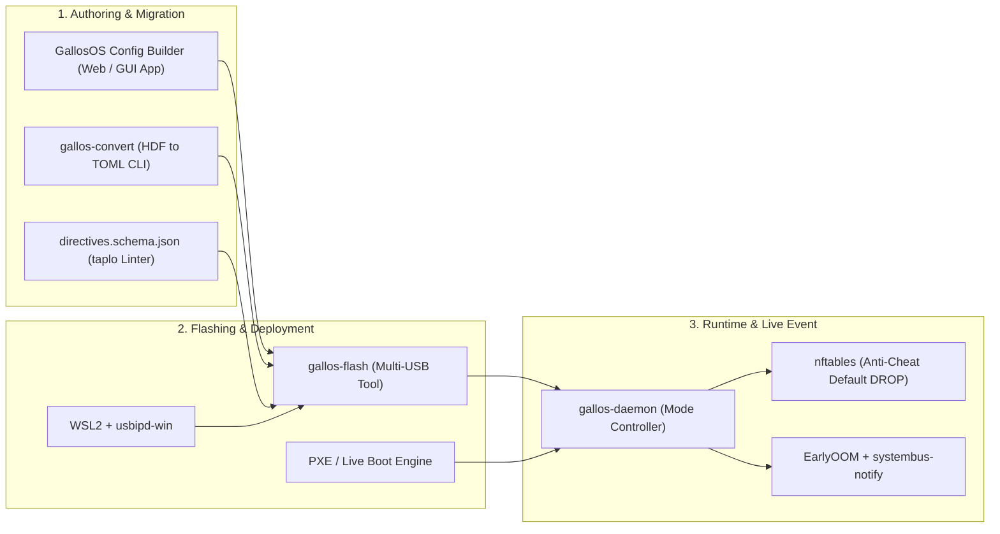
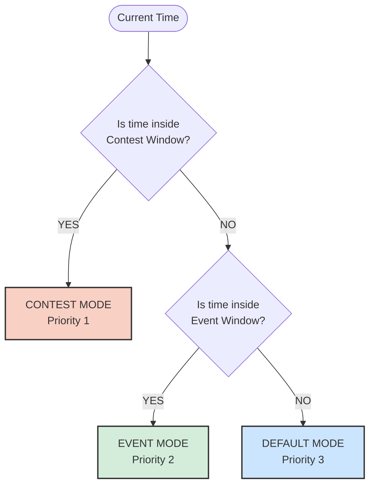

# GallosOS Configuration Specification & Directives Guide

This document defines the configuration schema, mode hierarchy, delivery methods, visual tooling, and legacy migration path for **GallosOS** contest and training profiles.

---

## 1. Versatility: Adapting to Every Competitive Programming Context

GallosOS is designed to seamlessly adapt to **any competitive programming scenario**.

> [!IMPORTANT]
> **The GallosOS root filesystem is always immutable, and the OS itself never writes to the USB.** All OS-internal writes during a session — logs, caches, session state — live in RAM (`tmpfs`), never on flash. This preserves USB drive longevity (it's high-frequency write *churn* that wears flash, not occasional writes) and guarantees a pristine clean state on every `Contest`-mode entry, which is the one context where persistence is never permitted regardless of what the drive supports. Outside `Contest` mode, source code persistence has three options: **optional cloud sync**, **end-of-session USB export**, or an **opt-in `event-data` partition** on the contestant's own drive for continuity across `Event`/`Default`-mode sessions (see `docs/ARCHITECTURE.md` §4 "Storage & Filesystem Architecture," item 5) — the last of these is a deliberate, low-frequency-write exception for the contestant's own hardware, not a contradiction of the immutability guarantee above.

### Context 1 — Weekly Club Sessions & Classes (Default / Event Mode)

- **Source Code Persistence:** Session work is synced to an **optional external workspace** (GitHub / GitLab / Google Drive / OneDrive / Nextcloud), configured once by the student on their account. The organizer whitelists these cloud services per the event profile.
- **Online IDEs:** Students may use browser-based IDEs (VS Code for the Web, Gitpod, Replit) if the organizer allows them — the browser is still governed by GallosOS's bookmark/whitelist policy.
- **Controlled Browsing:** Even in open club mode, the browser enforces curated bookmarks and optionally strips AI-generated response panels (e.g., blocks Google AI Overviews, Bing Copilot answers, ChatGPT).
- **Offline Tools:** Full access to compilers, VSCodium + CPH extension, and offline documentation (cppreference, Python docs, Kotlin manual) without requiring internet.

### Context 2 — Multi-Day Training Camps & Warm-Ups (Event + Contest Transitions)

- **Automated Time-Window Transitions:** $\text{Class (Event)} \to \text{Contest Simulation (Contest)} \to \text{Upsolving (Event)}$
- **Cloud Sync Between Sessions:** During Event windows between contests, students sync their upsolving notes to whitelisted cloud storage.
- **Contest Isolation:** During Contest windows, cloud sync is suspended; only the judge domain is reachable.
- **Post-Contest Export:** USB mass storage unlocks at contest close, allowing contestants to manually save their code for the subsequent Event (upsolving) window.

### Context 3 — Official Sanctioned Tournaments (Strict Contest Mode)

- **Zero-Leak Anti-Cheat Kernel Firewall:** Only the designated judge domain is reachable (BOCA, DOMjudge, PC^2, Codeforces). All cloud storage, online IDEs, AI assistants, and general web access are hard-blocked.
- **USB Mass-Storage Disabled:** No external code injection via flash drives.
- **Fresh Ephemeral Scratch Space:** RAM-backed `tmpfs` — every team starts from an identical, pristine state regardless of prior usage.

---

## 2. Configuration Delivery Methods

GallosOS is designed to be **infrastructure-agnostic**: it operates across the full spectrum of network infrastructure that a venue may provide — from completely offline rooms to university-managed networks to full Venue Controller setups (see [§10 of `ARCHITECTURE.md`](./ARCHITECTURE.md#10-deployment-infrastructure-spectrum)).

### `config_url` Auto-Discovery Priority Chain

Before fetching a remote directives file, GallosOS resolves the target URL through the following chain (first match wins):

| Priority | Source | Description |
| :---: | :--- | :--- |
| **1** | GRUB boot parameter | `gallos.config_url=https://...` set at flash time via `gallos-flash`. Highest priority. |
| **2** | DHCP Option 235 | Standard DHCP lease response announces the URL. Works with any dnsmasq/ISC DHCP router — including basic lab routers — with a single config line. No GallosOS-specific server required. Option 235 is a deliberately-chosen site-specific option (RFC 3942 range 224–254); Option 252 is avoided because it is informally reserved for WPAD on many real networks. |
| **3** | `/etc/gallos/sync-server.conf` | Written by the GallosOS Venue Controller on first contact, or manually injected at flash time. |
| **4** | None | Boot directly from baked-in `/boot/gallos/gallos.toml` (air-gapped / standalone mode). |

### Method A: Remote Directives URL (GitHub Gist / Web Server / DHCP-Announced URL)

- Organizers host a single `gallos.toml` on a **GitHub Gist**, **GitHub Raw repository**, **university HTTP server**, or **any reachable URL**.
- The URL is delivered to contestant machines via **Priority 1 (GRUB param)** or **Priority 2 (DHCP Option 235)**:
  - **DHCP Option 235 (recommended for basic lab setups):** Add one line to the venue's existing router (dnsmasq or ISC DHCP) — no GallosOS-specific server required:

    ```text
    # dnsmasq (OpenWrt, Pi-hole, most lab routers):
    dhcp-option=235,"https://gist.githubusercontent.com/.../raw/gallos.toml"

    # ISC DHCP (dhcpd.conf) — declare a custom option, then set it:
    option option-235 code 235 = text;
    option option-235 "https://gist.githubusercontent.com/.../raw/gallos.toml";
    ```

    > [!NOTE]
    > Option 235 (RFC 3942 site-specific range 224–254) is used instead of the
    > commonly-cited Option 252, which is informally reserved for WPAD
    > (Windows proxy autodiscovery) on many real-world networks. Reusing 252
    > risks colliding with genuine WPAD deployments, especially on the
    > BYOD-Windows-laptop campus networks GallosOS explicitly targets.

  - **GRUB boot parameter:** Set `gallos.config_url=https://...` in the USB's GRUB config at flash time via `gallos-flash --config-url`.
- **Advantage:** Organizers can update contest times, add whitelisted domains, or change wallpapers **on the fly without re-flashing or collecting USB drives**.
- **Architectural Caveat (Boot Splash):** While the desktop wallpaper and UI update instantly once the network connects, the Plymouth boot splash (`boot_splash_logo_url`) *cannot* be updated remotely because the system has no network connectivity during the first few seconds of boot. White-labeling the boot splash strictly requires Method B (Baked-In).

### Method B: Baked-In / Burn-Time Directives (Air-Gapped / Offline)

- **Default Profile:** Directives are placed directly on the USB drive during creation in `/boot/gallos/gallos.toml` or `/etc/gallos/gallos.toml`. The system automatically loads this file at boot.
- **Support for Multiple Profiles (Boot Parameter):** If an organizer wants to store multiple profiles on the same USB (e.g., `practice.toml`, `regional.toml`), they can instruct the Linux kernel via the GRUB boot menu to load a specific file using a boot parameter: `gallos.config=regional.toml`. This provides maximum flexibility for offline labs.
- **Advantage:** Requires zero internet or external server connectivity. Perfect for air-gapped rooms or offline school invitationals.

### Method C: Resilient Hybrid Fallback

- On boot, GallosOS attempts to fetch the remote URL (with a configurable 5-second timeout).
- If the remote server or network is unreachable, it automatically falls back to the **local baked-in configuration cache**, guaranteeing the machine boots into a working state under any circumstances.
- **User Notification (UX):** When a fallback occurs, the system informs the user via a Plymouth boot warning and a persistent desktop notification (e.g., *"⚠️ Offline Mode: Remote configuration unreachable. Using local baked-in profile."*) upon entering the Wayland session.

### 2.4 Architectural Separation: `build.toml` vs. `gallos.toml` vs. `machine.toml`

To prevent configuration pollution and keep deployment modular, GallosOS enforces a strict separation of configuration roles:

| Configuration Entity | Purpose & Scope | Target Audience | Example Content |
| :--- | :--- | :--- | :--- |
| **`build.toml`** | **Container Build Recipe (HOW & BASE):** Used exclusively during ISO compilation. Defines what core Ubuntu packages, kernels, and optimizations are permanently baked into the base OS before the USB is even flashed. | Developers & System Admins (`gallos-builder`) | `base_os = "ubuntu-24.04-minimal"`, `preinstall_apt = ["python3"]`, `strip_docs = true`. |
| **`gallos.toml`** | **Global Contest Policy (WHAT & WHEN):** Identical for all 50–200 machines in the arena. Governs the rules, schedules, and security constraints of the event. | Contest Organizers & Jury | Schedule windows, `allowed_websites` (judge IPs), available IDEs, firewall rules, printing mode. |
| **`machine.toml`** | **Local Station Identity (WHO & WHERE):** Unique to each individual USB / physical PC. Defines the physical seat and assigned team metadata. | Flashing station (`gallos-flash`) / Venue Controller | `pc_name = "PC-14"`, `room = "Lab-A"`, `team_name = "Team-42"`, `seat_label = "Desk 03"`. |
| **`examples/*.toml`** | **Production-Ready Blueprints & Templates:** Pre-baked configuration recipes for popular contest platforms. | Event Organizers | `icpc-onsite.toml`, `maratona-sbc.toml`, `ioi-cms.toml`, `codeforces-training.toml`. |

> [!TIP]
> **How to use `examples/`:** Organizers do not write `gallos.toml` from scratch. For an ICPC regional, simply copy [`examples/icpc-onsite.toml`](../examples/icpc-onsite.toml) (or [`examples/maratona-sbc.toml`](../examples/maratona-sbc.toml) for South America / BOCA) to `gallos.toml` on your server or USB, adjust the competition timestamps, and deploy!

---

## 3. Format: TOML as the Sole Canonical Standard

**TOML** (`gallos.toml`) is the **sole, definitive configuration format** for GallosOS directives.

### Why TOML is the Exclusive Choice

1. **Superior Organizer UX (Syntax Highlighting):** Legacy custom formats like HuronOS `.hdf` lack editor support. TOML is natively supported by modern editors (VSCodium, Notepad++), providing rich syntax highlighting and instantly revealing syntax errors to organizers before a contest begins.
2. **AI-Assisted Configuration:** Organizers increasingly rely on LLMs to generate or modify lab configurations. Custom formats cause AI hallucinations, whereas TOML is universally understood by AI models, allowing organizers to seamlessly prompt: *"Adjust these TOML timestamps to Mexico City time and add Codeforces to the whitelist"*.
3. **Strict Schema Validation:** Integrates natively with `taplo` and JSON Schema (`directives.schema.json`), providing real-time linting and auto-completion directly in the organizer's IDE.
4. **Native Datetime Literals (RFC 3339 / ISO 8601):** Timestamps like `2026-08-29T11:00:00Z` are first-class primitives in TOML, eliminating string parsing errors and timezone ambiguities.
5. **Zero Indentation Vulnerabilities:** Unlike YAML, TOML uses explicit headers (`[contest]`, `[[contest.schedule]]`) and is immune to broken indentation, tab vs. space mixups, or accidental whitespace corruption during copy-pasting.
6. **Native Standard Library Support:** Modern languages like Python 3.11+ include native support for parsing TOML (`tomllib`), allowing `gallos-daemon` to securely ingest configuration natively without requiring a compiler or heavy third-party dependencies.

---

## 4. End-to-End Ecosystem Tooling

GallosOS is designed as a complete, integrated toolkit covering every phase of contest management:



### 4.1 GallosOS Config Builder (Future Web / Desktop GUI Configurator)

To make contest preparation effortless for non-technical organizers, the design specifies **GallosOS Config Builder** (a web application and desktop GUI):

- **Visual Schedule Builder:** Interactive calendar and time-picker to define Contest, Event, and Warm-up time windows without manually typing ISO dates.
- **HuronOS `.hdf` Drag-and-Drop Importer:** One-click visual migration tool that parses legacy `.hdf` files in the browser, populates the entire UI form automatically, and exports valid `gallos.toml`.
- **Package & IDE Selector:** Checkbox catalog of available compilers (GCC, Clang, OpenJDK, Python, Rust, Kotlin) and IDEs (VSCodium, IntelliJ CE, PyCharm CE, Geany).
- **Firewall Whitelist Manager:** Preset templates for popular online judges (BOCA, DOMjudge, Codeforces, OmegaUp, AtCoder).
- **Live Validation & Export:** Instant JSON Schema validation with one-click export to `gallos.toml` or direct publishing to a GitHub Gist.

### 4.2 `gallos-convert` CLI (HuronOS `.hdf` Migration Tool)

For institutions migrating from HuronOS, the architecture includes an automated offline migration utility:

```bash
# Convert a local HuronOS directives file to native TOML
gallos-convert icpc-gpm-2026-3rd-date.hdf gallos.toml

# Convert and validate directly from a remote directives URL (e.g. CPC-GALLOS ICPC GPM)
gallos-convert https://raw.githubusercontent.com/CPC-GALLOS/icpc-gpm-uaa-huronos/refs/heads/main/icpc-gpm-2026-3rd-date.hdf gallos.toml --validate

# Preview differences between legacy .hdf and generated TOML
gallos-convert icpc-gpm-2026-3rd-date.hdf gallos.toml --diff
```

---

## 5. Schema Validation with `taplo`

GallosOS ships a formal **JSON Schema** for the TOML directives file at [`schema/directives.schema.json`](../schema/directives.schema.json).

- ✅ **IDE Autocompletion:** Configure `taplo` in VS Code / VSCodium to validate and autocomplete `gallos.toml` while editing.
- ✅ **CI Validation:** GitHub Actions workflow validates every committed `*.toml` against the schema before building an ISO.
- ✅ **Local Linting:** `taplo check --schema schema/directives.schema.json configs/sample-icpc.toml`

**VS Code / VSCodium setup (`settings.json`):**

```json
{
  "[toml]": {
    "editor.defaultFormatter": "tamasfe.even-better-toml"
  },
  "evenBetterToml.schema.associations": {
    "**/gallos.toml": "https://raw.githubusercontent.com/gallosos/gallosos/main/schema/directives.schema.json",
    "**/configs/*.toml": "https://raw.githubusercontent.com/gallosos/gallosos/main/schema/directives.schema.json"
  }
}
```

---

## 6. The 3-Tier Mode Precedence Hierarchy

GallosOS specifies the time-governed mode hierarchy:

$$\mathbf{Contest} \succ \mathbf{Event} \succ \mathbf{Default}$$



### Visualizing Mode Overlaps

The following Gantt chart illustrates how overlapping time windows are resolved on a typical Training Camp day. Because `Contest` has the highest priority, it cleanly overriding the background `Event` and `Default` modes without requiring the organizer to split the Event window into pieces.

```mermaid
gantt
    title Time-Based Mode Transitions (Example Training Camp Day)
    dateFormat X
    axisFormat %H:%M
    section Declared Windows
    Contest Window 1         :crit,   contest1, 36000, 46800
    Contest Window 2         :crit,   contest2, 54000, 72000
    Event Window             :done,   event1,   28800, 79200
    Default Fallback         :active, default1, 21600, 82800
    section Active Mode Result
    Default (06-08)          :active, res1, 21600, 28800
    Event (08-10)            :done,   res2, 28800, 36000
    Contest (10-13)          :crit,   res3, 36000, 46800
    Event (13-15)            :done,   res4, 46800, 54000
    Contest (15-20)          :crit,   res5, 54000, 72000
    Event (20-22)            :done,   res6, 72000, 79200
    Default (22-23)          :active, res7, 79200, 82800
```



### Mode Semantics & Behavior Matrix

The following matrix defines the **exact behavior** of every configurable subsystem across all three modes. Universal Baselines (marked ⛔ Always) are immutable and cannot be overridden by `gallos.toml`.

| Subsystem | `Default` Mode | `Event` Mode | `Contest` Mode |
| :--- | :--- | :--- | :--- |
| **Network Firewall** | Open (`allowed_websites = ["*"]`) | Configurable (whitelist or open) | 🔒 Default-DROP, judge-only IPs |
| **Audio (PipeWire)** | ✅ Enabled | ✅ Enabled | 🔇 Muted & disabled |
| **Wallpaper** | Default branding | Default or event branding | 🔴 Contest branding |
| **Regular Clock (Time of Day)** | ⌚ Visible (with Stress Toggle) | ⌚ Visible (with Stress Toggle) | ⌚ Visible (with Stress Toggle) |
| **Countdown Timer** | Hidden | Hidden | ⏱️ Active (with Stress Toggle) |
| **Cloud Sync** | Allowed if configured | Allowed between sessions | ❌ Suspended |
| **Bookmarks** | Open or curated | Configurable per event | 🔒 Judge portal only |
| **Software Modules (.gsm)** | All available | Configurable subset | Configurable subset |
| **Contestant Files** | Persistent across sessions | Persistent between classes | 🧹 **Clean State Wipe on entry** |
| **USB Mass Storage** | Configurable (`allow_usb_storage`) | Configurable (`allow_usb_storage`) | 🔒 Always blocked |
| **AI Plugin Purging** | ⛔ Always purged on boot | ⛔ Always purged on boot | ⛔ Always purged on boot |
| **OOM Protection** | ⛔ Always active | ⛔ Always active | ⛔ Always active |
| **Wayland Kiosk Lock** | ⛔ Always locked | ⛔ Always locked | ⛔ Always locked |
| **Virtual TTY (`Ctrl+Alt+F3`)** | ⛔ Always disabled | ⛔ Always disabled | ⛔ Always disabled |

> [!IMPORTANT]
> **The Clean State Wipe** is the single most critical anti-cheat mechanism. When `gallos-daemon` transitions into `Contest` mode from any other mode, it kills the Wayland session, purges `/home/contestant/` (destroying all browser caches, bash history, bookmarks, and saved files from the previous session), restores the pristine `/etc/skel` skeleton, and restarts the session. This guarantees that no student can pre-load answers, algorithm templates, or saved code before the contest begins.

#### 1. `Default` Mode (Fallback / Always)

- **Trigger:** Active when neither a Contest nor Event time window is scheduled.
- **Use Case:** Regular competitive programming club sessions, everyday training, general university lab usage, initial setup, and post-event cleanup.
- **Network:** Open internet access (or organizer-curated whitelist), backed by a persistent, auto-updating DNS host blocklist (e.g., via `/etc/hosts` or `dnsmasq`) for known AI domains (OpenAI, Claude, Copilot, etc.) to enforce traditional algorithmic practice.
- **Files:** Persistent. Students can save files, browse freely, and configure their environment.

#### 2. `Event` Mode (Medium Priority)

- **Trigger:** Active ISO 8601 time window in `[event.schedule]` (e.g., training camp, lecture, warm-up).
- **Use Case:** Multi-day camps where students attend lectures in the morning and practice in the afternoon.
- **Network:** Broad internet access or course-specific whitelist.
- **Files:** Persistent between classes within the same Event window, but **hidden and inaccessible** during any overlapping Contest window. This prevents students from referencing lecture notes during a simulated contest.

#### 3. `Contest` Mode (Highest Priority — Strict Lockdown)

- **Trigger:** Active ISO 8601 time window in `[contest.schedule]`.
- **Use Case:** Official ICPC regionals, IOI rounds, university invitationals.
- **Transition In:** Executes the **Clean State Wipe** (kills session → purges home → restores skeleton → restarts fresh).
- **Network:** Kernel-level Default-DROP firewall. Only judge IPs in `allowed_websites` are reachable.
- **Audio:** PipeWire is muted and disabled to enforce arena silence.
- **Visual:** Contest wallpaper applied, countdown timer visible in Waybar.
- **Transition Out:** When the contest window ends, `gallos-daemon` automatically unlocks the network and transitions back to `Event` or `Default`, allowing contestants to export their code via USB or the internet.

---

## 7. Official TOML Schema Specification (`gallos.toml`)

### 7.1 `software` Module Categories

Every `software` entry follows `<category>/<package>`, validated against `schema/directives.schema.json`'s `software_list` pattern. Categories: `internet` (browsers, translation tools), `langs` (compilers/runtimes), `programming` (IDEs/editors), `tools` (terminal/utility apps), `docs` (offline reference material), and `drivers` (opt-in hardware drivers not baked into the base image by default — currently `drivers/nvidia-proprietary`; see `docs/HARDWARE_COMPATIBILITY.md` § 1.3 for the SecureBoot/MOK implications of enabling it).

```toml
# ==============================================================================
# GallosOS Contest Profile Specification (v1.0)
# ==============================================================================

[global]
timezone = "America/Mexico_City"
config_expiration = "2026-08-30T23:59:59Z"
available_keyboard_layouts = ["latam", "us", "es", "br"]
default_keyboard_layout = "latam"
enable_event_mode = false
enable_contest_mode = true

[branding]
name = "ICPC Gran Premio de México 2026"
organizer = "Universidad Nacional Autónoma de México"
logo_url = "https://directives.icpcmexico.org/assets/logo.png"
boot_splash_logo_url = "https://directives.icpcmexico.org/assets/plymouth-logo.png"
show_powered_by_gallos = true

# ------------------------------------------------------------------------------
# REAL-TIME BROADCAST VERIFICATION KEY (Ed25519)
# ------------------------------------------------------------------------------
# Global, not per-mode: the Venue Controller can also push gallos-broadcast
# announcements during Event-mode training camps, not only Contest windows.
[global.broadcast]
enabled = true
# Public verification key to authenticate live signed announcements from gallos-broadcast
broadcast_public_key = "a8f3b2e7c9d4e5f60123456789abcdef0123456789abcdef0123456789abcdef"

# ------------------------------------------------------------------------------
# DEFAULT MODE SETTINGS (Active when no contest or event is running)
# ------------------------------------------------------------------------------
[default]
allowed_websites = ["*"]
allow_usb_storage = true
allow_audio = true
wallpaper = "default"

software = [
  "internet/chromium",
  "internet/firefox",
  "internet/crow",
  "langs/gcc",
  "langs/g++",
  "langs/javac",
  "langs/python3",
  "langs/pypy3",
  "langs/kotlinc",
  "langs/rustc",
  "programming/vscodium",
  "programming/intellij",
  "programming/pycharm",
  "programming/codeblocks",
  "programming/geany",
  "programming/vim",
  "programming/neovim"
]

bookmarks = [
  { name = "GallosOS Portal", url = "http://localhost:8080" },
  { name = "Documentation", url = "file:///usr/share/doc/index.html" }
]

# ------------------------------------------------------------------------------
# EVENT MODE SETTINGS (Training camp / warm-up session)
# ------------------------------------------------------------------------------
[event]
allowed_websites = ["*"]
allow_usb_storage = true
allow_audio = true
wallpaper = "default"
software = ["internet/chromium", "langs/g++", "langs/python3", "programming/vscodium"]

[[event.schedule]]
start = "2026-08-29T09:00:00Z"
end   = "2026-08-29T10:30:00Z"

# ------------------------------------------------------------------------------
# CONTEST MODE SETTINGS (Strict Competition Lockdown)
# ------------------------------------------------------------------------------
[contest]
# Only designated judge domains and local network judge IPs are reachable
allowed_websites = [
  "boca.icpcmexico.org",
  "score.icpcmexico.org",
  "icpcmexico.org"
]
allow_usb_storage = false
allow_audio = false
wallpaper = "https://directives.icpcmexico.org/wallpapers/gpmx_2026_contest.png"
wallpaper_sha256 = "c382c20791695176be47257ec924c9df39e40534d4ac02fb23c4f3c823334fd8"

software = [
  "internet/chromium",
  "internet/firefox",
  "internet/crow",
  "langs/g++",
  "langs/gcc",
  "langs/javac",
  "langs/kotlinc",
  "langs/pypy3",
  "langs/python3",
  "langs/rustc",
  "programming/vscodium",
  "programming/intellij",
  "programming/pycharm",
  "programming/codeblocks",
  "programming/geany",
  "programming/vim",
  "programming/neovim"
]

bookmarks = [
  { name = "BOCA Judge", url = "https://boca.icpcmexico.org" },
  { name = "Scoreboard", url = "https://score.icpcmexico.org" },
  { name = "Offline C++ Reference", url = "file:///usr/share/doc/cppreference/index.html" }
]

# ------------------------------------------------------------------------------
# AUDITING & PROCTORING (Optional, enabled for official finals / IOI / ICPC)
# ------------------------------------------------------------------------------
[contest.audit]
enable_screen_capture = true
screenshot_interval_secs = 60
enable_code_backup = true
backup_interval_secs = 300
enable_fleet_telemetry = true
enable_keystroke_forensics = false

# ------------------------------------------------------------------------------
# PRINTING SUBSYSTEM (CUPS with automated metadata headers)
# ------------------------------------------------------------------------------
[contest.printing]
mode = "hosted"                  # "hosted" (Controller hosts USB printer, static IP by default — see ANTI_CHEAT_AND_SECURITY.md §3.1), "external", or "none"
printer_host = "192.168.1.50"    # IP address if mode = "external"
default_printer = "Lab-A-LaserJet"
print_metadata_header = true
max_pages_per_job = 10

[[contest.schedule]]
start = "2026-08-29T11:00:00Z"
end   = "2026-08-29T16:00:00Z"
```

---

## 8. HuronOS `.hdf` Translation Reference

The following table specifies how `gallos-convert` maps legacy HuronOS directives into canonical `gallos.toml` format:

| HuronOS `.hdf` Directive | GallosOS TOML Path | Transformation Rule |
| :--- | :--- | :--- |
| `[Global] TimeZone` | `global.timezone` | Direct string copy |
| `[Global] ConfigExpirationTime` | `global.config_expiration` | ISO 8601 string → RFC 3339 datetime |
| `[Global] AvailableKeyboardLayouts` | `global.available_keyboard_layouts` | `latam\|us\|` → `["latam", "us"]` |
| `[Global] DefaultKeyboardLayout` | `global.default_keyboard_layout` | Direct string copy |
| `[Global] EventConfig` | `global.enable_event_mode` | `true`/`false` string → TOML boolean |
| `[Global] ContestConfig` | `global.enable_contest_mode` | `true`/`false` string → TOML boolean |
| `[Always] AllowedWebsites` | `default.allowed_websites` | `domain1\|domain2\|` → `["domain1", "domain2"]`; `all` → `["*"]` |
| `[Event] AllowedWebsites` | `event.allowed_websites` | `domain1\|domain2\|` → `["domain1", "domain2"]` |
| `[Contest] AllowedWebsites` | `contest.allowed_websites` | `domain1\|domain2\|` → `["domain1", "domain2"]` |
| `[Section] AllowUsbStorage` | `[section].allow_usb_storage` | `true`/`false` string → TOML boolean |
| `[Section] AvailableSoftware` | `[section].software` | `pkg1\|pkg2\|` → `["pkg1", "pkg2"]` with name remapping |
| `[Section] Bookmarks` | `[section].bookmarks` | `{Title^URL}\|` → `[{name="Title", url="URL"}]` |
| `[Section] Wallpaper` | `[section].wallpaper` | Direct URL or `"default"` |
| `[Section] WallpaperSha256` | `[section].wallpaper_sha256` | Direct SHA-256 hex string |
| `[Event-Times]` lines | `[[event.schedule]]` | `BeginTime EndTime` → `{start = ..., end = ...}` |
| `[Contest-Times]` lines | `[[contest.schedule]]` | `BeginTime EndTime` → `{start = ..., end = ...}` |

> [!NOTE]
> **No Binary Migration Required:** When `gallos-convert` performs "name remapping" on the `AvailableSoftware` configuration flags, it safely maps legacy HuronOS software requests directly to modern GallosOS `.gsm` modules. **You do not need to copy your old `.hsm` files to the GallosOS USB.** GallosOS provides its own updated software stack natively.

### Package Name Remapping Table (HuronOS → GallosOS)

| HuronOS Package | GallosOS Equivalent | Notes |
| :--- | :--- | :--- |
| `programming/vscode` | `programming/vscodium` / `programming/vscode` | Default ISO maps to telemetry-free VSCodium; official Microsoft VS Code is supported if enabled via build script |
| `internet/crow` | `internet/crow` | Same (Crow Translate, offline dictionary mode) |
| `programming/intellij` | `programming/intellij` | Maps to JetBrains IDEA CE |
| `programming/pycharm` | `programming/pycharm` | Maps to PyCharm CE |
| `programming/atom` | ⚠ Deprecated | Atom was archived by GitHub; remapped to `programming/vscodium` |
| `programming/kdevelop` | `programming/kdevelop` | Direct match (KDE C/C++ IDE) |
| `programming/codeblocks` | `programming/codeblocks` | Direct match (Code::Blocks C/C++ IDE) |
| `programming/eclipse` | `programming/eclipse` | Direct match (Eclipse IDE) |
| `programming/geany` | `programming/geany` | Direct match (Geany Lightweight IDE) |
| `programming/gedit` | `programming/gedit` | Direct match (GNOME Text Editor) |
| `programming/kate` | `programming/kate` | Direct match (KDE Advanced Text Editor) |
| `programming/sublime` | `programming/sublime` | Direct match (Sublime Text) |
| `programming/gvim` | `programming/gvim` | Direct match (Graphical Vim) |
| `programming/vim` | `programming/vim` | Name match (Mapped to GallosOS Vim with CP plugins) |
| `programming/neovim` | `programming/neovim` | Name match (Mapped to GallosOS LazyVim environment) |
| `internet/chromium` | `internet/chromium` | Direct match |
| `internet/firefox` | `internet/firefox` | Direct match |
| `langs/g++` | `langs/g++` | Direct match |
| `langs/gcc` | `langs/gcc` | Direct match |
| `langs/javac` | `langs/javac` | Direct match |
| `langs/kotlinc` | `langs/kotlinc` | Direct match |
| `langs/pypy3` | `langs/pypy3` | Direct match |
| `langs/python3` | `langs/python3` | Direct match |
| `langs/rustc` | `langs/rustc` | Direct match (Rust Compiler) |
| `tools/konsole` | `tools/konsole` / `tools/foot` | Konsole is supported if requested; `tools/foot` is recommended and default for minimal RAM footprint on Wayland |
| `tools/byobu` | `tools/byobu` | Direct match (Terminal Multiplexer) |
| `tools/midnight-commander` | `tools/midnight-commander` | Direct match (Midnight Commander file manager) |
