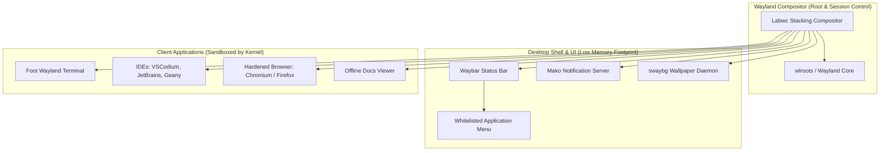

# GallosOS Wayland Kiosk Desktop Specification

This document defines the architectural rationale, component selection, dotfile structure, security guarantees, and user experience specifications for the **GallosOS Wayland Kiosk Session**.

For the broader system architecture, see [`docs/ARCHITECTURE.md`](./ARCHITECTURE.md). For configuration schema and runtime directives, see [`docs/CONFIG_SPEC.md`](./CONFIG_SPEC.md).

---

## 1. Design Philosophy & Architectural Rationale

Traditional competitive programming live distributions (including HuronOS and legacy ICPC environments) have historically relied on X11 desktop environments (such as Solus Budgie, XFCE, or Openbox). While familiar, X11 presents critical architectural vulnerabilities:

1. **The X11 Security Flaw (Zero Window Isolation):** Under X11, any running application can listen to global keystrokes across all windows (sniffing contestant code, passwords, and clipboard data) and take unprivileged screenshots of other applications.
2. **Bloat of Full Desktop Environments:** Mainstream desktop environments (GNOME, KDE Plasma, Budgie) pull extensive dependency trees and background daemons (indexing services, system settings daemons, tracker miners), increasing ISO size, RAM consumption, and flashing times.
3. **Exploitable Setting Panels:** Desktops with rich GUI control centers expose network management and display settings that contestants can tamper with during a competition.

### Why the Wayland Kiosk Stack?

GallosOS replaces X11 with a customized, lightweight **Wayland Kiosk Session**:



---

## 2. Core Desktop Components

| Component | Software | Role & Rationale |
| :--- | :--- | :--- |
| **Compositor** | **Labwc** | Stacking Wayland compositor inspired by Openbox. Extremely lightweight, native per-window memory isolation, easily configured via XML/environment files. |
| **Status Bar** | **Waybar** | Highly customizable, CSS-styled status bar hosting whitelisted application menus, contest countdowns, keyboard switchers, and the stress-free clock. |
| **Terminal** | **Foot** | Ultra-lightweight, Wayland-native terminal emulator with minimal startup latency and low memory footprint (<10 MB RAM architectural estimate). |
| **Notifications** | **Mako** | Low-distraction Wayland notification daemon for EarlyOOM warnings and administrative broadcasts. |
| **Wallpaper** | **swaybg** | Minimal Wayland wallpaper utility rendering contest-specific or university-branded backgrounds. |
| **Seat Management** | **seatd** | Minimal, rootless seat management daemon providing unprivileged DRM/KMS and input device access. |
| **Display Control** | **wlr-randr** | Minimal command-line tool for Wayland display resolution and scaling management. |
| **App Launcher** | **wmenu** | Ultra-fast Wayland menu triggered from Waybar for whitelisted applications. |

### 2.1 GPU Backend Note (Proprietary Driver Compatibility)

Labwc's `wlroots` backend renders via GBM/EGL. On machines running the opt-in `drivers/nvidia-proprietary` module (`docs/HARDWARE_COMPATIBILITY.md` § 1.3), correct Wayland compositing depends on the installed NVIDIA driver version shipping working GBM support — older proprietary driver releases historically required the separate `wlroots` EGLStreams codepath instead. No specific minimum driver version is certified here; this is a compatibility dimension organizers enabling the proprietary module should verify against the driver version their `build.toml` pins. The default Nouveau/`amdgpu`/`i915` path is unaffected.

---

## 3. Immutable Configuration & Tamper Resistance

To maintain tournament integrity, desktop configuration files (dotfiles) are **pre-configured, root-owned, and protected against contestant tampering**:

1. **System-Level Overrides (`/etc/xdg/`):**
   Authoritative desktop dotfiles reside in system-level paths (`/etc/xdg/labwc/`, `/etc/xdg/waybar/`, `/etc/xdg/foot/`, `/etc/xdg/mako/`).
2. **Explicit Kiosk Configuration Loading (`labwc -C /etc/xdg/labwc`):**
   Upstream `labwc` defaults to checking `${XDG_CONFIG_HOME:-$HOME/.config}/labwc` before `/etc/xdg/labwc` without merging. To prevent a contestant from bypassing restrictions by writing a local `~/.config/labwc/rc.xml`, the kiosk session launcher explicitly executes `labwc -C /etc/xdg/labwc` without `--merge-config`.
3. **Read-Only SquashFS Layer:**
   These configurations are baked into the immutable SquashFS base layer. Even if a contestant modifies local files during a session, the baseline settings cannot be permanently corrupted, and a reboot restores the pristine environment.
4. **No Unprivileged Desktop Settings GUI:**
   GallosOS intentionally excludes settings panels (like `gnome-control-center` or `xfce4-settings`). System configuration (display resolution, timezone, keyboards) is handled declaratively beforehand via `gallos.toml`.

---

## 4. Keybindings & Desktop Controls

All keybindings are centralized within `/etc/xdg/labwc/rc.xml` and enforced authoritatively by Labwc via `labwc -C /etc/xdg/labwc`.

> [!NOTE]
> **The `Super` Key:** In Linux documentation, the **`Super`** key refers to the **Windows key ($\mathbf{\boxplus}$)** on standard PC keyboards, or the **Command key ($\mathbf{\⌘}$)** on Apple Mac keyboards.

### 4.1 Global Hotkeys

| Hotkey | Action | Description |
| :--- | :--- | :--- |
| **`Super + Space`** | Keyboard Layout Toggle | Cycles through configured keyboard layouts (`latam` $\to$ `us` $\to$ `es` $\to$ `br`). |
| **`Alt + Shift`** | Keyboard Layout Toggle | Legacy fallback shortcut for keyboard layout switching. |
| **`Super + Return`** | Launch Foot Terminal | Opens a new Foot terminal instance. |
| **`Alt + Tab`** | Window Switcher | Switches focus between open contestant application windows. |
| **`Super + Q` / `Alt + F4`** | Close Window | Closes the active client window. |

### 4.2 Security Restrictions

- **Virtual Terminal (VT) Console Switch Lockout:** Keybindings for switching virtual terminals (`Ctrl+Alt+F1` through `Ctrl+Alt+F6`) are explicitly disabled at the compositor level. In legacy X11 distributions like huronOS, contestants pressing IDE shortcuts (e.g. VS Code comment toggles or Fn shortcuts) routinely triggered accidental VT switches to raw text prompts, leading to panic reboots, DHCP IP churn, and subsequent BOCA judge "IP Warning" lockouts.
- **Restricted Spawning:** Dangerous shortcuts that could break desktop kiosk integrity (such as spawning arbitrary unvetted desktop shells or executing raw system commands outside the whitelisted menu) are completely excluded from `/etc/xdg/labwc/rc.xml`.

---

## 5. Waybar Ergonomics & Custom Modules

The status bar (`Waybar`) is customized specifically for competitive programming comfort and operational control:

```text
+---------------------------------------------------------------------------------------------------+
| [ Gallos Menu ]  [Active Task]                   [ Countdown: 02:45:10 ]  [LATAM]  [14:32:08] [RAM] |
+---------------------------------------------------------------------------------------------------+
```

1. **Whitelisted Application Menu:**
   - A clean dropdown launcher anchored to the left of the bar.
   - Exposes strictly authorized contest applications (IDEs, Terminal, Docs, Browser) according to the active mode (`Contest`, `Event`, or `Default`).
2. **Dynamic Contest Countdown:**
   - Local script polling `gallos-daemon` state. Displays remaining time (e.g. `Time Left: 02:45:10`) and flashes amber when under 15 minutes remain.
3. **Interactive Stress-Free Clock:**
   - Clicking directly on the clock widget cycles between:
     $$\text{Full Precision (HH:MM:SS)} \longrightarrow \text{Relaxed (HH:MM)} \longrightarrow \text{Focus Mode (Hidden)}$$
4. **Keyboard Layout Indicator & Switcher:**
   - Visual badge (`LATAM`, `US`, `ES`, `BR`) showing current active layout. Clicking the badge cycles to the next layout.
5. **EarlyOOM Low-Memory Indicator:**
   - Visual indicator alerting contestants when RAM usage approaches critical limits before processes are terminated.
6. **Anti-Accident Power Button Lock:**
   - In `Contest` mode, the graphical shutdown/reboot button on the Waybar is strictly disabled to prevent contestants from accidentally powering off their machine during the competition.

---

## 6. Unified Visual Styling & Typography

GallosOS enforces a clean, distraction-free dark aesthetic across both native Wayland and XWayland applications:

- **UI Font:** `Inter` / `Roboto` (clean legibility on high-resolution displays).
- **Monospace Font:** `JetBrains Mono` (high-clarity code rendering with distinct punctuation and ligatures).
- **Theme Palette:** Neutral dark background with high-contrast text and subtle accents, reducing eye strain during 5-hour contest sessions.
- **GTK/Qt Consistency:** Unified GTK3/GTK4 dark theme (`Adwaita-dark` / `Arc-Dark`) applied globally to Geany, VSCodium, JetBrains, and Chromium without requiring full desktop background daemons.

---

## 7. Audio Subsystem (PipeWire & WirePlumber)

GallosOS uses **PipeWire** paired with the **WirePlumber** session manager as its low-overhead Wayland audio and video server.

### 7.1 Contest vs. Practice Audio Policy

To avoid acoustic disruptions in competition arenas while enabling rich multimedia support during training camps, audio availability is governed by mode state:

- **Contest Mode (Disabled / Muted by Default):**
  - Live competitive programming contests (such as ICPC and IOI) are held in strict low-noise environments.
  - To prevent accidental noise, notification dings, or rogue audio cues, the PipeWire master output is **muted and disabled by default** during active `Contest` windows (`allow_audio = false`).
- **Event & Default Modes (Enabled for Training & Lectures):**
  - Audio output is fully enabled (`allow_audio = true`) during training camp lectures, classroom practice, and upsolving sessions, allowing contestants to watch tutorial videos, algorithm lectures (e.g. YouTube / course portals), and participate in remote debriefs.
