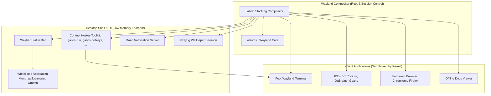

# GallosOS Wayland Kiosk Desktop Specification

This document defines the architectural rationale, component selection, dotfile structure, security guarantees, keybindings, and user experience specifications for the **GallosOS Wayland Kiosk Session**.

For the broader system architecture, see [`docs/ARCHITECTURE.md`](./ARCHITECTURE.md). For configuration schema and runtime directives, see [`docs/CONFIG_SPEC.md`](./CONFIG_SPEC.md). The files described here live in [`build/desktop/`](../build/desktop/README.md) and are copied verbatim into the live image by Stage 2 of the build pipeline ([`docs/BUILD_SYSTEM.md`](./BUILD_SYSTEM.md)).

---

## 1. Design Philosophy & Architectural Rationale

Traditional competitive programming live distributions (including HuronOS and legacy ICPC environments) have historically relied on X11 desktop environments (such as Solus Budgie, XFCE, or Openbox). While familiar, X11 presents critical architectural vulnerabilities:

1. **The X11 Security Flaw (Zero Window Isolation):** Under X11, any running application can listen to global keystrokes across all windows (sniffing contestant code, passwords, and clipboard data) and take unprivileged screenshots of other applications.
2. **Bloat of Full Desktop Environments:** Mainstream desktop environments (GNOME, KDE Plasma, Budgie) pull extensive dependency trees and background daemons (indexing services, system settings daemons, tracker miners), increasing ISO size, RAM consumption, and flashing times.
3. **Exploitable Setting Panels:** Desktops with rich GUI control centers expose network management and display settings that contestants can tamper with during a competition.

### Why the Wayland Kiosk Stack?

GallosOS replaces X11 with a customized, lightweight **Wayland Kiosk Session**:



The visual target is deliberately close to a well-configured tiling-style setup (gaps, rounded server-side decorations, accent-coloured focus border, keyboard-driven half/quarter tiling, virtual workspaces, a slim pill-style bar) while remaining **formal and distraction-free**: one muted graphite palette, one accent colour, no animations beyond the under-15-minutes countdown warning.

---

## 2. Core Desktop Components

| Component | Software | Ubuntu 24.04 package (version) | Role & Rationale |
| :--- | :--- | :--- | :--- |
| **Compositor** | **Labwc** | `labwc` (0.7.1) | Stacking Wayland compositor inspired by Openbox. Extremely lightweight, native per-window memory isolation, configured via XML (`rc.xml`, `menu.xml`) plus a themerc. |
| **Status Bar** | **Waybar** | `waybar` (0.9.24) | CSS-styled status bar hosting the whitelisted launcher, run button, contest mode badge, countdown, layout badge, RAM/network state, the stress-free clock, and the power button. |
| **Terminal** | **Foot** | `foot` (1.16.2) | Ultra-lightweight, Wayland-native terminal emulator. Runs as `foot --server`, so `Super+Return` spawns `footclient` windows near-instantly. |
| **Launcher / pickers** | **wmenu** | `wmenu` (0.1.6) | dmenu-style Wayland menu used by every picker (`gallos-menu`, `gallos-run --pick`, `gallos-power`), themed by the `gallos-wmenu` wrapper. |
| **Notifications** | **Mako** | `mako-notifier` | Low-distraction Wayland notification daemon for EarlyOOM warnings, mode transitions, and administrative broadcasts. |
| **Wallpaper** | **swaybg** | `swaybg` | Minimal Wayland wallpaper utility, driven by the in-session `gallos-wallpaper` watcher. |
| **Seat Management** | **seatd** | `seatd` | Minimal, rootless seat management daemon providing unprivileged DRM/KMS and input device access. |
| **Display Control** | **wlr-randr** | `wlr-randr` | Minimal command-line tool for Wayland display resolution and scaling management. |
| **Contest hotkey toolkit** | `gallos-*` helper scripts | `build/desktop/usr/bin/` (Bash) | In-band helpers behind every keybinding and bar button — see § 8. |

Package versions are those published for Ubuntu 24.04 LTS ("noble") and pinned by `build/profiles/icpc.toml`; the configuration files target exactly these versions (for example, labwc 0.7.1 has no IPC for the active keyboard layout, see § 5, item 5).

### 2.1 Renderer & GPU Drivers

wlroots renders through EGL/GLES2 on top of Mesa. Because Stage 2 installs packages with `--no-install-recommends`, the Mesa drivers `labwc` merely *recommends* are listed explicitly in `build/profiles/icpc.toml`: `libgl1-mesa-dri` (DRI drivers — `iris`, `radeonsi`, `nouveau`, `vmwgfx` for VirtualBox/VMware, `kms_swrast` software fallback) and `libegl-mesa0`. Without them labwc exits immediately with `unable to create renderer ... eglInitialize`. As a last resort the kiosk launcher (`/etc/profile.d/gallos-kiosk.sh`) retries labwc once with `WLR_RENDERER=pixman`, wlroots' pure-software renderer, so the desktop still appears on a VM or GPU with no working EGL — slower, but functional.

In VirtualBox use the **VMSVGA** graphics controller (a KMS device via `vmwgfx`) with 128 MB of video memory; **VBoxVGA** exposes no DRM/KMS device and cannot run a Wayland compositor.

### 2.2 GPU Backend Note (Proprietary Driver Compatibility)

Labwc's `wlroots` backend renders via GBM/EGL. On machines running the opt-in `drivers/nvidia-proprietary` module (`docs/HARDWARE_COMPATIBILITY.md` § 1.3), correct Wayland compositing depends on the installed NVIDIA driver version shipping working GBM support — older proprietary driver releases historically required the separate `wlroots` EGLStreams codepath instead. No specific minimum driver version is certified here; this is a compatibility dimension organizers enabling the proprietary module should verify against the driver version their `build.toml` pins. The default Nouveau/`amdgpu`/`i915` path is unaffected.

---

## 3. Immutable Configuration & Tamper Resistance

To maintain tournament integrity, desktop configuration files (dotfiles) are **pre-configured, root-owned, and protected against contestant tampering**:

1. **System-Level Overrides (`/etc/xdg/`):**
   Authoritative desktop dotfiles reside in system-level paths, all sourced from `build/desktop/`:

   | Live path | Source | Content |
   | :--- | :--- | :--- |
   | `/etc/xdg/labwc/rc.xml` | `build/desktop/etc/xdg/labwc/rc.xml` | Keybindings, workspaces, snap regions, window rules, fonts. |
   | `/etc/xdg/labwc/menu.xml` | `.../labwc/menu.xml` | Desktop right-click menu (whitelisted launchers only). |
   | `/etc/xdg/labwc/themerc-override` | `.../labwc/themerc-override` | Window/menu/OSD colours; loaded from the config dir, so no `/usr/share/themes` lookup is involved. |
   | `/etc/xdg/labwc/autostart`, `environment` | `.../labwc/autostart`, `environment` | Session start-up and toolkit environment. |
   | `/etc/xdg/waybar/config.jsonc`, `style.css` | `.../waybar/` | Bar modules and GTK CSS theme. |
   | `/etc/xdg/foot/foot.ini`, `/etc/xdg/mako/config` | `.../foot/`, `.../mako/` | Terminal and notification appearance. |
   | `/etc/profile.d/gallos-kiosk.sh` | `.../etc/profile.d/gallos-kiosk.sh` | Kiosk session launcher (tty1 autologin → `labwc`). |
   | `/usr/bin/gallos-*`, `/usr/share/gallos/apps.list` | `.../usr/bin/`, `.../usr/share/gallos/` | Contest hotkey toolkit (§ 8) and application whitelist. |

2. **Explicit Kiosk Configuration Loading (`labwc -C /etc/xdg/labwc`):**
   Upstream `labwc` defaults to checking `${XDG_CONFIG_HOME:-$HOME/.config}/labwc` before `/etc/xdg/labwc` without merging. To prevent a contestant from bypassing restrictions by writing a local `~/.config/labwc/rc.xml`, the kiosk session launcher explicitly executes `labwc -C /etc/xdg/labwc` without `--merge-config`. Waybar and mako are likewise started with explicit `-c`/`-s` paths, and foot reads `/etc/xdg/foot/foot.ini` via `XDG_CONFIG_DIRS=/etc/xdg`.
3. **Read-Only SquashFS Layer:**
   These configurations are baked into the immutable SquashFS base layer. Even if a contestant modifies local files during a session, the baseline settings cannot be permanently corrupted, and a reboot restores the pristine environment.
4. **No Unprivileged Desktop Settings GUI:**
   GallosOS intentionally excludes settings panels (like `gnome-control-center` or `xfce4-settings`). System configuration (display resolution, timezone, keyboards) is handled declaratively beforehand via `gallos.toml`.
5. **Daemon ↔ session bridge (`/run/gallos/`):**
   `gallos-daemon` runs as root inside a systemd sandbox and never touches the compositor directly. It publishes state files that session-side helpers consume: `state.json` (mode, remaining seconds — read by `gallos-waybar-status` every second), `wallpaper` (image path — applied by `gallos-wallpaper --watch`), and `desktop.env` (`XKB_DEFAULT_LAYOUT`/`XKB_DEFAULT_OPTIONS` derived from `[global].available_keyboard_layouts` / `default_keyboard_layout` — sourced by the kiosk launcher before `labwc` starts).

---

## 4. Keybindings & Desktop Controls

All keybindings are centralized within `/etc/xdg/labwc/rc.xml` and enforced authoritatively by Labwc via `labwc -C /etc/xdg/labwc`. The same table is available on-screen at any time with **`Super + F1`** (or `Super + /`), rendered by `gallos-hotkeys`; the two must be kept in sync with this section.

> [!NOTE]
> **The `Super` Key:** In Linux documentation, the **`Super`** key refers to the **Windows key ($\mathbf{\boxplus}$)** on standard PC keyboards, or the **Command key ($\mathbf{\⌘}$)** on Apple Mac keyboards.

### 4.1 Applications & System

| Hotkey | Action | Helper |
| :--- | :--- | :--- |
| **`Super + Return`** | New terminal (opens in `~/workspace`) | `gallos-terminal` (`footclient`, falls back to `foot`) |
| **`Super + D`** | Whitelisted application launcher | `gallos-menu` |
| **`Super + E`** | Code editor / IDE (first installed of VSCodium, Geany, CLion, IntelliJ, PyCharm, Kate, Code::Blocks, then Neovim/Vim in a terminal) | `gallos-launch editor` |
| **`Super + B`** | Browser / judge portal (Chromium, then Firefox) | `gallos-launch browser` |
| **`Super + O`** | Offline documentation (cppreference / Python docs bundle, when installed) | `gallos-launch docs` |
| **`Super + F1`**, **`Super + /`** | On-screen keyboard-shortcut cheat sheet | `gallos-hotkeys` |
| **`Super + Space`**, **`Alt + Shift`** | Next keyboard layout (XKB group toggle, works identically in every window) | XKB `grp:win_space_toggle,grp:alt_shift_toggle` |
| **`Super + Shift + P`** | Power menu (Cancel / Shut down / Reboot) — refused while Contest mode is active | `gallos-power` |

### 4.2 Build & Run

| Hotkey | Action |
| :--- | :--- |
| **`Super + R`** | Pick a source file from `~/workspace` (newest first) and compile & run it in a terminal window |
| **`Super + Shift + R`** | Compile & run the most recently edited source file, no prompt |
| `gallos-run FILE` | Same from any terminal (see § 8.1 for languages, flags and stdin handling) |

Aliases that do not need the Super key — for virtual machines whose host swallows the Windows key (VirtualBox in windowed mode, for example) and for keyboards without one:

| Hotkey | Same as |
| :--- | :--- |
| **`Ctrl + Alt + T`** | `Super + Return` (terminal) |
| **`Alt + F1`** / **`Alt + F2`** | `Super + F1` (cheat sheet) / `Super + D` (launcher) |
| **`Alt + F5`** / **`Alt + Shift + F5`** | `Super + R` (pick & run) / `Super + Shift + R` (run most recent) |
| **`Alt + F10`** / **`Alt + F11`** | `Super + ↑` (maximise) / `Super + F` (fullscreen) |

### 4.3 Windows & Workspaces

| Hotkey | Action |
| :--- | :--- |
| **`Alt + Tab`** / **`Super + Tab`** | Next window (Alt+Tab OSD with live previews); add `Shift` for previous |
| **`Super + Q`** / **`Alt + F4`** | Close window |
| **`Super + ←`** / **`Super + →`** | Tile to the left / right half of the screen |
| **`Super + Shift + U` `I` `J` `K`** | Tile to a quarter: top-left, top-right, bottom-left, bottom-right (the U I / J K key cluster mirrors the four corners) |
| **`Super + ↑`** | Maximise / restore |
| **`Super + ↓`** | Minimise |
| **`Super + C`** | Centre the window |
| **`Super + F`** | Toggle fullscreen |
| **`Super + T`** | Toggle keep-on-top |
| **`Super + drag`** | Drag a window while holding Super to snap it into a half or quarter region |
| **`Super + 1 … 4`** | Switch to workspace 1–4 (labwc shows a brief workspace OSD) |
| **`Super + Shift + 1 … 4`** | Move the active window to workspace 1–4 and follow it |
| **`Super + Ctrl + ←`** / **`→`** | Previous / next workspace |

Four workspaces are configured; their use is a convention, not an enforcement (suggested: 1 code, 2 judge, 3 documentation, 4 scratch).

### 4.4 Security Restrictions

- **Virtual Terminal (VT) Console Switch Lockout:** Keybindings for switching virtual terminals (`Ctrl+Alt+F1` through `Ctrl+Alt+F6`) are disabled at the `logind`/keymap level (`docs/ANTI_CHEAT_AND_SECURITY.md`, ROADMAP Phase 2). In legacy X11 distributions like huronOS, contestants pressing IDE shortcuts (e.g. VS Code comment toggles or Fn shortcuts) routinely triggered accidental VT switches to raw text prompts, leading to panic reboots, DHCP IP churn, and subsequent BOCA judge "IP Warning" lockouts.
- **Restricted Spawning:** `rc.xml` does not load labwc's built-in default keybinds (`<keyboard><default />` is deliberately absent, so `bemenu-run`, `alacritty` and friends are never bound) and defines no `Exit` or `Reconfigure` binding. Every `Execute` target is a shipped `gallos-*` helper; `scripts/validate_desktop.py` fails the build checks if a binding points anywhere else. Launchers are whitelist-driven (`/usr/share/gallos/apps.list`), never a raw `$PATH` command runner.
- **Power lock:** `gallos-power` (bar button, `Super+Shift+P`, right-click menu) reads the mode from `/run/gallos/state.json` and refuses with a critical notification while Contest mode is active.

---

## 5. Waybar Ergonomics & Custom Modules

```text
+-------------------------------------------------------------------------------------------------------------------+
| [ GallosOS ] [ Run ] [kbd]  [ a.cpp — VSCodium ] [ foot ]        [ CONTEST ] [ 02:45:10 ]        [ latam/us ] [ 41% ] [ 192.168.50.23 ] [ 14:32:08 ] [ ⏻ ] |
+-------------------------------------------------------------------------------------------------------------------+
```

Left: launcher, run button, cheat-sheet button, then the task list (`wlr/taskbar`: click activates, middle-click closes, right-click minimises). Centre: contest state. Right: keyboard layouts, RAM, network, clock, power. All state modules are fed by the pure-Bash `gallos-waybar-status` script, so the bar costs no interpreter start-up per tick.

1. **Whitelisted Application Menu (`GallosOS` button, `Super+D`):**
   `gallos-menu` shows the entries of `/usr/share/gallos/apps.list` whose program exists on the image — so a profile without JetBrains modules never lists them — in a themed `wmenu` list. The desktop right-click menu (`menu.xml`) exposes the same curated launchers. Neither ever offers arbitrary command execution.
2. **Run button (`Super+R`):** opens `gallos-run --pick`; right-click runs the most recently edited file (`Super+Shift+R`).
3. **Contest Mode Badge & Dynamic Countdown:**
   `custom/mode` shows `DEFAULT` (graphite), `EVENT` (teal) or `CONTEST` (red) from `gallos-daemon`'s `state.json`. `custom/countdown` is visible only in Contest mode, shows `HH:MM:SS` in a monospace pill, and turns **amber and blinks when under 15 minutes remain**. Clicking it applies the same stress-free cycle as the clock (full → `HH:MM` → hidden).
4. **Interactive Stress-Free Clock:**
   Clicking directly on the clock widget cycles between:
   $$\text{Full Precision (HH:MM:SS)} \longrightarrow \text{Relaxed (HH:MM)} \longrightarrow \text{Focus Mode (Hidden, dot icon)}$$
   The choice is per-session (`$XDG_RUNTIME_DIR/gallos-clock-mode`) and the tooltip always reveals the full timestamp.
5. **Keyboard Layout Badge:**
   Shows the configured layout cycle (e.g. `latam/us/es`) as exported by `gallos-daemon` from `[global].available_keyboard_layouts` (default layout first), with the switching hotkeys in the tooltip. Switching itself is handled by XKB inside the compositor (`Super+Space` / `Alt+Shift`), so it works in every application. **Limitation:** labwc 0.7.1 exposes no IPC for the currently active XKB group, so this badge is informational — it does not highlight which layout is active right now (tracked in ROADMAP Phase 4).
6. **Memory & EarlyOOM Indicator:**
   Waybar's `memory` module turns amber at 75 % and red/blinking at 90 % RAM usage, ahead of EarlyOOM's kill threshold (`docs/ANTI_CHEAT_AND_SECURITY.md`).
7. **Anti-Accident Power Button Lock:**
   The power button opens `gallos-power`, which is refused while Contest mode is active (§ 4.4).

---

## 6. Unified Visual Styling & Typography

GallosOS enforces a clean, distraction-free dark aesthetic across native Wayland and XWayland applications. The palette is defined once (comment header of `build/desktop/etc/xdg/labwc/themerc-override`) and repeated verbatim in Waybar's CSS, `foot.ini`, mako's config and the `gallos-wmenu` wrapper:

| Token | Hex | Used for |
| :--- | :--- | :--- |
| `bg0` | `#111418` | Terminal background, text on accent pills |
| `bg1` | `#171b21` | Bar and OSD background, inactive titlebars |
| `bg2` | `#1f242c` | Pills, menus, tooltips, active titlebars |
| `bg3` | `#2a313b` | Borders, inactive window border, separators |
| `fg` | `#e4e8ee` | Primary text |
| `fg-muted` | `#98a2b3` | Secondary text, inactive labels |
| `accent` | `#5a9bd8` | Focused window border, launcher pill, selection, cursor |
| `contest` | `#d1495b` | Contest badge, critical notifications, errors |
| `warning` | `#e2a336` | Under-15-minute countdown, RAM warning |
| `event` | `#3aa39a` | Event badge |
| `success` | `#4caf7d` | Successful compile/run |

- **UI Font:** `Inter` (`fonts-inter`), used by Waybar, labwc titlebars/menus/OSD, mako and wmenu; falls back to Liberation Sans / DejaVu Sans.
- **Monospace Font:** `JetBrains Mono` (`fonts-jetbrains-mono`) for foot, the countdown and the clock; falls back to Liberation Mono / DejaVu Sans Mono.
- **Icon glyphs:** Font Awesome as packaged by Ubuntu (`fonts-font-awesome` 5.0.10+really4.7.0 — i.e. Font Awesome **4.7**, family name `FontAwesome`); Waybar's config therefore uses only 4.7-era codepoints.
- **Windows:** server-side decorations for every client (consistent look for XWayland IDEs), 6 px corner radius, 2 px border coloured by focus, 8 px gap when tiled, new windows centred.
- **Wallpapers:** three generated graphite gradients with a mode-coloured glow (`build/scripts/gen-wallpapers.py`): blue (Default), teal (Event), red (Contest). Organizer branding from `[section].wallpaper` (`docs/CONFIG_SPEC.md`) replaces them per mode.
- **GTK/Qt Consistency:** the dark theme is applied through the toolkits' Wayland backends (`GDK_BACKEND=wayland,x11`, `QT_QPA_PLATFORM=wayland`) without any desktop settings daemon.

---

## 7. Audio Subsystem (PipeWire & WirePlumber)

GallosOS uses **PipeWire** paired with the **WirePlumber** session manager as its low-overhead Wayland audio and video server.

### 7.1 Contest vs. Practice Audio Policy

To avoid acoustic disruptions in competition arenas while enabling rich multimedia support during training camps, audio availability is governed by mode state:

- **Contest Mode (Disabled / Muted by Default):**
  - Live competitive programming contests (such as ICPC and IOI) are held in strict low-noise environments.
  - To prevent accidental noise, notification dings, or rogue audio cues, the PipeWire master output is **muted and disabled by default** during active `Contest` windows (`allow_audio = false`).
- **Event & Default Modes (Enabled for Training & Lectures):**
  - Audio output is fully enabled (`allow_audio = true`) during training camp lectures, classroom practice, and upsolving sessions, allowing contestants to watch tutorial videos, algorithm lectures (e.g. YouTube / course portals), and participate in remote debriefs.

> [!NOTE]
> The current `build/profiles/icpc.toml` does not yet install PipeWire, so `rc.xml` binds no volume keys; they will be added together with the audio subsystem.

---

## 8. Contest Hotkey Toolkit (`gallos-*` helpers)

Every keybinding and bar button resolves to a small Bash script under `/usr/bin/` (source: `build/desktop/usr/bin/`). Bash is a deliberate choice — per `AGENTS.md` § In-Band vs Out-of-Band tooling, anything running inside the live OS must be field-patchable without a compiler. All helpers pass ShellCheck in CI.

### 8.1 `gallos-run` — compile & run in one keystroke

```text
gallos-run FILE        compile & run FILE
gallos-run --pick      choose a file from ~/workspace (Super+R)
gallos-run --latest    most recently edited source file (Super+Shift+R)
```

- **Languages** (by extension): C++ (`.cpp` `.cc` `.cxx`), C (`.c`), Python (`.py`), Java (`.java`, single-file source launcher), Rust (`.rs`). A missing toolchain is reported as "not part of this profile", not as a crash.
- **Flags:** `g++ -std=gnu++20 -O2 -Wall -Wextra` and `gcc -std=gnu17 -O2 -Wall -Wextra -lm` by default; organizers should match their judge's exact compile command through `GALLOS_CXX`, `GALLOS_CXXFLAGS`, `GALLOS_CC`, `GALLOS_CFLAGS`, `GALLOS_PYTHON` (set them in `/etc/profile.d/gallos-kiosk.sh` or a custom `.gsm` layer).
- **Input:** if `FILE.in`, `input.txt` or `in.txt` exists next to the source it is fed to stdin; otherwise the program reads from the keyboard (`Ctrl+D` ends input). `GALLOS_RUN_TIMEOUT=<seconds>` adds a wall-clock limit and reports *Time limit exceeded*.
- **Output:** compiled binaries go to `.gallos-build/` beside the source (the workspace stays clean); the run ends with the exit status or the terminating signal (`SIGSEGV`, …) and the elapsed wall time.
- **Windowing:** launched from a hotkey, it opens its own terminal window titled `Run · FILE` and waits for a key press before closing; run from an existing terminal it behaves as a plain CLI.

### 8.2 Launchers and pickers

| Helper | Purpose |
| :--- | :--- |
| `gallos-menu` | Whitelisted application launcher (`/usr/share/gallos/apps.list`, only installed programs listed). |
| `gallos-launch editor\|browser\|docs\|terminal` | Opens the first installed candidate of each kind; `--which KIND` prints what would run. Documentation resolves to `/usr/share/cppreference/doc/html/en/index.html` (`cppreference-doc-en-html`) or the `python3-doc` index when those Phase 4 bundles are present, and reports "not installed" otherwise. |
| `gallos-terminal` | `footclient` window (foot server started by autostart), `foot` fallback; opens in `~/workspace`. |
| `gallos-wmenu` | `wmenu` with the GallosOS palette and font; used by every picker. |
| `gallos-hotkeys` | On-screen cheat sheet window (`--plain` prints the table, used by docs/tests). |
| `gallos-power` | Cancel / Shut down / Reboot picker, locked during Contest mode. |

### 8.3 Session-side state consumers

| Helper | Purpose |
| :--- | :--- |
| `gallos-waybar-status mode\|countdown\|clock\|layout` | JSON feeders for Waybar's custom modules; `clock-toggle` / `countdown-toggle` implement the stress-free cycles and nudge Waybar via `SIGRTMIN+8`. |
| `gallos-wallpaper [--watch]` | Applies `/run/gallos/wallpaper` with `swaybg` and re-applies it on every mode transition (started from `autostart`). Falls back to the Default image when the daemon is absent. |

### 8.4 Adding or changing a hotkey

1. Edit `build/desktop/etc/xdg/labwc/rc.xml` (and `menu.xml` if it should also be in the right-click menu).
2. Mirror the change in `build/desktop/usr/bin/gallos-hotkeys` and in § 4 of this document.
3. Run `./scripts/check.sh` — `scripts/validate_desktop.py` verifies the XML, the Waybar JSONC and that every `Execute` target is shipped; ShellCheck covers the helper scripts.
