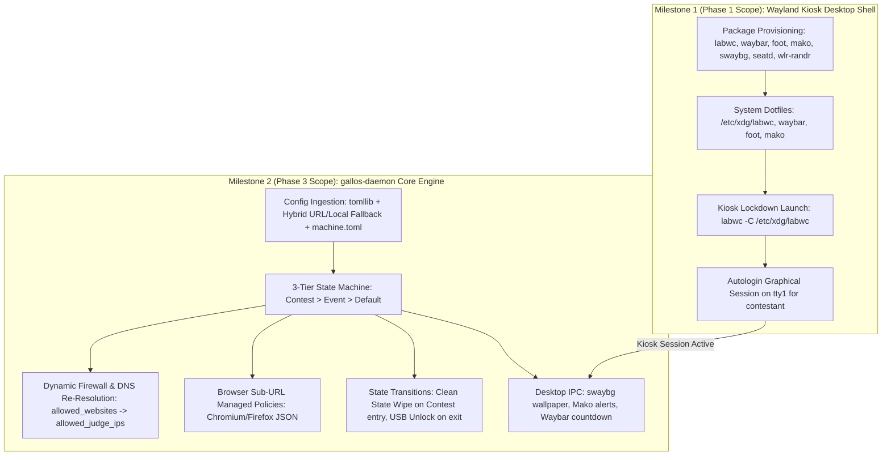

# Implementation Plan — Wayland Kiosk Desktop Shell (Phase 1 Completion) & `gallos-daemon` Core Engine (Phase 3)

This plan integrates the feedback and technical review from [`implementation_plan.md`](file:///home/ravary/Desktop/GallosOS/implementation_plan.md). It reconciles the scope split between completing the **Phase 1 Wayland Kiosk Desktop Shell** and delivering the **Phase 3 `gallos-daemon` Runtime Configuration Engine**, strictly grounded in the canonical specifications (`docs/WAYLAND_DESKTOP.md`, `docs/CONFIG_SPEC.md`, `docs/ANTI_CHEAT_AND_SECURITY.md`, `docs/ARCHITECTURE.md`, `ROADMAP.md`, and `schema/directives.schema.json`).

---

## 🎯 Architecture & Scope Breakdown



---

## 📦 Milestone 1 (Phase 1 Completion): Wayland Kiosk Desktop Shell

### 1.1 Architectural Rationale & Kiosk Dotfile Tamper-Resistance
- **Compositor:** `labwc` (stacking Wayland compositor based on wlroots).
- **Enforcement Mechanism:**
  - Upstream `labwc` defaults to checking `${XDG_CONFIG_HOME:-$HOME/.config}/labwc` *before* `/etc/xdg/labwc`.
  - To guarantee tamper-resistance against `contestant` modifying `~/.config/labwc/`, the kiosk session launcher MUST invoke `labwc` with the explicit config-directory flag:
    ```bash
    labwc -C /etc/xdg/labwc
    ```
  - `--merge-config` MUST NOT be passed.
  - `/etc/xdg/labwc/` and sub-files will be root-owned (mode `0755` / `0644`).
- **Additional Stack Packages:**
  - `waybar` (status bar, contest countdown, keyboard switcher).
  - `foot` (lightweight Wayland terminal, theoretical architectural estimate of <10 MB RAM footprint).
  - `mako-notifier` (lightweight notification daemon).
  - `swaybg` (wallpaper renderer).
  - `seatd` (minimal seat management daemon for direct DRM/KMS access without root).
  - `wlr-randr` (display configuration utility).
  - `wmenu` / `wofi` (minimal application launcher triggered from Waybar).

### 1.2 System Dotfiles Layout (`/etc/xdg/`)
1. **`/etc/xdg/labwc/rc.xml`:**
   - Window placement and decor rules (no maximize/minimize bloat).
   - Keybindings (per `docs/WAYLAND_DESKTOP.md` §4.1):
     - `Super + Return` $\to$ spawn `foot`.
     - `Super + Space` / `Alt + Shift` $\to$ cycle keyboard layouts.
     - `Alt + Tab` $\to$ window switcher.
     - `Super + Q` / `Alt + F4` $\to$ close window.
2. **`/etc/xdg/labwc/autostart`:**
   - Spawns `waybar -c /etc/xdg/waybar/config.jsonc -s /etc/xdg/waybar/style.css &`
   - Spawns `mako -c /etc/xdg/mako/config &`
   - Spawns `swaybg -i /usr/share/backgrounds/gallos/default.png -m fill &`
3. **`/etc/xdg/labwc/environment`:**
   - Sets `XDG_CURRENT_DESKTOP=labwc`, `MOZ_ENABLE_WAYLAND=1`, `QT_QPA_PLATFORM=wayland`.
4. **`/etc/xdg/waybar/config.jsonc` & `style.css`:**
   - Modules: contest mode badge/countdown, keyboard layout indicator, network link status, system clock (`HH:MM`).
5. **`/etc/xdg/foot/foot.ini`:**
   - Solarized/Monokai high-contrast dark theme, default font: monospace 11pt.
6. **`/etc/xdg/mako/config`:**
   - Bottom-right corner placement, 5s timeout, high-contrast border for EarlyOOM & contest alert broadcasts.

### 1.3 Display Session & Graphical Autologin on `tty1`
- Instead of heavyweight display managers (GDM/LightDM), wire direct graphical autologin on `tty1`:
  - `getty@tty1.service.d/override.conf` executes a wrapper session script for user `contestant`.
  - Wrapper script starts `seatd` (if not running via socket) and executes `exec dbus-run-session labwc -C /etc/xdg/labwc`.
  - User `contestant` is added to group `_seatd` / `video` / `input` for unprivileged DRM/input access.
- `03-harden.sh`'s serial console `ttyS0` autologin remains removed/restricted in production profiles.

### 1.4 Documentation Sync for Milestone 1
- Update `docs/WAYLAND_DESKTOP.md`:
  - Reconcile §3 and §4: clarify that `rc.xml` is located at `/etc/xdg/labwc/rc.xml` and loaded authoritatively via `labwc -C /etc/xdg/labwc`.
  - Add `seatd`, `wlr-randr`, and `wmenu` to §2 Stack Table.
- Update `ROADMAP.md`: Check off "Wayland Kiosk Desktop Shell" under Phase 1.

---

## ⚙️ Milestone 2 (Phase 3 Core): `gallos-daemon` Runtime Configuration Engine

### 2.1 File & Module Organization (`daemon/`)
Per AGENTS.md Rule #10 (in-band hackability without compilers or packaging overhead), `gallos-daemon` will be written in Python 3 (using standard library `tomllib`, `urllib.request`, `socket`, `subprocess`, `threading`, `time`) and deployed flatly into `/usr/libexec/gallos-daemon/`:

```text
daemon/
├── gallos-daemon.service          # Hardened systemd unit
├── gallos-ctl                     # Organizer CLI control script
└── src/
    ├── __init__.py
    ├── main.py                    # Entry point, daemon loop, signal handling
    ├── config.py                  # Hybrid config fetch, local cache, schema validator
    ├── identity.py                # machine.toml & DHCP MAC matching for host/team identity
    ├── state_machine.py           # Precedence engine (Contest > Event > Default), triggers
    ├── firewall.py                # nftables renderer, DNS periodic re-resolution
    ├── browser_policy.py          # Chromium / Firefox managed policy generator
    ├── desktop.py                 # swaybg wallpaper trigger, Mako notification sender
    └── usb_manager.py             # polkit JS rule (primary) & udev fallback toggler
```

### 2.2 Functional Specifications per Component

#### 1. Config Ingestion & Hybrid Fallback (`config.py`)
- Reads runtime kernel cmdline for `gallos.config=<url_or_path>`.
- Ingestion Hierarchy:
  1. If `gallos.config` URL provided: attempt HTTP/HTTPS fetch with a strict **5-second timeout**.
  2. If fetch fails or unreachable: emit warning via `desktop.py` (Mako/Plymouth) and fall back to local `/boot/gallos/gallos.toml` cache (or `/gallos/gallos.toml` for Ventoy).
  3. Validate directives structure via Python `tomllib`.
  4. Check `global.config_expiration`: if current UTC is past expiration date, force immediate fallback to `Default` mode.

#### 2. Machine Identity & Team Assignment (`identity.py`)
- Ingests optional `/boot/gallos/machine.toml` or `machines[]` list from `gallos.toml`.
- Matches current interface MAC addresses (`/sys/class/net/*/address`):
  - Sets hostname (`sethostname`) to `pc_name` or `room-pc_number`.
  - Exports environment/state file `/run/gallos/identity.env` (`TEAM_NAME`, `SEAT_LABEL`, `ROOM`) for Waybar display.

#### 3. 3-Tier Precedence State Machine (`state_machine.py`)
- **Precedence Rule:** $\text{Contest} \succ \text{Event} \succ \text{Default}$.
- **Triggers Supported:**
  1. ISO 8601 wall-clock `schedule` (`start_time` / `end_time`).
  2. Monotonic duration (`duration_minutes` via `CLOCK_MONOTONIC` for air-gapped Tier 0).
  3. `auto_start_on_boot = true`.
  4. Manual CLI trigger: `gallos-ctl contest start|stop` (via Unix socket `/run/gallos/daemon.sock`).
- **Transitions:**
  - **Entering `Contest` Mode:**
    1. Triggers **Clean State Wipe**: terminates all `contestant` processes (`pkill -u contestant`), purges `/home/contestant/` tmpfs contents, restores from `/etc/skel/`, and restarts the kiosk session.
    2. Ensures `event-data` partition is **unmounted and hidden** (inaccessible during contest).
    3. Engages Zero-Trust firewall (`firewall.py`), locks USB mass storage (`usb_manager.py`), switches to contest wallpaper (`swaybg`), and broadcasts notification (`mako`).
  - **Exiting `Contest` Mode (Post-Contest):**
    1. Re-authorizes USB mass-storage (`usb_manager.py`) so contestants can export solutions.
    2. Transitions to `Default` or `Event` mode (re-mounting `event-data` partition if present).
    3. Re-renders firewall and updates desktop wallpaper/Waybar.

#### 4. Dynamic Firewall & DNS Resolver (`firewall.py`)
- Ingests `contest.allowed_websites` (domain names).
- Resolves domains to IPv4 addresses and generates the dynamic `allowed_judge_ips` nftables set.
- Applies updates atomically via `nft -f -`:
  ```text
  table ip gallos_filter {
      set allowed_judge_ips {
          type ipv4_addr
          flags interval
          elements = { <resolved_ips> }
      }
  }
  ```
- **Periodic DNS Re-Resolution:** Background thread re-resolves `allowed_websites` every 45s (configurable). If IPs change (e.g. CDN endpoints), applies differential `nft add/delete element ip gallos_filter allowed_judge_ips { ... }`.

#### 5. Browser URL Path Filtering (`browser_policy.py`)
- For HTTPS sites where nftables cannot inspect request paths, renders Enterprise Managed Policies:
  - Chromium: `/etc/chromium/policies/managed/gallos_policy.json` (`URLBlocklist`, `URLAllowlist`).
  - Firefox: `/etc/firefox/policies/policies.json`.
- Dynamically populated from `contest.browser_policy.url_allowlist` and `url_blocklist`.

#### 6. Peripheral Lockdown (`usb_manager.py`)
- **Primary:** Controls `/etc/polkit-1/rules.d/99-gallos-usb-block.rules` (enables `polkit.Result.NO` on `org.freedesktop.udisks2.*` during Contest mode; removes or returns `YES` on Post-Contest).
- **Fallback:** Toggles `/etc/udev/rules.d/99-contest-usb-block.rules` (`ATTR{bInterfaceClass}=="08" authorized=0`) and runs `udevadm control --reload-rules`.

### 2.3 Systemd Integration & Security Sandboxing
- `/etc/systemd/system/gallos-daemon.service`:
  ```ini
  [Unit]
  Description=GallosOS Dynamic Configuration & State Daemon
  After=network-online.target sysinit.target
  Wants=network-online.target

  [Service]
  Type=simple
  ExecStart=/usr/bin/python3 /usr/libexec/gallos-daemon/main.py
  Restart=always
  RestartSec=3s
  OOMScoreAdjust=-900

  # Systemd Security Hardening
  NoNewPrivileges=true
  ProtectSystem=strict
  ProtectHome=read-only
  ReadWritePaths=/run /etc/nftables.conf /etc/polkit-1/rules.d /etc/udev/rules.d /etc/chromium/policies/managed /etc/firefox/policies /home/contestant
  CapabilityBoundingSet=CAP_NET_ADMIN CAP_SYS_ADMIN CAP_KILL CAP_SETUID CAP_SETGID CAP_DAC_OVERRIDE
  AmbientCapabilities=CAP_NET_ADMIN CAP_SYS_ADMIN

  [Install]
  WantedBy=multi-user.target
  ```
- Configure `/etc/default/earlyoom`: update `--avoid` regex to protect `gallos-daemon`, `mako`, `labwc`, and `Xwayland`:
  ```ini
  EARLYOOM_ARGS="-r 60 -m 10 -s 5 -n --avoid '^(gallos-daemon|labwc|mako|Xwayland)$' --prefer '^(chromium|firefox|code)$'"
  ```

---

## 🛠️ Pipeline Implementation Steps

### Step 1: Provisioning Stage (`02-provision.sh`)
1. Add desktop and utility packages to `02-provision.sh`:
   `labwc`, `waybar`, `foot`, `mako-notifier`, `swaybg`, `seatd`, `wlr-randr`, `wmenu`, `python3-minimal`.
2. Write `/etc/xdg/` dotfiles for `labwc`, `waybar`, `foot`, `mako`.
3. Install `daemon/src/` into `$ROOTFS/usr/libexec/gallos-daemon/` (mode `0755`).
4. Install `daemon/gallos-ctl` into `$ROOTFS/usr/bin/gallos-ctl` (mode `0755`).
5. Configure `seatd` user permissions and `tty1` autologin launcher invoking `labwc -C /etc/xdg/labwc`.

### Step 2: Hardening Stage (`03-harden.sh`)
1. Deploy `gallos-daemon.service` into `$ROOTFS/etc/systemd/system/gallos-daemon.service`.
2. Enable `gallos-daemon.service` and `seatd.service` via `chroot "$ROOTFS" systemctl enable ...`.
3. Update `/etc/default/earlyoom` with the expanded `--avoid` / `--prefer` regex list.

### Step 3: ISO Assembly (`build-iso.sh`)
1. Create `/boot/gallos/` on the ISO staging filesystem with sample `gallos.toml` configurations.
2. Include default background assets in `/usr/share/backgrounds/gallos/`.

---

## 🧪 Verification Plan

### Automated Pre-Merge Checks
```bash
# 1. Shell script static analysis
shellcheck -x build/scripts/*.sh

# 2. Taplo / Schema validation of example profiles against directives.schema.json
taplo check examples/*.toml
```

### End-to-End Build & QEMU Verification
```bash
# Build the ISO
make iso CONFIG=profiles/build-icpc.toml

# Boot in Graphical QEMU
qemu-system-x86_64 \
  -enable-kvm \
  -m 2048 \
  -cdrom build/output/gallosOS-custom-amd64.iso \
  -vga virtio \
  -display gtk
```

### Guest Assertion Checklist:
1. **Desktop Kiosk Startup:**
   - System boots straight into `labwc` on `tty1` as `contestant`.
   - `Waybar` renders at the top; `swaybg` renders the background wallpaper.
   - `Super + Return` opens `foot`.
   - `~/.config/labwc/` does not override `/etc/xdg/labwc/` (verified by testing that `-C /etc/xdg/labwc` was used).
2. **Daemon Active & Sandboxed:**
   - `systemctl is-active gallos-daemon` reports `active`.
   - `cat /proc/$(pgrep -f gallos-daemon)/oom_score_adj` returns `-900`.
3. **State Machine & Mode Transition:**
   - Launch `gallos-ctl contest start`:
     - Clean State Wipe executes: contestant session restarts with clean `/home/contestant/`.
     - Wallpaper switches to contest mode; Mako alert displays contest start.
     - `nft list ruleset` displays dynamic `allowed_judge_ips` set populated from `allowed_websites`.
     - USB mass storage insertion is blocked.
   - Launch `gallos-ctl contest stop`:
     - Contest ends; USB mass storage becomes authorized.
     - Wallpaper returns to Default mode.
